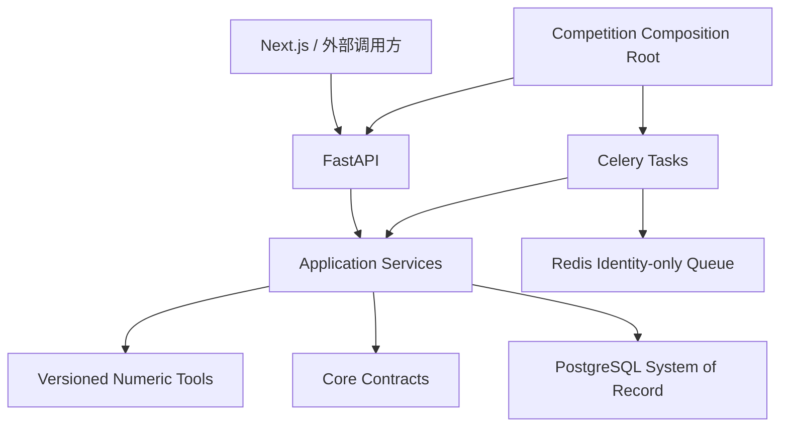

# 泉芯智寿

> 面向电芯研发的可信寿命预测、有限时域退化轨迹与受约束专业智能体工作流

泉芯智寿不是让 LLM 猜测电池寿命，而是把真实电芯数据、正式模型、区间校准、
`ToolResult`、审计账本和受约束 Agent 组织成一条可追溯的数值链。SOH、RUL、
预测区间和决策数值只能由版本化工具产生；LLM 只负责理解任务、编排已授权工具和
解释已经登记的证据。

当前仓库已经完成 MATR 三批正式 Advanced 训练与制品验收，并在测试环境贯通
active route、calibration materialization、RUL/SOH/Conformal、Agent、报告和
Next.js UI。个人比赛单机部署代码及 ECS/TLS 前置设施已经准备，但公网应用栈尚未
完成纵向验收。这不等于生产部署，也不构成跨数据集覆盖保证或工业寿命承诺。

## 当前状态

状态更新时间：2026-07-28。

| 状态 | 定义 | 当前结论 |
| --- | --- | --- |
| **Implemented** | 代码、契约、配置或 migration 已存在 | Advanced 产品链、竞赛 Compose、API、Worker、Next.js、Nginx、ADMIN bootstrap |
| **Validated** | 有正式实验、测试、哈希或受控 E2E | 80 次 A100 Final、逐样本对账、Conformal、项目纵向 E2E、部署契约 |
| **Published** | 不可变镜像或发布包已进入目标 registry | **是**；`2026.07.28-1` 五个私有 ACR 镜像及 digest 已冻结 |
| **Deployed** | 已在目标 ECS 启动并通过服务验收 | **否**；ECS、Docker、UFW、ACR、TLS 前置就绪，应用栈尚未启动 |
| **Demonstrated** | 公网浏览器真实业务路径通过 | **否**；尚待完成 |
| **Planned** | 仍需实现、实验或外部输入 | HUST、删失感知区间、企业 BMS/EMS、HA 与长期运维 |

完整矩阵见[项目状态](docs/status.md)，禁止性表述见
[已知限制](docs/limitations.md)。本次镜像身份见
[ACR release `2026.07.28-1`](docs/deployment/releases/2026.07.28-1.md)。

## 已验证结果

### MATR Advanced Final

```text
4 个 cutoff（20 / 50 / 100 / 150）
× 4 个模型
× 5 个随机种子（38 / 39 / 40 / 41 / 42）
= 80 次正式运行
```

结果包验收：

```text
status=VERIFIED
mode=final
operations=80
files=2654
source_commit=232d9fc8957bb547ca2b80205802f377864e982b
output_sha256=d201224870a28c655f66a810bc94f90ad28133e06f2fb4a7285195274c303d82
```

代表性五种子结果：

| 任务 | 模型与 cutoff | MAE | RMSE | 其他指标 |
| --- | --- | ---: | ---: | --- |
| MATR 官方 cycle life | CyclePatch Direct，150 cycles | 98.19 cycles | 122.49 cycles | MAPE 12.62%，R² 0.8656，15%-Acc 64.44% |
| 有限时域 SOH | HybridPatch-v2，20 cycles | 1.281 SOH 百分点 | 2.700 SOH 百分点 | 单调违规率 0% |
| 有限时域 SOH | Current Hybrid，20 cycles | 1.610 SOH 百分点 | 2.578 SOH 百分点 | 单调违规率 0% |

结论保持双路由：

- CyclePatch Direct 在 `cutoff=150` 获得当前最低 RUL 平均 MAE；
- Direct 与 CyclePatch-BatLiNet 的逐电芯配对区间跨过零，不能宣称统计显著胜出；
- HybridPatch-v2 的平均 SOH 误差较低，但 Current Hybrid 的 RMSE 和尾部风险更低；
- 12 个 calibration 电芯属于小校准队列，不能外推为任意域的覆盖保证；
- RUL `cutoff=100` 的现有候选均未达到目标 90% PICP。

完整五种子表、PICP、MPIW、Bootstrap 和晋级规则见
[Advanced Benchmark](docs/benchmark.md)。

### 真实实验图件

下列图片由已验收的逐样本结果通过 Python/Matplotlib 确定性生成，不是模型生图。
公开副本、来源 SHA-256 和统计口径见
[`docs/assets/benchmark/advanced-final-20260723/`](docs/assets/benchmark/advanced-final-20260723/)。

#### RUL 性能随早期观测窗口变化


#### 代表电芯 SOH 真实与预测轨迹


#### 精度、稳定性、训练耗时与显存权衡


## 核心技术路线


### 数据与标签

- MATR 三批 MATLAB v7.3/HDF5 使用来源清单、文件哈希和安全读取；
- train/validation/calibration/test 严格按 `cell_id` 隔离；
- RUL 标量目标是 MATR 官方 `cycle-life`，不是统一 EOL80；
- SOH 监督与输出采用真实有限时域，当前正式轨迹最长到 cycle 500；
- HUST 官方 pickle 不能在主进程直接加载，必须先隔离核验并安全转换。

### 正式模型与基线

| 类别 | 定位 |
| --- | --- |
| Dummy / Variance / XGBoost | 透明基线与经典特征基线 |
| CPMLP | legacy 曲线集合基线，不作为当前 Advanced 旗舰 |
| CyclePatch Direct | 带真实 cycle 位置、工况编码和跨循环 Transformer 的 RUL 模型 |
| CyclePatch-BatLiNet | 在 CyclePatch 表征上加入冻结参考库分支 |
| Current Hybrid | 带强单调先验的 SOH 尾部/效率基线 |
| HybridPatch-v2 | 学习式退化幅度与多尺度曲线编码的 SOH 平均精度模型 |

统一原理、输入输出和适用边界见[算法原理](docs/algorithms/README.md)与
[Advanced 模型卡](docs/model-card-advanced.md)。

### 可信数值链

- 模型、数据、划分、特征、代码、路由和 calibration cohort 全部版本化；
- safetensors、JSON、Parquet 消费前复验清单、大小和 SHA-256；
- 禁止未经核验加载 pickle、joblib、`.pt` 或 `.pth`；
- `AgentStep` 精确绑定工具、输入身份、依赖和审批证据；
- ledger 与 step 完成原子提交；
- fenced claim 阻止失效 Worker 覆盖新结果；
- Agent 队列只传 `run_id` 与不可变 `plan_hash`；Calibration 队列只传
  `materialization_id`；
- API、报告和 UI 只消费已登记 `ToolResult`，不重算或补写业务数字。

系统目的、主要流程和比赛完成标准见
[系统总体设计](docs/architecture/system-overview.md)。

## 软件架构



- 核心公共语义来自 `quanxin_life.core`；
- Application 层不依赖 FastAPI 请求对象；
- 基础设施通过 composition root 显式注入；
- PostgreSQL 是正式 system of record，Redis 不保存业务真相；
- `deploy/competition.compose.yaml` 只公开 Nginx 80/443；
- 高级依赖延迟导入，核心包导入不连接网络、数据库或加载权重。

详细信任边界见[软件架构](ARCHITECTURE.md)，包职责、依赖方向与组合入口见
[模块设计](docs/architecture/module-design.md)。

## 成熟度边界

### 已经验证

- MATR 三批 Advanced Final 80 次正式运行；
- 1,080 行 RUL 和 500,000 行 SOH 逐循环预测对账；
- 80% / 90% / 95% Split 与 Normalized Conformal 离线评价；
- 15 条条件路由与 representative checkpoint 绑定；
- artifact v2、安全注册、人工激活/回退与 active-route resolver；
- target-aware RUL、finite-horizon SOH 与 route-specific Split Conformal；
- 项目 API、受约束 Agent、报告、UI 和 calibration materialization；
- 真实认证、数据库、manifest/split/Parquet/SHA 解析的受控纵向 E2E；
- 竞赛 Compose、ACR workflow、migrations、API/Worker entrypoint 和 ADMIN bootstrap 契约。

### 尚未验证或尚未部署

- ACR 五个镜像的成功发布及 immutable digest；
- ECS Compose、migration、真实 route/calibration 激活和公网浏览器 E2E；
- 服务重启、route 回退、失败恢复和数据库备份恢复演练；
- HUST 零样本外部泛化与目标域重校准；
- 右删失样本的 survival-aware 评价与 Conformal；
- 单样本推理延迟、吞吐、并发和长期运行；
- 企业 BMS/EMS、设备安全联锁、HA、KMS 和合规验收。

## 快速开始

要求 Python `>=3.11,<3.12`。

### 安装

Windows PowerShell：

```powershell
py -3.11 -m venv .venv
.\.venv\Scripts\Activate.ps1
python -m pip install --upgrade pip
python -m pip install -e ".[data,dev,ml,api]"
```

Linux：

```bash
python3.11 -m venv .venv
source .venv/bin/activate
python -m pip install --upgrade pip
python -m pip install -e ".[data,dev,ml,api]"
```

按需安装：

```bash
python -m pip install -e ".[agents,auth,infrastructure,persistence,reporting,training]"
python -m pip install -e ".[mcp]"
```

### Foundation API

[`deploy/foundation_api.py`](deploy/foundation_api.py) 只提供健康检查、工具发现和
已装配基础工具，不是完整产品 API：

```bash
python -m uvicorn deploy.foundation_api:app --host 127.0.0.1 --port 8000
```

```text
http://127.0.0.1:8000/health
http://127.0.0.1:8000/v1/tools
http://127.0.0.1:8000/docs
```

基础 Compose：

```bash
docker compose -f deploy/compose.yaml up --build
```

文件系统原型可以使用 `FileSystemVerifiedEarlyCycleBatchStore` 与
`JsonlAuditLedger`；正式竞赛运行使用 PostgreSQL、Redis 和 strict competition
composition root。

### Next.js 与 Streamlit

Next.js 版本以 [`frontend/package.json`](frontend/package.json) 为准，固定使用
`pnpm@10.28.1`：

```bash
cd frontend
pnpm install --frozen-lockfile
pnpm dev
```

科研工作台：

```bash
streamlit run workbench/streamlit_app.py
```

工作台只通过 HTTP API 消费结果，不加载模型或读取服务端路径。

### A100 复现入口

正式数据集标识为 `matr-three-batch`：

```bash
bash scripts/a100/preflight.sh
bash scripts/a100/train_dataset.sh matr-three-batch smoke
bash scripts/a100/train_dataset.sh matr-three-batch final
```

当前正式结果已经完成，产品开发不需要重复训练。A100 离线服务器不使用 Git、SSH、
SCP 或网盘；更新采用用户既有人工通道、离线归档和 SHA-256 校验。

### 竞赛 ECS

竞赛部署不使用 foundation Compose。入口是：

- [竞赛 ECS 单机部署](docs/deployment/competition-ecs.md)
- [竞赛部署运维 Runbook](docs/deployment/operations-runbook.md)
- [部署安全与 Secrets](docs/deployment/security-and-secrets.md)

## API 与代码走读

运行时 OpenAPI 是路由和 schema 的机器事实源：

```text
GET /docs
GET /openapi.json
```

认证、项目、record batch、model route、calibration、Agent、结果和报告入口见
[API 文档](docs/api/README.md)。一次请求从 Next.js 进入 FastAPI，经 application
service、active route、数值工具、Audit Ledger、Worker 再返回 UI 的文件级路径见
[代码走读](docs/development/code-walkthrough.md)。

## 扩展能力

以下能力存在代码、契约或沙箱，但不属于当前算法主结论：

- PyBaMM：短时工况边界核验，不制造长期退化标签；
- 主动试验：Gaussian Process、信息增益和成本约束候选排序；
- 知识库：审核材料、BM25、pgvector 与 reranker 的显式降级检索；
- MCP：[`src/quanxin_life/tools/mcp_host.py`](src/quanxin_life/tools/mcp_host.py)
  提供 stdio 和 Streamable HTTP；
- 飞书：`src/quanxin_life/integrations/feishu` 提供签名回调和幂等事件，
  HTTP 入口包含 `POST /v1/integrations/feishu/events`；
- 工业接口：REST/MQTT/Modbus/EMS 是协议沙箱，不代表真实 BMS/EMS 已接入。

## 质量门禁

后端：

```bash
python -m pytest -q
python -m ruff check .
python -m mypy
python -m compileall -q src workbench deploy migrations
python -m pip check
```

前端：

```bash
cd frontend
pnpm test
pnpm lint
pnpm typecheck
pnpm build
```

文档：

```bash
python -m pytest tests/integration/test_runtime_docs.py -q
python -m ruff check tests/integration/test_runtime_docs.py
```

GitHub Actions 使用 Python 3.11、Node.js 24 和锁定 pnpm。测试通过只能证明当前
自动化契约成立，不能替代外部数据、目标 ECS、安全或长期运行验收。

## 文档导航

### 八类核心文档

| 类别 | README 摘要 | 详细文档 |
| --- | --- | --- |
| 系统总体设计 | 目标、端到端路线、比赛完成标准 | [系统总体设计](docs/architecture/system-overview.md) |
| 软件架构 | 分层、数据流、信任和部署边界 | [架构说明](ARCHITECTURE.md) |
| 模块设计 | 包职责、依赖方向、组合根和测试边界 | [模块设计](docs/architecture/module-design.md) |
| API 文档 | 认证、角色、幂等、资源和 OpenAPI | [API 文档](docs/api/README.md) |
| 代码走读 | 浏览器到 ToolResult、Worker 和报告的 golden path | [代码走读](docs/development/code-walkthrough.md) |
| 算法原理 | RUL、SOH、Conformal、指标与拒绝条件 | [算法原理](docs/algorithms/README.md) |
| ADR | 关键架构取舍与后果 | [Architecture Decision Records](docs/adr/README.md) |
| 部署与使用 | 本地、ECS、安全、备份和回滚 | [运行指南](docs/runtime-setup.md) / [ECS 部署](docs/deployment/competition-ecs.md) |

### 实验与可信证据

- [项目状态](docs/status.md)
- [Advanced Benchmark](docs/benchmark.md)
- [Advanced 模型卡](docs/model-card-advanced.md)
- [已知限制](docs/limitations.md)
- [可复现性](docs/reproducibility.md)
- [公开图件 manifest](docs/assets/benchmark/advanced-final-20260723/manifest.json)

### 规范与开发

- [文档同步策略](docs/development/documentation-policy.md)
- [项目宪法](PROJECT_CHARTER.md)
- [数据契约](DATA_CONTRACT.md)
- [实验协议](EXPERIMENT_PROTOCOL.md)
- [完成定义](DEFINITION_OF_DONE.md)
- [技术路线扩展参考](docs/architecture/technical-roadmap.md)
- [许可证策略](LICENSE_POLICY.md)
- [第三方声明](THIRD_PARTY_NOTICES.md)

`docs/superpowers/plans/` 保存历史实施计划和工程追踪，不是当前公开状态的单一事实源。
