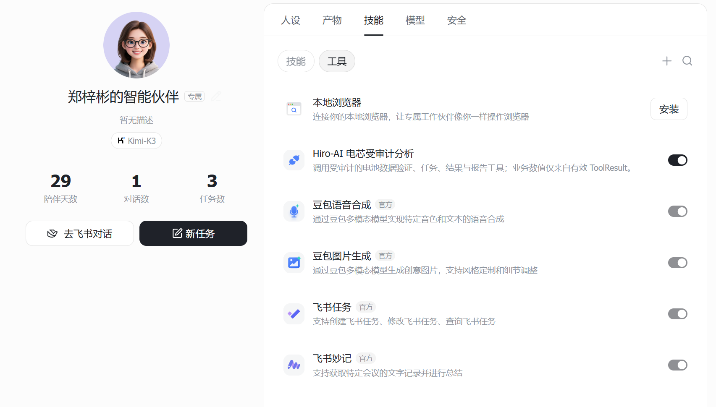
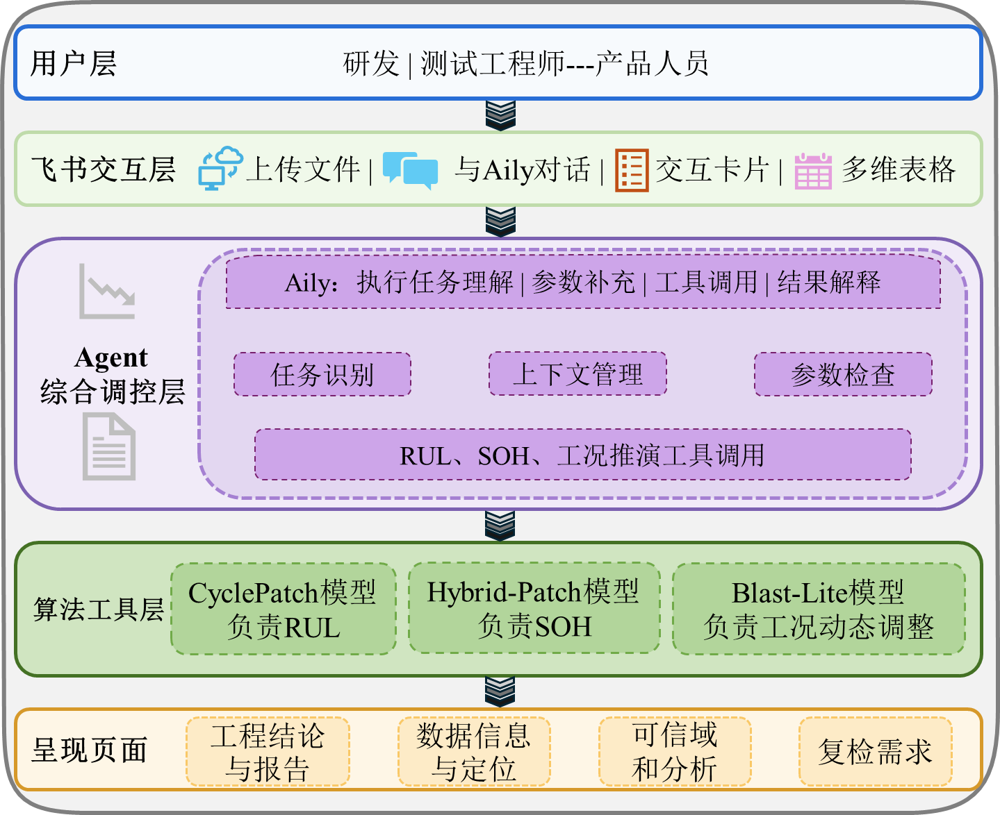
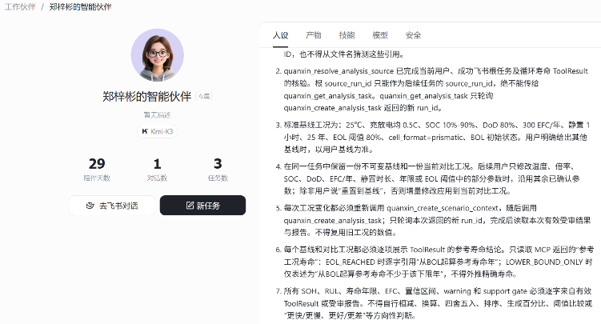
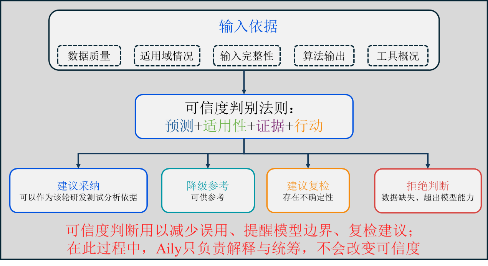

# Hiro

> 面向新能源装备产业的储能电芯寿命预测与退化感知决策引擎


Hiro 将早期循环数据、深度学习模型、物理参考情景和飞书协作组织成一条可追溯的电芯分析链。工程师上传 CSV 后，系统完成数据校验、循环寿命与 RUL 预测、有限时域 SOH 轨迹、工况对比、可信度判别，并将同一份受审结果交付到飞书卡片、报告、多维表格和 Aily。

> LLM 只负责理解、编排和解释。SOH、RUL、区间、阈值比较和工况寿命等业务数值只能来自版本化数值工具生成的有效 `ToolResult`。

<p align="center">
  
</p>

## 核心能力

| 环节 | Hiro 提供的能力 |
| --- | --- |
| 数据接入 | 自描述 CSV 字段映射、单位与周期完整性检查、附件 SHA-256 和稳定数据身份 |
| 寿命预测 | CyclePatch 系列模型输出总循环寿命与剩余循环，HybridPatch 输出有限时域 SOH 轨迹 |
| 工况推演 | BLAST-Lite 按温度、倍率、SOC、DoD、EFC 和静置时间比较参考情景 |
| 可信度 | 结合预测证据、适用域、校准状态和输入完整性，输出采纳、降级、复检或拒绝 |
| 协作闭环 | 飞书机器人、Aily MCP、受审卡片、曲线、报告、多维表格和复检动作 |

## 工作流程

```text
飞书上传 CSV
  -> 确定性字段映射与数据校验
  -> CyclePatch RUL / HybridPatch SOH
  -> BLAST-Lite 参考工况
  -> ToolResult / AuditLedger
  -> 卡片、曲线、报告、Bitable
  -> Aily 查询、参数调整与复检
```

工况修改支持一次改变一个或多个参数。服务端继承未修改字段并原子校验完整新工况；任一字段无效时，不创建部分结果，也不覆盖历史上下文。

## 系统架构

<p align="center">
  
</p>

系统分为五层：

1. 飞书、Aily、Next.js 和 API 提供用户入口。
2. 数据治理层完成来源校验、字段规范化、按 `cell_id` 隔离和支持域检查。
3. 数值工具层封装 RUL、SOH、Conformal 与 BLAST-Lite，不向 LLM 暴露模型制品路径。
4. Agent 层只做任务识别、参数收集、工具编排和结果解释。
5. AuditLedger 统一约束卡片、曲线、报告和 Bitable 的数值来源。

完整边界见 [架构说明](ARCHITECTURE.md) 和 [系统总体设计](docs/architecture/system-overview.md)。

## 快速体验

### 环境要求

- Python `>=3.11,<3.12`
- Docker Desktop 与 Docker Compose，用于完整运行时
- Node.js 24 与 `pnpm@10.28.1`，仅在独立开发前端时需要

### 1. 创建 Python 环境

Windows PowerShell：

```powershell
py -3.11 -m venv .venv
.\.venv\Scripts\Activate.ps1
python -m pip install --upgrade pip
python -m pip install -e ".[api]"
```

Linux：

```bash
python3.11 -m venv .venv
source .venv/bin/activate
python -m pip install --upgrade pip
python -m pip install -e ".[api]"
```

### 2. 启动无真实凭证的飞书 Sandbox

```powershell
python scripts/run_fake_feishu_sandbox.py --host 127.0.0.1 --port 8765
```

该入口只模拟飞书 OpenAPI，用于检查卡片、文件和 Bitable 请求，不会连接真实租户，也不会自行生成模型结果。

### 3. 启动完整本地运行时

完整运行时由 PostgreSQL、Redis、FastAPI、Celery Worker、Next.js 和 Nginx 组成。运行目录、模型制品、密钥模板以及飞书/Aily override 的准备步骤见 [运行与部署指南](docs/runtime-setup.md)。

```powershell
$RuntimeRoot = "D:\HiroRuntime"
powershell -ExecutionPolicy Bypass -File scripts\local\prepare_runtime.ps1 -RuntimeRoot $RuntimeRoot
.\.venv\Scripts\python.exe scripts\local\prepare_assets.py --target "$RuntimeRoot\runtime"
docker compose --env-file "$RuntimeRoot\compose\local.env" `
  -f deploy/local.compose.yaml `
  -f deploy/competition.feishu-aily.override.yaml `
  -f deploy/competition.aily-mcp.override.yaml `
  up -d --build
```

首次启动前必须完成私有环境文件、数据库密钥、模型制品和 route 授权配置。模板不包含真实 Secret。

## 飞书与 Aily

Hiro 已在目标飞书租户完成 CSV 回调、RUL、有限时域 SOH、25 摄氏度/35 摄氏度参考工况、受审卡片、曲线、报告和 Bitable 交付。Aily 通过受保护的 MCP HTTPStreaming 端点按“电芯 ID | cutoff-N”解析用户获授权的任务，不要求用户填写内部 UUID。

<table>
  <tr>
    <td width="50%"></td>
    <td width="50%"></td>
  </tr>
</table>

接入说明：

- [飞书与 Aily 模型工具联动](docs/integrations/feishu-aily-model-tools.md)
- [Aily MCP HTTPStreaming](docs/integrations/aily-mcp-httpstreaming.md)
- [Aily MCP 系统提示词](docs/integrations/aily-mcp-system-prompt.md)

## 已验证模型证据

正式 MATR Advanced Final 覆盖 4 个 cutoff、4 条模型路线和 5 个随机种子，共 80 次冻结运行。

| 任务 | 模型与输入 | MAE | RMSE | 其他指标 |
| --- | --- | ---: | ---: | --- |
| MATR 官方 cycle life | CyclePatch Direct，前 150 cycles | 98.19 cycles | 122.49 cycles | MAPE 12.62%，R2 0.8656，15%-Acc 64.44% |
| 有限时域 SOH | HybridPatch-v2，前 20 cycles，预测至 cycle 500 | 1.281 SOH 百分点 | 2.700 SOH 百分点 | 单调违规率 0% |

这些数字来自冻结实验报告，不是 README 示例值，也不代表企业目标电芯的工业寿命承诺。完整五种子结果、逐电芯输出、区间覆盖和 SHA-256 证据见 [Benchmark](docs/benchmark.md)、[模型卡](docs/model-card-advanced.md) 与 [可复现性](docs/reproducibility.md)。


## 可信度与使用边界

<p align="center">
  
</p>

- MATR 模型只在已登记数据协议和已激活 route 内签发 RUL/SOH 结果。
- BLAST-Lite 是大型方形 LFP/石墨参考情景，不是 MATR 电芯自然年换算，也不是产品寿命承诺。
- 小 calibration 队列、域外输入、缺失字段和制品哈希异常必须显式警告或拒绝。
- PyBaMM 仅用于短时滚动物理核验，不制造长期退化标签。
- 临时 Quick Tunnel 只用于受控演示，不具备生产 SLA。

更多限制见 [已知限制](docs/limitations.md) 和 [项目状态](docs/status.md)。

## 仓库结构

```text
src/quanxin_life/   Python 领域模型、工具、Agent、审计与飞书集成
frontend/           Next.js 项目门户
deploy/             本地与竞赛 Compose、API/Worker 入口和 Nginx
migrations/         Alembic 数据库迁移
configs/            数据源、模型视图和训练任务矩阵
scripts/            数据治理、训练、部署和演示入口
reports/            已登记实验摘要与证据
docs/               架构、算法、API、部署、集成和参考协议
```

完整文档索引见 [docs/README.md](docs/README.md)。

## 质量门禁

```bash
python -m ruff check .
python -m mypy
python -m compileall -q src deploy migrations
python -m pip check
```

前端：

```bash
cd frontend
pnpm lint
pnpm typecheck
pnpm build
```

根目录测试代码作为本地维护材料，不随 Git 分发。静态门禁、历史内部回归和受控演示证据不能替代企业数据校准、长期运行或现场安全验收。

## License

仓库代码、模型、数据、字体和第三方组件的权利边界并不相同。使用或再分发前请阅读 [许可证策略](LICENSE_POLICY.md) 与 [第三方声明](THIRD_PARTY_NOTICES.md)。当前仓库没有通过单一开源许可证授予全部内容的统一再许可权。
