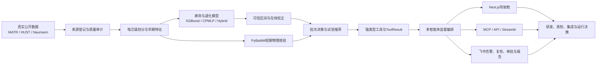

# 泉芯智寿

> **面向新能源装备产业的多智能体协同储能电芯寿命预测与退化感知决策系统**

泉芯智寿面向储能电芯“试验周期长、工况差异大、早期信息有限、模型结论难以直接进入研发决策”的行业问题，将真实电芯数据治理、早期寿命预测、单调退化轨迹、可信区间、在线校正、主动试验、短期物理核验和多智能体协同组织为一条可训练、可恢复、可审计、可交付的AI工程链。

项目以三批MATR公开电芯数据和单卡A100真实训练为算法主线，以Naumann工况试验和PyBaMM短期边界核验增强研发决策，以强类型工具、`ToolResult`证据链和专业智能体将数值能力连接到FastAPI、Next.js、Streamlit、MCP、工业接口与飞书协同空间。

## 项目价值

电芯寿命研发不是单一回归问题，而是从数据可信度、跨工况泛化、不确定性、持续更新到试验与应用决策的系统工程。泉芯智寿将这些环节统一起来：

| 产业问题 | 泉芯智寿的AI解法 | 形成的工程价值 |
| --- | --- | --- |
| 完整寿命试验耗时长 | 使用早期20/50/100/150循环预测官方cycle-life和后续退化轨迹 | 提前形成研发判断和复检优先级 |
| 数据格式、单位和协议不统一 | 来源清单、SHA-256、Canonical Schema、质量审计和电芯级划分 | 建立可复现的数据资产底座 |
| 单点预测难以支撑决策 | Split/Normalized Conformal输出覆盖率与区间宽度 | 将模型置信程度显式纳入决策 |
| 新循环到达后模型结论容易失效 | 冻结全局模型并更新电芯个体退化参数 | 形成持续进化的寿命认知 |
| 老化试验组合多、成本高 | Gaussian Process、信息增益和成本约束主动选点 | 优先安排更有价值的下一组试验 |
| 纯数据模型缺少物理边界 | PyBaMM SPMe短期工况响应与边界核验 | 为倍率、SOC和终止条件提供物理参考 |
| 算法结果难以进入团队协作 | 受约束智能体、可追溯报告、飞书任务与审批引用 | 把模型能力转化为可执行研发流程 |

面向济南新能源装备、储能系统集成和智能制造场景，项目可服务电芯研发、批次质量筛选、储能设备选型、质保评估、运行边界比较和梯次利用分级，形成可复制的“AI＋电池机理＋研发决策＋产业协同”示范。

## AI核心能力

### 1. 数据智能

- 对MATR、HUST和Naumann数据建立来源、论文、使用条件、下载时间和SHA-256清单。
- 统一电芯、循环、采样点、工况和标签语义，使用JSON元数据与Parquet数组发布内容寻址制品。
- 按 `cell_id` 完全隔离训练、验证、Conformal校准和测试集合。
- 自动检查字段、单位、时间、循环完整性、异常跳变、重复记录、缺失值和截断点未来信息泄漏。

### 2. 寿命与退化AI

- Dummy和Variance提供透明基线。
- XGBoost提供可解释的早期特征回归基线。
- CPMLP使用固定电压网格、显式缺失掩码和跨循环聚合学习早期曲线表征。
- 混合退化模型以正值趋势项和累计非负残差增量构造单调SOH轨迹，RUL只由轨迹首次跨越目标阈值派生。
- MATR官方 `cycle-life` 与统一 `EOL80` 目标严格分离，避免标签语义混用。

### 3. 可信与自适应AI

- Split/Normalized Conformal对预测区间进行独立校准并评价PICP与MPIW。
- 在线校正仅更新电芯个体偏置、退化速率和拐点参数，不在线改写全局模型。
- CORAL、DANN和目标域重校准组件服务跨数据集迁移与小样本适配。
- 每个模型、数据、特征、划分、校准队列和结果均拥有独立版本。

### 4. 主动试验AI

- 以温度、平均SOC、DOD和充放电倍率描述储能工况。
- 使用Gaussian Process同时输出退化指标预测均值和方差。
- 以“预期信息增益÷时间与设备成本”为核心选择下一组试验。
- 支持安全边界、设备能力、重复试验惩罚，以及随机、网格、最大方差和成本约束策略回放。

### 5. 物理核验AI

- 使用PyBaMM SPMe、Prada2013参数集和Experiment描述短期运行工况。
- 输出短期电压、电流、容量、SOC、终止原因和边界风险。
- 物理核验与寿命预测保持职责分离，不使用仿真曲线制造长期退化训练标签。

### 6. 多智能体协同

| 角色 | 核心职责 | 工具边界 |
| --- | --- | --- |
| 数据质检Agent | 检查Schema、质量、异常循环、划分和泄漏 | 只调用数据治理工具 |
| 寿命预测Agent | 组织寿命、轨迹、区间和在线校正 | 只消费登记模型与可信结果 |
| 物理核验Agent | 检查倍率、SOC、电压和终止边界 | 只调用短期PyBaMM工具 |
| 试验决策Agent | 推荐下一组老化试验并解释信息增益 | 只调用受约束候选与成本工具 |
| 监督器 | 校验来源、权限、域状态和人工复核条件 | 阻断无来源数字与越权调用 |

LLM负责理解任务、选择工具、组织证据和生成说明；SOH、RUL、区间、退化率、阈值比较及其他工程数字始终由版本化数值工具产生。

## 端到端系统闭环



系统不把多个仓库机械拼接为依赖集合，而是在独立单仓库中重新建立统一数据契约、模型边界、工具接口和审计链。FastAPI、Next.js、Streamlit、MCP和飞书只复用领域服务，不复制算法逻辑。

## 技术架构

```text
数据与制品层
  MATR / HUST / Naumann
  JSON + Parquet + SHA-256 + 内容寻址存储
          │
          ▼
数值智能层
  特征工程 ─ 寿命模型 ─ Conformal ─ 在线校正
      └──── 主动试验 ─ PyBaMM短期核验
          │
          ▼
可信工具层
  Tool Registry ─ ToolResult ─ Audit Ledger ─ Provenance
          │
          ▼
智能体与任务层
  LangGraph ─ 专业Agent ─ 监督器 ─ Celery异步任务
          │
          ▼
产品与协同层
  FastAPI ─ Next.js ─ Streamlit ─ MCP ─ MQTT/Modbus/EMS ─ 飞书
```

核心Python包采用3.11和 `src/quanxin_life` 布局。`ToolRegistry`负责强类型输入、角色白名单和统一结果契约；`AuditLedger`与 `JsonlAuditLedger`负责证据链；`FileSystemVerifiedEarlyCycleBatchStore`提供重启可恢复、读取时复验的本地批次存储。数据库层使用SQLAlchemy、Alembic、PostgreSQL与pgvector，任务与制品层面向Redis、Celery、MinIO和MLflow。

## 工程进展全景

### 已形成的可运行能力

- 三批MATR原始文件登记、HDF5安全读取、统一预处理、组合电芯划分和A100训练包。
- HUST ZIP静态安全审计、隔离opcode检查和Canonical数据接入边界。
- Naumann Excel/MAT显式布局适配与来源一致性校验。
- 容量、温度、内阻、协议、ΔQ(V)和曲线张量等早期特征。
- Dummy、Variance、XGBoost、CPMLP、单调混合退化、Conformal、CORAL/DANN和在线个体校正组件。
- 三批MATR单卡A100 Smoke/Final入口、验证早停、断点恢复、资源指标、JSONL/CSV/MLflow记录和安全制品。
- Gaussian Process主动试验、PyBaMM短期核验、批次决策和确定性报告工作流。
- 强类型工具注册、角色白名单、共享审计账本和数值来源防火墙。
- FastAPI项目、数据集、Agent运行、知识库与飞书事件接口；审核知识材料支持幂等向量索引、pgvector/BM25/reranker混合检索和整库显式降级。
- Next.js项目门户、Agent运行页、结果页与认证流程；HTTP-only Streamlit科研工作台；经官方客户端验收的MCP stdio与Streamable HTTP服务。
- 飞书签名回调、幂等事件回执、租约令牌、失败重试、引用卡片和数据库绑定。
- Python与前端质量门禁、数据库迁移检查、GitHub Actions和受控依赖配置。

### 当前重点推进

- 三批MATR在物理GPU 1上的A100 Smoke验收与正式五种子训练。
- 四个早期截断点、五类模型的训练、验证、测试和自动汇总。
- A100结果安全导入、实验登记、统一查询和模型制品追踪。
- 正式校准集上的Conformal评价与20→50→100→150在线校正回放。
- Celery、MLflow、MinIO、FastAPI领域工具和Next.js驾驶舱的数值贯通。
- 寿命轨迹、可信区间、主动试验热图、物理核验和审计页面。
- 飞书异常告警、复检任务、报告分发、人工审批与任务跟踪工作流。
- JSON、Markdown、PDF和Word报告统一导出。

### 下一阶段完整配置

- HUST安全Canonical Parquet、MATR→HUST零样本评价、CORAL、DANN和少样本重校准。
- Naumann Cycle/Calendar真实工况实验和多种主动采集策略对比。
- PyBaMM短期边界核验与寿命感知运行策略联动。
- 四专业Agent、监督器、多轮规划、人工确认、会话恢复和Agent可靠性评价。
- MQTT、Modbus、BMS/EMS模拟和飞书协同适配。
- PostgreSQL、pgvector、Redis、MinIO、MLflow、Mosquitto和Celery完整服务栈。
- 五种子消融、跨域、区间、在线更新、主动试验、Agent与端到端性能实验。
- 竞赛技术文档、架构图、实验表、演示视频和干净Docker环境断网复现。

## 快速开始

### 1. Python 3.11环境

Windows PowerShell：

```powershell
py -3.11 -m venv .venv
.\.venv\Scripts\Activate.ps1
python -m pip install --upgrade pip
python -m pip install -e ".[data,dev,ml,api,streamlit]"
```

Linux：

```bash
python3.11 -m venv .venv
source .venv/bin/activate
python -m pip install --upgrade pip
python -m pip install -e ".[data,dev,ml,api,streamlit]"
```

按使用场景增加高级能力：

```bash
python -m pip install -e ".[training,physics,agents,mcp,infrastructure,persistence,auth]"
```

可选依赖及版本范围以 [`pyproject.toml`](pyproject.toml) 为准。运行配置从 [`.env.example`](.env.example) 创建，凭证字段保持为空并由运行环境注入。

### 2. 基础FastAPI

[`deploy/foundation_api.py`](deploy/foundation_api.py) 提供健康检查、工具发现和统一工具调用入口：

```bash
python -m uvicorn deploy.foundation_api:app --host 127.0.0.1 --port 8000
```

访问：

```text
http://127.0.0.1:8000/health
http://127.0.0.1:8000/v1/tools
http://127.0.0.1:8000/docs
```

也可使用基础Compose：

```bash
docker compose -f deploy/compose.yaml up --build
```

## 三批MATR与A100真实训练

### 1. 准备三批数据

将以下三个来源已核验的MATLAB v7.3/HDF5文件放入 `data/`：

```text
data/
├── 2017-05-12_batchdata_updated_struct_errorcorrect.mat
├── 2017-06-30_batchdata_updated_struct_errorcorrect.mat
└── 2018-04-12_batchdata_updated_struct_errorcorrect.mat
```

对应原始清单位于：

- [`configs/data_manifests/matr_2017_05_12_batch_v1.json`](configs/data_manifests/matr_2017_05_12_batch_v1.json)
- [`configs/data_manifests/matr_2017_06_30_batch_v1.json`](configs/data_manifests/matr_2017_06_30_batch_v1.json)
- [`configs/data_manifests/matr_2018_04_12_batch_v1.json`](configs/data_manifests/matr_2018_04_12_batch_v1.json)

原始数据不进入Git；训练前会核验HDF5文件头、文件大小、路径和SHA-256。

### 2. 创建A100环境

A100服务器使用Conda Python 3.11.13、PyTorch 2.12和Linux哈希锁文件：

```bash
bash scripts/a100/create_env.sh
conda activate quanxin-a100
```

训练入口固定绑定物理GPU 1：

```text
CUDA_DEVICE_ORDER=PCI_BUS_ID
CUDA_VISIBLE_DEVICES=1
PyTorch内部设备=cuda:0
```

### 3. 预检与一键训练

```bash
bash scripts/a100/preflight.sh
bash scripts/a100/train_dataset.sh matr-three-batch smoke
bash scripts/a100/train_dataset.sh matr-three-batch final
```

Smoke使用单种子短配置验证数据、GPU、训练、验证、恢复、日志和制品链。Final自动运行四个截断点、五类模型和五个固定种子；任务顺序执行，已完成任务安全跳过，中断任务从最后有效检查点恢复。

正式运行持续记录：

```text
训练/验证损失
MAE / RMSE / MAPE / R²
学习率与最佳epoch
提前停止状态
耗时与GPU显存
JSONL / CSV / MLflow
安全模型制品与SHA-256
```

详细实施与服务器操作见：

- [A100真实训练与评价流水线](docs/superpowers/plans/2026-07-17-a100-real-training-evaluation-pipeline.md)
- [三批MATR A100实施计划](docs/superpowers/plans/2026-07-17-matr-three-batch-a100-implementation.md)

## 产品与协同入口

### Next.js正式驾驶舱

前端依赖入口为 [`frontend/package.json`](frontend/package.json)，固定使用 `pnpm@10.28.1`：

```bash
corepack enable
corepack prepare pnpm@10.28.1 --activate
pnpm --dir frontend install --frozen-lockfile
pnpm --dir frontend dev
```

访问 `http://127.0.0.1:3000`。门户覆盖登录、项目、数据集、Agent运行和可信结果详情，并通过FastAPI获取领域数据。

### Streamlit科研工作台

[`workbench/streamlit_app.py`](workbench/streamlit_app.py) 是HTTP-only算法与实验工作台：

```bash
python -m streamlit run workbench/streamlit_app.py
```

工作台与Next.js共享后端领域服务，不另建预测逻辑。

### MCP工具服务

MCP为可选能力：

```bash
python -m pip install -e ".[mcp]"

# 本机子进程传输
python scripts/run_mcp_host.py --transport stdio

# 本机 Streamable HTTP，客户端地址 http://127.0.0.1:8001/mcp
python scripts/run_mcp_host.py --transport streamable-http --host 127.0.0.1 --port 8001
```

[`scripts/run_mcp_host.py`](scripts/run_mcp_host.py) 提供真实stdio与Streamable HTTP入口，[`src/quanxin_life/tools/mcp_host.py`](src/quanxin_life/tools/mcp_host.py) 负责官方Host装配。MCP暴露的仍是经过白名单、版本和来源校验的共享工具，不允许客户端绕过领域服务；未鉴权HTTP端口不得直接暴露到公网。

### 工业接口

集成层提供明确标注的 REST、MQTT、Modbus BMS 协议沙箱和 EMS 决策出口。BMS 输入只接受原始容量观测与版本上下文，SOH 仍由共享工具计算；EMS 消息只解析审计账本中的 `make_batch_decision` 结果。入口统一位于：

```text
/v1/integrations/industrial/sandbox/
```

MQTT 主题固定为 `quanxin/v1/bms/{measurement_batch_id}`，Modbus 寄存器映射固定为 `quanxin-modbus-bms-v1`。这些能力用于无凭证条件下的协议和演示闭环，不代表生产 BMS/EMS 已接入；详细装配与边界见 [`docs/runtime-setup.md`](docs/runtime-setup.md)。

## 飞书研发协同

飞书是泉芯智寿的研发决策协同出口。当前安全底座位于：

```text
src/quanxin_life/integrations/feishu
src/quanxin_life/api/feishu.py
```

完整应用装配后接收：

```text
POST /v1/integrations/feishu/events
```

回调链提供：

- 时间戳、Nonce、SHA-256签名和验证Token检查；
- URL Verification与事件V2信封处理；
- 一兆字节请求上限和秘密安全错误响应；
- 数据库事件回执、原子认领、租约令牌、幂等路由和失败重试；
- `run_id`、`result_id`任务引用卡片；
- 飞书绑定、事件回执和审批记录的数据模型。

协同工作流围绕以下场景展开：

```text
模型或数据异常告警
→ 创建批次复检任务
→ 同步任务与实验状态
→ 分发可审计报告
→ 发起人工审批
→ 将审批结果回写Agent运行
```

飞书消息层只传递任务状态、对象引用和审批动作，不生成、复制或修改SOH、RUL、区间及退化率。`FEISHU_APP_ID`、`FEISHU_APP_SECRET`和回调验证材料不进入仓库，由秘密管理器或运行环境注入。

## 可信与可追溯

泉芯智寿以“每个正式数字都能找到来源”为可信基线：

1. 每个业务数字必须来自有效 `ToolResult`。
2. 结果绑定 `result_id`、工具版本、输入哈希和UTC创建时间。
3. 模型结果绑定数据、划分、特征、模型和代码版本。
4. 训练、验证、校准和测试电芯按 `cell_id` 完全隔离。
5. 未经来源核验不加载pickle、joblib、`.pt`或`.pth`。
6. 深度模型使用safetensors与严格架构/特征清单。
7. PyBaMM输出明确标记为短期仿真核验。
8. 缺测、域外、未校准和质量阻断均显式降级。
9. Agent不能修改工具数值，报告不能接收无来源数字。
10. 原始数据、密钥、凭证和未经登记模型不进入源码仓库。

## 质量门禁

Python：

```bash
python -m pytest -q
python -m ruff check .
python -m mypy
python -m compileall -q src workbench deploy
python -m pip_audit --progress-spinner off
```

前端：

```bash
pnpm --dir frontend lint
pnpm --dir frontend typecheck
pnpm --dir frontend test
pnpm --dir frontend build
```

本地提交门禁：

```bash
python -m pre_commit install
python -m pre_commit run --all-files
```

GitHub Actions分别执行Python与前端质量检查。数据、模型、Agent、API、迁移、飞书回调和浏览器关键路径均通过对应测试契约约束。

## 仓库结构

```text
Battery-energy-storage-zzb/
├── src/quanxin_life/
│   ├── data/            # 数据适配、质检、划分、存储与泄漏审计
│   ├── features/        # 早期循环与曲线张量特征
│   ├── models/          # 基线、CPMLP与混合退化模型
│   ├── uncertainty/     # Conformal校准与覆盖率评价
│   ├── adaptation/      # CORAL与DANN
│   ├── online/          # 个体在线校正
│   ├── experiments/     # GP主动试验与回放
│   ├── physics/         # PyBaMM短期核验
│   ├── decision/        # 批次入组、复检、降级和拒绝
│   ├── tools/           # Tool Registry、MCP与强类型工具
│   ├── agents/          # 专业Agent、监督器与状态图
│   ├── audit/           # 数值来源与审计账本
│   ├── api/             # FastAPI传输适配
│   ├── training/        # A100训练、评价、恢复与制品
│   ├── integrations/    # 飞书及工业接口
│   └── reporting/       # 审计报告
├── frontend/            # Next.js正式驾驶舱
├── workbench/           # Streamlit科研工作台
├── scripts/a100/        # A100环境、预检和一键训练
├── configs/             # 数据、训练、模型和策略配置
├── deploy/              # API容器和Compose入口
├── migrations/          # Alembic数据库迁移
├── tests/               # 单元、集成、泄漏、API与端到端测试
└── docs/                # 章程、协议、设计、计划和运行文档
```

## 典型应用场景

### 电芯研发

使用早期循环预测寿命与退化轨迹，比较模型不确定性，并根据工况覆盖和信息增益安排补充试验。

### 批次质量与复检

将数据质量、预测区间和审核策略组合为入组、复检、降级使用或拒绝决策，并生成可追溯报告。

### 储能装备集成

为电芯选型、质保评估、SOC窗口和倍率策略提供寿命证据与短期物理边界参考。

### 运行与梯次利用

吸收新增循环观测，持续更新个体退化参数，为运行策略比较和分级使用提供动态依据。

### 研发团队协同

通过Agent组织分析任务，通过Next.js查看证据，通过飞书接收告警、报告、复检和审批引用，使数据科学、测试、质量和管理角色共享同一结果链。

## 文档导航

- [项目章程](PROJECT_CHARTER.md)
- [系统架构](ARCHITECTURE.md)
- [数据契约](DATA_CONTRACT.md)
- [实验协议](EXPERIMENT_PROTOCOL.md)
- [完成定义](DEFINITION_OF_DONE.md)
- [运行指南](docs/runtime-setup.md)
- [最高配置完整实施计划](docs/superpowers/plans/2026-07-12-quanxin-zhishou-full-implementation.md)
- [A100真实训练与评价计划](docs/superpowers/plans/2026-07-17-a100-real-training-evaluation-pipeline.md)
- [CPMLP独立实现说明](docs/cpmlp-implementation-note-v1.md)
- [许可证策略](LICENSE_POLICY.md)
- [第三方声明](THIRD_PARTY_NOTICES.md)

泉芯智寿以真实数据、真实训练、可信数值和可审计协作为核心，把电芯寿命预测从单一算法推进为面向新能源装备产业的AI研发决策系统。
