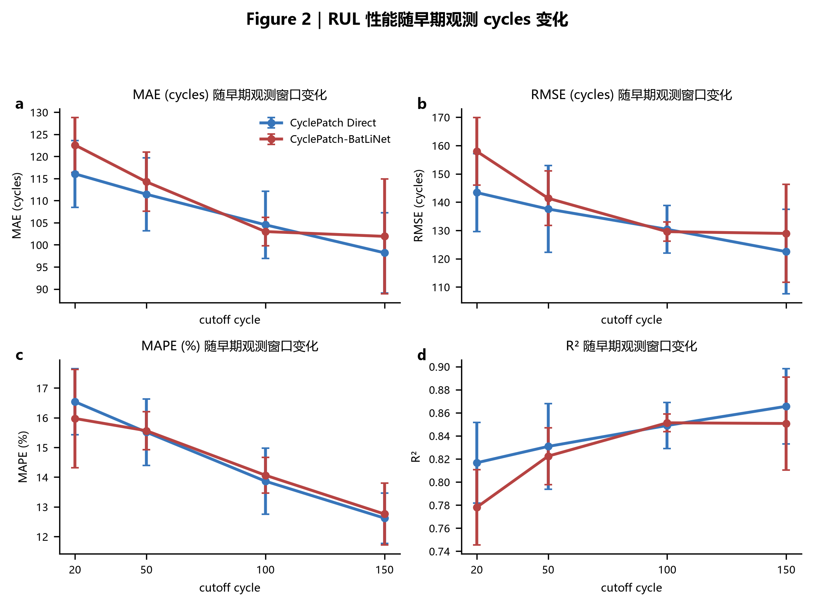
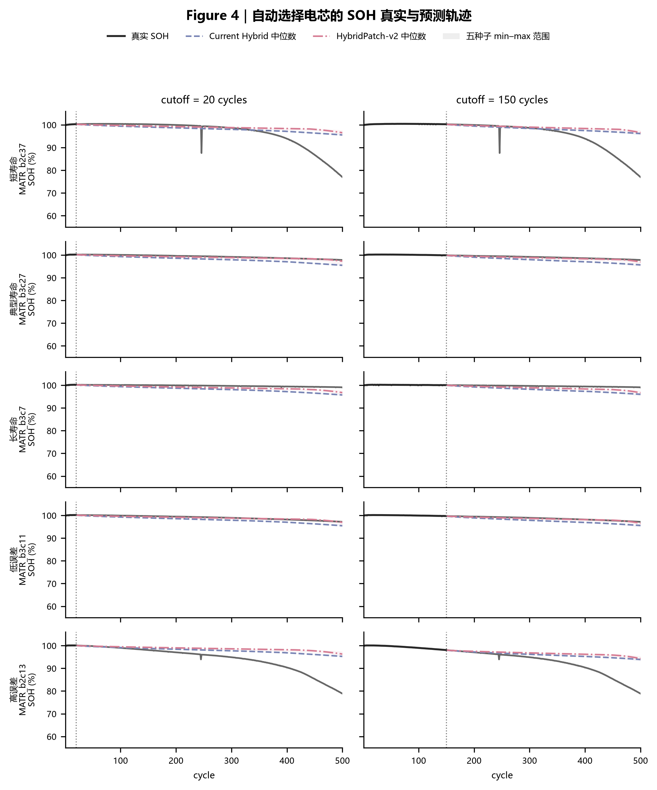
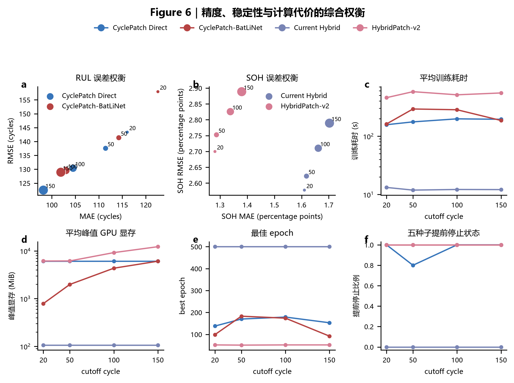

# 算法原理与证据边界

本页解释当前 Advanced 主线如何从早期充放电曲线得到 MATR 官方 cycle-life
预测和有限时域 SOH 轨迹，并说明模型选择、Split Conformal、正式实验与运行时
拒绝条件。它是算法入口，不替代逐项协议、模型卡或正式 Benchmark。

一句话结论是：

> 在冻结的 MATR 三批、按 `cell_id` 隔离的实验协议内，CyclePatch 系列学习早期
> 循环的时序演化以预测官方 cycle life，Hybrid 系列在 cycle 500 的真实监督边界内
> 预测结构单调的 SOH 轨迹；80 次 A100 Final 和独立 calibration/test 证据支持这些
> 条件化结论，但不支持跨数据集泛化、企业寿命承诺或“单一模型全面胜出”。

## 1. 术语与任务口径

| 术语 | 本项目中的固定含义 |
| --- | --- |
| `cutoff` | 模型可见的最后一个早期循环，取 20、50、100 或 150 |
| RUL 目标 | MATR 官方 cycle life；点预测为总寿命周期，`RUL = 预测总寿命 - cutoff` |
| SOH 目标 | cutoff 之后的真实容量派生 SOH 轨迹，输出不超过 cycle 500 |
| Split Conformal | 使用独立 calibration 电芯残差构造有限样本预测区间或轨迹带 |
| active route | 经人工审批后，某任务、cutoff 和业务角色当前允许使用的具体制品 |
| Advanced artifact v2 | 自包含架构、特征上下文、标准化统计、权重及逐文件 SHA-256 的制品 |

RUL 与 SOH 是两条独立数值链。Advanced RUL 不从 SOH 的阈值穿越反推，也不把
MATR 官方 cycle life 改写成统一 EOL80。SOH 没有观察到 cycle 500 之后的监督时，
系统不会插值或外推长期标签。

正式实验使用 MATR 2017-05-12、2017-06-30 和 2018-04-12 三批数据，共 140 个
电芯；固定划分为 train 82、validation 19、calibration 12、test 27。RUL 有
138 个官方标签，SOH test 有 25 个满足有限轨迹条件的电芯。所有划分以
`cell_id` 为最小隔离单位，禁止按周期行随机切分。

详细数据、指标和边界见：

- [Advanced Benchmark](../benchmark.md)
- [Advanced 模型卡](../model-card-advanced.md)
- [可复现性](../reproducibility.md)
- [已知限制](../limitations.md)

## 2. 共同早期循环表示

CyclePatch Direct、CyclePatch-BatLiNet 和 HybridPatch-v2 共享受治理的
CyclePatch 编码器。单个批次张量形状为：

```text
[batch, cycle, phase=2, sample=150, variable=3]
```

其中两个 phase 分别编码充电和放电曲线；每个 phase 使用卷积核 3、5、7 的
多尺度一维卷积分支。缺测样本通过 `sample_mask` 进入掩码池化，缺测循环通过
`cycle_mask` 从注意力和汇总中排除，而不是补造观测值。

编码器随后融合三类信息：

1. 单循环的充放电 PhasePatch 表示；
2. 真实 cycle 位置和可学习位置编码；
3. 工况值及其显式缺测掩码。

融合后的循环 token 由 masked Transformer 建模跨循环演化。最终表示不是简单平均：
模型将 `CLS` token 与注意力加权的循环汇总通过可学习门控融合。这个结构使循环顺序、
真实位置和工况进入模型，避免将早期循环仅视为无序曲线集合。

权威实现：

- [`models/cyclepatch.py`](../../src/quanxin_life/models/cyclepatch.py)
- [`features/early_cycle_sequence.py`](../../src/quanxin_life/features/early_cycle_sequence.py)

## 3. RUL：CyclePatch Direct

CyclePatch Direct 在共享编码器后接一个标量回归头。训练标签仅使用 train 电芯拟合
标准化器；模型输出标准化 cycle life，评估和服务阶段再通过绑定的标准化统计恢复为
MATR 官方 cycle 数值。

训练目标为 Smooth L1：

\[
\mathcal{L}_{direct}
=
\operatorname{SmoothL1}(\hat{z}, z),
\]

其中 \(z\) 是由 train cohort 统计量标准化后的官方 cycle life。优化器使用 AdamW，
学习率按验证结果由 `ReduceLROnPlateau` 调整，并执行梯度范数裁剪。验证与测试指标在
逆标准化后的原始 cycle 单位计算。

这个分支直接优化点预测精度，结构简单且在本次 Final 中取得最低的平均
MAE、RMSE 和 MAPE，但“平均值最低”不等于相对 BatLiNet 具有统计显著的全面优势。

## 4. RUL：CyclePatch-BatLiNet

CyclePatch-BatLiNet 复用同一 CyclePatch 编码器，并加入只从 train 电芯构建的冻结
参考库。参考库与标准化统计、训练 cell 集、训练标签、随机种子和制品 SHA-256
共同绑定，validation、calibration 和 test 标签不能进入参考库。

对目标嵌入 \(h_i\) 和参考嵌入 \(r_j\)，pair head 使用：

\[
[h_i-r_j,\; |h_i-r_j|,\; h_i\odot r_j]
\]

预测标准化寿命差 \(\widehat{\Delta}_{ij}\)。推理时，将各参考寿命与预测差相加，
取参考估计的中位数，再与 direct head 按冻结的 `fusion_alpha` 融合：

\[
\hat z_i
=
\alpha \hat z_i^{direct}
+
(1-\alpha)\operatorname{median}_j
\left(z_j^{ref}+\widehat{\Delta}_{ij}\right).
\]

训练损失包含 direct Smooth L1、pairwise Smooth L1 和可选排序项：

\[
\mathcal{L}_{BatLiNet}
=
\mathcal{L}_{direct}
+\lambda_{pair}\mathcal{L}_{pair}
+\lambda_{rank}\mathcal{L}_{rank}.
\]

该分支的价值是引入训练电芯间的相对寿命证据。它不代表外部知识检索，也不能在
服务阶段读取未登记路径或测试标签。

权威实现：

- [`models/batlinet.py`](../../src/quanxin_life/models/batlinet.py)
- [`training/advanced_tasks.py`](../../src/quanxin_life/training/advanced_tasks.py)

## 5. SOH：Current Hybrid

Current Hybrid 是带强结构先验的有限轨迹基线。它把初始 SOH 减去四类非负退化：

\[
\hat s(t)
=
s_0
-
\left[
a\sqrt{t}
+bt
+c\operatorname{ReLU}(t-\tau_k)^2
+\sum_{\tau\le t}\Delta r_\tau
\right].
\]

平方根项、线性项、knee 加速项和累计非负残差共同保证预测轨迹不会长期回升。
输出限制在 `[0, 1.5]`。当前实现中的趋势与残差尺度包含固定缩放常数，因此它应被
理解为 MATR 条件下的结构基线，而不是跨化学体系已经验证的通用退化定律。

权威实现：

- [`models/hybrid_degradation.py`](../../src/quanxin_life/models/hybrid_degradation.py)
- [Hybrid 退化协议](../hybrid-degradation-protocol-v1.md)

## 6. SOH：HybridPatch-v2

HybridPatch-v2 将共享 CyclePatch 时序表示与结构单调解码器结合：

```text
早期充放电序列
→ CyclePatch token memory
→ 工况自适应 LayerNorm
→ 退化 query / masked summary
→ 正参数结构解码器
→ cutoff+1 … cycle 500 的 SOH
```

解码器对平方根、线性、knee 和残差幅度使用 `softplus`，knee 位置使用
`sigmoid`。残差速率为非负值并按真实 cycle 间隔累计，因此未裁剪的退化总量也单调
不减。输出最终限制在 `[0, 1.5]`。

训练目标包含：

\[
\mathcal{L}
=
\mathcal{L}_{trajectory}
+\lambda_h\mathcal{L}_{history}
+\lambda_s\mathcal{L}_{smooth}
+\lambda_o\mathcal{L}_{order}
+\lambda_r\mathcal{L}_{residual}.
\]

- `trajectory`：未来真实 SOH 的 masked Smooth L1；
- `history`：已观察早期轨迹的重建约束；
- `smooth`：按真实 cycle 间隔计算的二阶斜率变化；
- `order`：相邻预测上升的惩罚；
- `residual`：残差增量正则化。

结构单调性与 order loss 是两层不同约束：前者限制解码器可表达的轨迹，后者保留为
训练诊断。HybridPatch-v2 在本次实验中平均 MAE 较低，但 RMSE 和尾部电芯误差高于
Current Hybrid，因此当前采用双路由，而不是宣布唯一 SOH 冠军。

权威实现：

- [`models/hybridpatch_v2.py`](../../src/quanxin_life/models/hybridpatch_v2.py)
- [`training/matr_data.py`](../../src/quanxin_life/training/matr_data.py)

## 7. Route-specific Split Conformal

Conformal 不训练预测模型，也不由 LLM 生成区间。它只使用与当前 active route
身份完全一致、且与目标电芯隔离的 calibration ToolResult。

### RUL 区间

对 calibration 电芯计算绝对残差：

\[
e_i=|y_i-\hat y_i|.
\]

对 \(n\) 个残差使用有限样本秩
\(\lceil(n+1)(1-\alpha)\rceil\) 取得 \(q\)，签发：

\[
\left[
\max(cutoff,\hat y-q),\;
\hat y+q
\right].
\]

当 calibration 数量无法支持所请求覆盖率时，系统直接拒绝，不通过截断秩虚标覆盖
保证。区间下界不得早于 cutoff。

### SOH 同时轨迹带

每个 calibration 电芯使用整条有限轨迹上的最大绝对误差：

\[
e_i^{traj}
=
\max_t|\hat s_i(t)-s_i(t)|.
\]

相同有限样本秩得到半径 \(q_{soh}\)，并对整条目标轨迹签发同时带：

\[
[\max(0,\hat s(t)-q_{soh}),\;\min(1.5,\hat s(t)+q_{soh})].
\]

这不是每个 cycle 独立覆盖的声明。RUL 与 SOH calibration 都要求精确匹配
project、task、cutoff、route role、candidate、artifact、数据版本、split 版本和
输入身份；目标 `cell_id` 不能属于 calibration cohort。

权威实现：

- [`application/advanced_split_conformal.py`](../../src/quanxin_life/application/advanced_split_conformal.py)
- [Conformal 校准工具协议](../conformal-calibration-tool-protocol-v1.md)
- [区间签发协议](../conformal-interval-issuance-protocol-v1.md)

Normalized Conformal 已作为实验候选评估，但在当前五种子分歧尺度下未稳定改善
覆盖—宽度权衡，因此不能自动替换 Advanced 主线的 Split 基线。

## 8. 正式实验与图件证据

正式矩阵为：

```text
4 个模型 × 4 个 cutoff × 5 个随机种子 = 80 次 A100 Final
```

误差棒统一表示五个随机种子的 `mean ± sample SD`。RUL 指标按逐电芯预测聚合；
SOH 指标按逐轨迹点聚合。训练、验证、测试、calibration 的统计角色分开，模型选择不
读取 test 反馈。

### RUL 随观测窗口变化



随着可见早期循环从 20 增加到 150，两个 RUL 分支的 MAE、RMSE 和 MAPE 总体下降。
当前最低平均 MAE 为 CyclePatch Direct、cutoff 150 的 98.19 cycles；对应 RMSE
122.49 cycles、MAPE 12.62%、R² 0.8656。Direct 与 BatLiNet 的逐电芯配对区间
跨过零，因此这里报告平均差异，不表述为统计显著全面胜出。

[图源数据：五种子汇总](../source-data/advanced-final-20260723/Figure_2_rul_cutoff_performance__five_seed_summary.csv)

### SOH 代表电芯轨迹



案例由短寿命、典型寿命、长寿命、低误差和高误差规则自动选择，不是人工挑选漂亮
样本。实线为五种子中位数，色带为五种子的最小—最大范围，**不是 Conformal
预测区间**。图中同时保留高误差样本，用于暴露远期和批次相关的失败模式。

- [案例选择表](../source-data/advanced-final-20260723/Figure_4_soh_trajectory_examples__selected_cells.csv)
- [五种子轨迹汇总](../source-data/advanced-final-20260723/Figure_4_soh_trajectory_examples__trajectory_summary.csv)

### 精度、稳定性与训练资源



这张图用于选择受约束业务角色，而不是寻找“所有维度唯一冠军”。Current Hybrid
训练快且显存低；HybridPatch-v2 的平均 SOH MAE 更低但训练代价和尾部误差更高；
RUL 的 Direct 与 BatLiNet 也存在点精度、coverage 和资源之间的权衡。图中的耗时是
本次 A100 **训练耗时**，不能冒充线上单样本推理延迟。

[图源数据：资源与误差汇总](../source-data/advanced-final-20260723/Figure_6_model_tradeoff__resource_summary.csv)

全部公开图件和 CSV 的来源、行数、字节数与 SHA-256 记录在
[清洗后的证据清单](../assets/benchmark/advanced-final-20260723/manifest.json)。

## 9. 结果解释与当前路由

| 任务 | 当前证据 | 解释边界 |
| --- | --- | --- |
| RUL 点精度 | Direct-150 获得最低平均 MAE/RMSE/MAPE | 不支持相对 BatLiNet 的统计显著全面胜出 |
| RUL coverage | 不同 cutoff 由 Direct 或 BatLiNet 承担 `COVERAGE` | cutoff 100 的候选未达到目标 90% PICP |
| SOH 平均误差 | HybridPatch-v2 四个 cutoff 的 MAE 较低 | RMSE 和尾部风险未同步改善 |
| SOH 尾部/效率 | Current Hybrid 的 RMSE、尾部误差和资源成本较低 | 固定缩放与 clamp 具有数据集依赖 |
| 单调性 | 两条 SOH 模型在正式测试中单调违规率均为 0 | 不等于跨域物理有效性已被证明 |

所有 promotion 结果是 `CONDITIONAL` 候选，需要管理员审批后才成为 active route。
业务调用还必须解析精确 route、验证 artifact v2、取得唯一 `READY` calibration
materialization，并把数值写入可追溯 `ToolResult`。模型得分不能直接越过这些门禁
进入 UI 或报告。

## 10. 已知失败模式

当前证据明确暴露了以下限制：

- 长寿命电芯的 RUL 误差和种子波动较大；
- SOH 远期 201–350 cycles 的误差增大；
- 2017-06-30 批次的 SOH 表现较弱；
- 12 个 calibration 电芯对 90%/95% 覆盖评价过小；
- RUL calibration 当前拒绝右删失电芯，尚不是 survival-aware conformal；
- 尚无 HUST 零样本外部验证或企业域重校准证据；
- A100 训练耗时和峰值显存不能替代线上 CPU 推理延迟与吞吐测量。

因此当前算法适用于 MATR 同协议研究、比赛展示和受控辅助分析；不适用于未经重校准
的外部域、质保赔付、安全关键控制或无人审批的批次放行。

## 11. 复现与安全制品

正式结果索引记录：

```text
operations: 80
indexed files: 2654
safetensors files: 897
RUL test rows: 1080
SOH trajectory rows: 500000
source commit: 232d9fc8957bb547ca2b80205802f377864e982b
output SHA-256: d201224870a28c655f66a810bc94f90ad28133e06f2fb4a7285195274c303d82
```

运行时只接受 safetensors、JSON、Parquet 及逐文件 SHA-256 完全匹配的 artifact v2。
pickle、joblib、`.pt`、`.pth`、路径逃逸、符号链接、未登记绝对路径和被新路由淘汰
的 calibration evidence 均被拒绝。

公开仓库只保存本页使用的轻量 PNG 与聚合 source data；完整权重、逐运行日志、
600 dpi TIFF 和完整结果包不进入 Git。复现链和本地 CPU/A100 浮点差异见
[可复现性](../reproducibility.md)。
