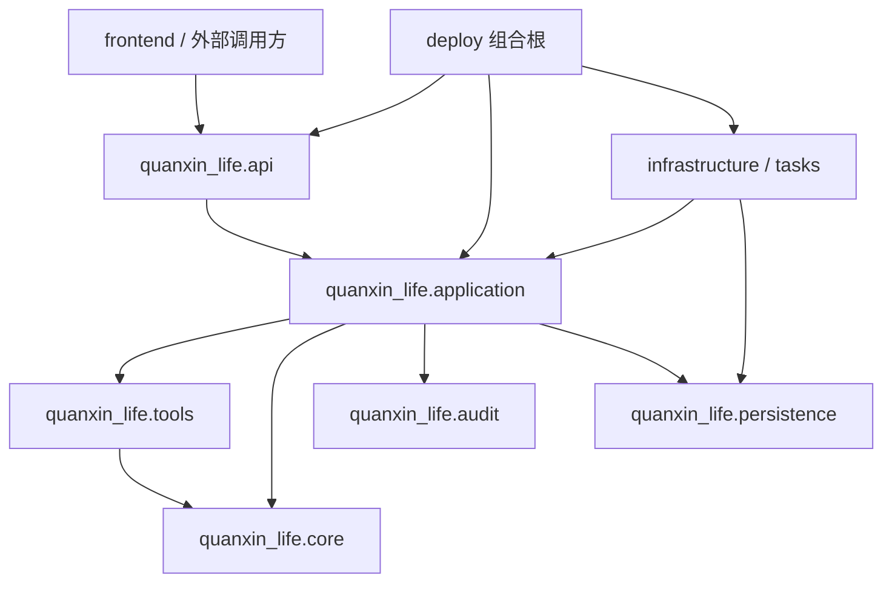

# 模块设计

更新时间：2026-07-28。

本文从代码组织、依赖方向和关键交互说明系统模块。系统总体目标见
[系统总体设计](system-overview.md)，安全和信任边界见
[架构说明](../../ARCHITECTURE.md)。

## 1. 设计原则

1. `quanxin_life.core` 是公共语义源，其他层不得另造等价 DTO；
2. 数值只能由注册工具产生，LLM、API、UI 和报告不得自行计算；
3. Application 层只协调领域能力，不依赖 FastAPI 请求对象；
4. 基础设施由组合根显式注入，核心导入不连接数据库、网络或加载权重；
5. 浏览器和消息队列只传身份，服务端重建路径、哈希、路由和依赖；
6. 跨多个表的结果登记必须在同一数据库事务中完成。

## 2. 依赖方向



`deploy` 可以了解全部适配器并完成组装；领域模块不能反向导入部署入口。

## 3. 顶层模块职责

| 模块 | 责任 | 主要输入/输出 | 当前成熟度 |
| --- | --- | --- | --- |
| `core` | 公共枚举、Pydantic 契约、哈希和错误语义 | `ToolResult`、`ProvenanceRecord` 等 | Validated |
| `data` | Canonical schema、安全读取、来源和质量约束 | 版本化数据与清单 | Validated（MATR） |
| `features` | 早期循环特征、曲线网格和 mask | 特征表、曲线张量 | Validated（正式实验） |
| `models` | 基线、RUL 和 SOH 模型定义 | 模型预测 | Validated（指定模型） |
| `training` | 训练编排、checkpoint 和 Final 输出 | artifact、日志、指标 | Validated（A100 Final） |
| `uncertainty` | Split/Normalized Conformal | 区间与覆盖证据 | Validated（MATR） |
| `tools` | 唯一业务数值执行边界 | 项目级 `ToolResult` | Validated |
| `application` | 项目、路由、物化、Agent 和装配服务 | 领域记录与工作流 | Validated |
| `audit` | 结果验证、项目绑定和原子登记 | ledger receipt | Validated |
| `persistence` | SQLAlchemy 模型、事务和 migration | PostgreSQL 记录 | Validated（测试） |
| `agents` | 角色、计划和执行策略 | 持久 AgentStep | Validated |
| `tasks` | Celery task 入口 | 仅 identity 消息 | Validated |
| `infrastructure` | Redis/Celery、对象存储等适配器 | 外部服务边界 | 部分 Validated |
| `api` | 认证、授权、HTTP 契约和错误映射 | JSON/文件响应 | Validated |
| `reporting` | 从账本渲染审计报告 | Markdown/PDF/DOCX | Validated |
| `integrations` | MCP、飞书、BMS/EMS 等扩展 | 外部协议 | 沙箱/Planned |

“模块存在”不等于“目标环境已部署”。实时状态以
[项目状态](../status.md)为准。

## 4. 核心契约

### ToolResult

`src/quanxin_life/core/schemas.py` 中的 `ToolResult` 至少包含：

- `result_id`；
- `tool_name` 与 `tool_version`；
- `model_version`、`data_version`、`feature_version`；
- canonical `input_hash`；
- `values`、可选 `uncertainty` 和 `warnings`；
- 一个或多个 `ProvenanceRecord`；
- 带时区并归一到 UTC 的 `created_at`。

契约 `extra="forbid"`，数值结构必须可进行 canonical JSON 哈希。

### 项目身份

项目级调用以 `project_id`、`record_batch_id`、`agent_run_id` 和 `result_id` 连接。
API 不允许客户端提交模型绝对路径、checkpoint 哈希或 calibration 样本数组。

### 路由身份

Advanced route 至少由以下坐标组成：

```text
task + cutoff + role + candidate + representative seed + artifact
```

RUL 角色包括 `POINT_ACCURACY / COVERAGE`，SOH 角色包括
`MEAN_ACCURACY / TAIL_EFFICIENCY`。不同角色可以选择不同制品。

## 5. Application 子模块

| 子模块 | 作用 | 关键不变量 |
| --- | --- | --- |
| `projects.py` | 项目生命周期与成员可见性 | 非成员不能读取项目 |
| `invocation_context.py` | 统一验证项目、会话和调用身份 | 非活动项目、撤销会话失败关闭 |
| `record_batch_bindings.py` | 将受控 early-cycle batch 绑定到项目 | 只引用已验证 batch |
| `model_artifact_catalog.py` | 导入和列出受管 artifact v2 | 清单、上下文和 SHA-256 一致 |
| `model_route_activation.py` | 激活、回退和读取 stream head | 历史只追加，不覆盖 |
| `advanced_runtime.py` | 解析当前 route 对应运行时 | 不信任客户端缓存 |
| `advanced_prediction.py` | target-aware RUL 与有限时域 SOH | 输入、模型和任务精确匹配 |
| `advanced_calibration_evidence.py` | 解析登记的 calibration 来源 | 路径受根目录和清单约束 |
| `advanced_calibration_materialization.py` | 生成逐 cell calibration 样本 | target cell 不进入 calibration cohort |
| `advanced_calibration_jobs.py` | 状态机、claim、lease 和 Worker | fence 匹配才允许写入 |
| `advanced_agent_execution_context.py` | 为 Agent 解析 route/batch/calibration | 只接受精确 READY evidence |
| `agent_runs.py` | Agent run 与步骤生命周期 | 按持久 ordinal 执行 |
| `agent_run_execution.py` | 执行 exact step 并提交结果 | step 与 ledger 原子完成 |
| `assembly.py` | 组合项目工具与 calibration 组件 | 导入时无外部副作用 |

## 6. 数值工具注册

`create_project_prediction_tool_registry` 只注册项目级正式工具：

1. `prepare_advanced_input`；
2. Advanced RUL；
3. Advanced SOH；
4. Advanced Split Conformal；
5. Advanced 单电芯审计报告。

注册表校验工具名、执行域、角色、输入模型和返回 `ToolResult`。API、Agent 和报告
共用同一服务，不复制预测逻辑。

仓库还保留 Foundation/研究工具，例如数据质量、传统寿命预测、物理检查和主动试验。
这些工具不能绕过项目级 active route 和 calibration 规则进入正式 Advanced 结果链。

## 7. Persistence 模块

`src/quanxin_life/persistence/models.py` 中的主要实体包括：

| 实体 | 作用 |
| --- | --- |
| `User`、`SessionRecord` | 用户、会话撤销和有效期 |
| `Project`、成员关系 | 项目隔离与角色权限 |
| `RecordBatchBinding` | 项目与受控输入批次绑定 |
| `AgentRun`、`AgentStep` | 持久意图、步骤、依赖和状态 |
| `ToolResultRecord`、`ProvenanceRecordRow` | 业务值与来源证据 |
| `ProjectToolResultBindingRecord` | 结果的项目所有权 |
| `ModelArtifact` | 受管模型身份 |
| `ModelRouteActivationEvent` | 追加式激活/回退事件 |
| `ModelRouteActivationStreamHead` | 当前 active route |
| `AdvancedCalibrationMaterialization` | 校准状态、claim、lease 和 fence |
| `AdvancedCalibrationSampleBinding` | 有序样本与 SHA-256 |

Alembic migration 是正式 schema 变更入口。比赛运行时固定使用 PostgreSQL；
SQLite 只用于部分自动化测试。数据库决策见
[ADR-0005](../adr/0005-postgresql-as-system-of-record.md)。

## 8. API 模块

API adapter 的共同责任：

- 验证 session、项目成员和 ADMIN 权限；
- 对状态变更检查 trusted Origin；
- 对创建/重试使用 `Idempotency-Key`；
- 将服务错误映射为稳定 HTTP 状态；
- 隐藏跨项目和未知资源；
- 返回安全摘要，不泄漏服务器路径、秘密或原始敏感数据。

FastAPI app 由组合根注入 adapter；某项依赖未装配时，其路由不应伪装成可用。

## 9. Worker 与消息模块

### Queue

- Agent 队列只传 `run_id` 与不可变 `plan_hash`；
- Calibration 队列只传 `materialization_id`；
- Redis 消息不是信任来源；
- Worker 必须从 PostgreSQL 重建上下文。

### Claim 与恢复

Worker claim 产生 lease 和递增 fence token。提交成功或失败时必须匹配当前：

```text
record identity + claim identity + fence token + status
```

lease 过期后新 Worker 可以接管，旧 Worker 不能回写。

## 10. 组合根

### `src/quanxin_life/application/assembly.py`

提供无副作用的显式工厂：

- `create_competition_tool_registry`；
- `create_project_prediction_tool_registry`；
- `create_advanced_calibration_components`。

### `deploy/competition_runtime.py`

构造比赛运行时：

```text
PostgreSQL session factory
→ Auth / Context / Audit Ledger
→ Record Batch / Artifact / Route
→ Advanced Runtime / RUL / SOH
→ Redis/Celery
→ Calibration API + Worker + Agent Resolver
→ Agent Run API + Worker
→ FastAPI
```

构造函数不启动网络监听；进程入口分别是 `competition_api.py` 和
`competition_worker.py`。

## 11. 前端模块

Next.js 只通过 FastAPI 获取：

- 登录与项目；
- 数据集和 record batch；
- 模型候选与 active route；
- calibration materialization；
- Agent run 与结果；
- 报告和告警。

前端不得加载权重、运行预测或用示例数字填充失败响应。

## 12. 部署模块

`deploy/competition.compose.yaml` 将服务分为：

- `backend`：PostgreSQL、Redis、migration、API、Worker；
- `edge`：API、Frontend、Nginx；
- 唯一公开入口：Nginx 80/443。

正式镜像从私有 ACR 拉取。模型、数据和 calibration evidence 通过只读受管目录挂载；
PostgreSQL 与 Redis 使用持久卷；密码和 URL 从 Compose secret file 读取。

该拓扑已实现并通过配置契约测试，但只有在目标 ECS 完成拉取、migration、健康检查和
浏览器流程后，才能标记 `Deployed/Demonstrated`。

## 13. 测试边界

| 测试层 | 证明什么 | 不证明什么 |
| --- | --- | --- |
| Unit | 契约、状态机和错误分支 | 真实外部服务可用性 |
| Integration | 数据库、API、装配和 migration 协作 | 目标 ECS 网络和性能 |
| Vertical E2E | 认证到报告的工程闭环 | 真实 GPU 推理吞吐 |
| A100 Final | 正式模型指标和制品 | 外部数据集泛化 |
| ECS smoke | 镜像、Compose、TLS、Worker | 企业 HA 和 SLA |

任何完成声明必须使用与声明范围相匹配的证据。
