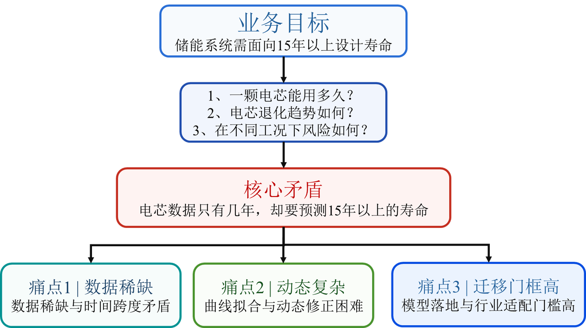
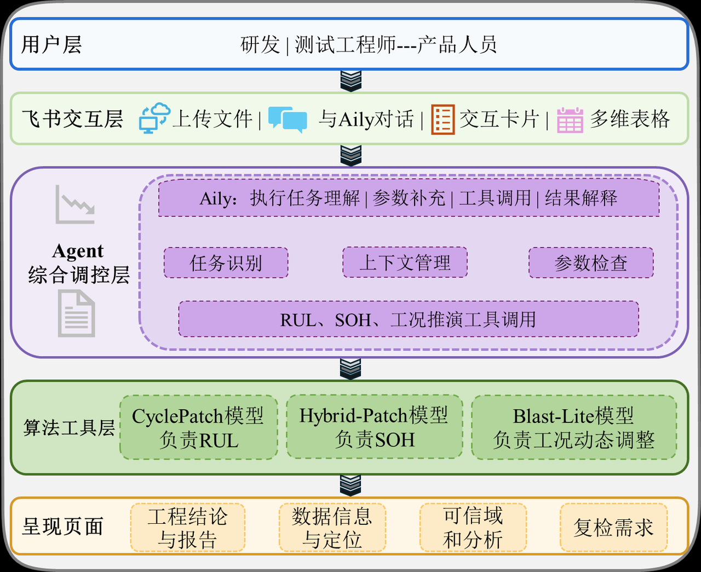
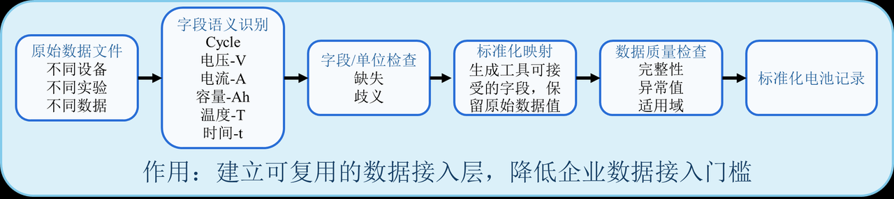
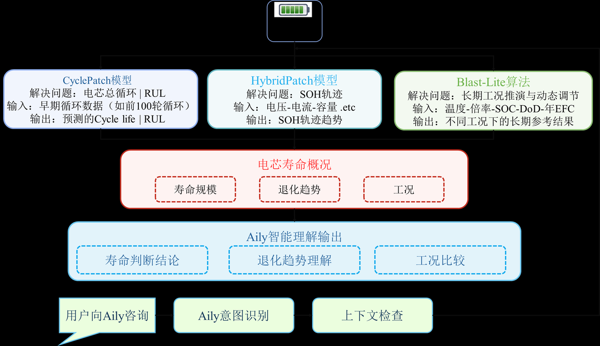
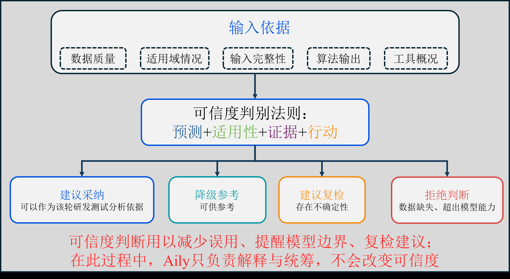
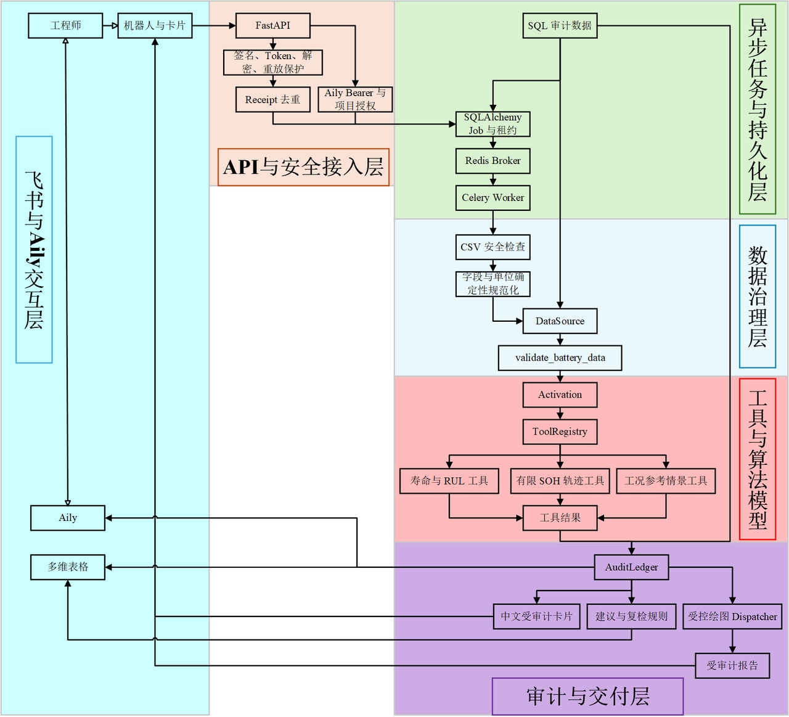

# 【40强赛】海辰储能🤝GUET-Bin｜泉芯智寿：AI驱动的电芯寿命预测引擎

> 命题：AI驱动的电芯寿命预测引擎
>
> 证据说明：本文中的模型指标均来自项目仓库内已冻结、已验收的实验报告。尚未取得企业试点证据的效率、成本、收入和业务承诺保持空白。公开数据上的研究结果不等同于海辰储能目标电芯的工业寿命验证。

---

# 一、参赛方案信息卡

| 项目 | 填写内容 |
| --- | --- |
| 队名 | GUET-Bin |
| 命题 | AI驱动的电芯寿命预测引擎 |
| 一句话摘要 | 工程师上传少量早期循环数据，系统完成数据校验、个体循环寿命RUL与有限 SOH 轨迹预测，并由 Aily 组织多工况参考推演、解释可信度和复检协同，所有业务数值均可追溯到真实算法模型、数据和版本。 |
| 成员介绍&分工 | 郑梓彬，单人参赛；桂林电子科技大学-信息与通信工程-2024届硕士研究生（2027届毕业生）。  独立完成需求分析、数据处理、算法模型训练与评估、后端系统、Docker 部署、飞书开放平台接入、Aily 工具设计和产品呈现。 |
| 使用的飞书 AI 能力 | 飞书 Aily、飞书机器人与交互卡片、多维表格、飞书文档、开放平台事件订阅。 |

---

# 二、方案成果展示

# 1. 命题场景描述、问题描述及痛点说明

## 1.1 命题场景描述

海辰储能面向的是典型的长寿命、大规模、强工况差异储能电芯应用场景。储能电站往往需要支撑十余年至二十余年的长期运行，而新型号电芯、新材料体系和新充放电策略又在持续快速迭代。企业无法等待完整生命周期试验结束后，再决定某款电芯是否值得继续研发、是否适合某类储能项目，或应该给出怎样的寿命与质保判断。

## 1.2 问题描述

核心问题是把长期结果提前到研发早期获得，即：如何利用有限的早期循环数据，在完整寿命尚不可观测的情况下，尽可能准确地判断电芯未来寿命、退化趋势及不同运行条件下的风险，并随着新数据持续进入，不断修正判断。

## 1.3 痛点说明

### 痛点 1：有限数据与超长寿命之间存在天然时间矛盾

储能电芯的目标服役寿命可能达到 15 年以上，但企业能够及时获得的往往只是早期数十至数百循环数据，或相对有限的历史运行数据。完整寿命试验能够提供直接证据，却难以满足研发立项、材料筛选和测试资源分配的时间要求。

### 痛点 2：电芯退化具有强工况依赖，且预测需要持续更新

电芯寿命并不存在一条脱离使用条件的固定曲线。温度、充放电倍率、SOC 工作区间、DoD、循环频率以及静置时间等条件发生变化，都可能改变电芯的退化速度和长期演化路径。同一型号电芯在不同储能项目和不同运行策略下，其寿命结果可能存在明显差异。因此，早期判断不能被视为一次性结论，而应随着新增观测、工况变化和模型版本更新持续修正。

### 痛点 3：学术模型距离储能企业真实使用仍存在明显落地门槛

近年来，电池 SOH、RUL 和寿命预测研究已取得大量成果，但学术模型与储能企业实际应用之间仍存在明显距离。一方面，不同公开数据集在电芯容量、化学体系、实验协议和数据格式上差异较大。许多公开模型主要针对实验室小容量电芯、消费电子电池或动力电池验证，在大型储能电芯上的直接迁移能力并不能天然保证。另一方面，真实企业数据也不会天然满足某个公开模型要求的标准输入格式。不同测试设备可能采用不同字段名称、单位和采样方式，研发人员在运行算法之前往往还需要大量人工清洗和转换工作。

*图 1. 业务矛盾框架图。图中的“15年以上”表示储能系统的业务设计寿命目标，不代表当前公开数据模型已经完成相同时间尺度的工业验证。*

## 1.4 问题定义与技术边界

设电芯 c 在截断周期 k 时只能使用不晚于 k 的观测数据，模型预测的总循环寿命为 \(\hat L_c\)，则截断点对应的剩余循环数定义为：

\[
\widehat{RUL}_{c,k}=\max(\hat L_c-k,0).
\]

SOH 在统一容量口径下定义为：

\[
SOH_{c,t}=\frac{C_{c,t}}{C_{c,\mathrm{ref}}}.
\]

这两个定义对应不同任务。CyclePatch 预测个体总循环寿命及 RUL；HybridPatch 分析有限观测范围内的 SOH 轨迹；BLAST-Lite 在给定温度、倍率、SOC、DoD、年等效全循环等条件下提供长期参考工况推演。三类结果在同一任务中并列呈现，但不进行未经验证的循环数与自然年换算。

当前 MATR 标量寿命目标采用数据集官方 cycle life，并非统一 EOL80；有限 SOH 轨迹的正式监督和输出边界为 cycle 500；长期工况结果属于大型方形 LFP 参考情景，不是海辰目标电芯的专属寿命结论。

---

# 2. 方案优势/创新点

## 2.1 方案亮点

- 面向早期数据少、寿命周期长的矛盾，实现寿命评价前移。
- 面向储能工况复杂、单一寿命指标不足的问题，构建多时间尺度退化分析体系。
- 面向公开模型难以直接迁移至储能业务的问题，将模型适用性纳入 AI 统筹协同的工具链路。
- 面向“模型完成预测、研发流程尚未完成”的工程断点，将寿命算法嵌入飞书研发协作。

## 2.2 AI 能力创新用法

- 将大模型限制为业务统筹调度工具。以往 AI 应用常让大模型直接回答预测结果，容易产生无法验证的数字。本方案将 Aily 限定在意图识别、参数补充、工具选择、任务查询和证据解释范围内。任何 SOH、RUL、预测区间、模型指标和规则阈值都不能由 LLM 生成或修改。
- 以算法模型结果为导向，构建数字证据链。所有业务数值首先进入版本化 ToolResult，再由卡片、图表、报告、多维表格和 Aily 读取。
- 模型能力与飞书业务流程解耦。飞书业务层只认识稳定工具，不直接绑定某个模型名称。后续接入其他模型时，无需同步修改飞书事件、Aily 提示词、卡片结构和多维表格业务流程。
- 保留拒绝回答的能力。系统对文件格式不安全、字段不完整、来源不可信、模型未激活或输入超出支持域等情况进行明确降级，不静默填补数据。
- 从分析结果延伸到真实协作动作。系统在展示预测之外，还能在规则工具输出“建议复检”时创建飞书复检记录，登记责任人、原因和处理状态。

## 2.3 可覆盖的业务范围

方案当前主要覆盖：

- 电芯测试数据接入、字段规范检查和数据身份登记；
- 早期循环数据的个体总循环寿命和 RUL 分析；
- 有限观测范围内的 SOH 轨迹分析；
- 温度、倍率、SOC、DoD、年等效全循环和静置时间等结构化工况的参考情景比较；
- 新观测数据进入后的重新分析、历史结果保留和版本追踪；
- 模型结果、警告、适用范围、图表和报告的统一交付；
- 采用、降级参考、建议复检或拒绝判断的受审计建议；
- 飞书多维表格中的任务台账和复检记录；
- Aily 对任务状态、结果证据和报告的自然语言查询及解释；
- 后续获得企业数据后，向大型储能电芯目标域校准、跨工况适配和新增运行数据在线更新扩展。

## 2.4 Before / After

| 序号 | Before | After |
| ---: | --- | --- |
| 1 | 电芯寿命评价依赖长周期循环试验或经验曲线外推；前者耗时长，后者难以描述非线性退化。 | 利用早期循环数据建立循环级退化表征，提前预测个体总循环寿命、RUL 及有限 SOH 退化轨迹，将寿命判断由试验结束后的结果确认前移至研发早期的辅助筛选。在 MATR 数据集、cutoff = 150 条件下，CyclePatch Direct 获得 MAE 98.19 cycles、RMSE 122.49 cycles、MAPE 12.62%、R² 0.8656 和 15%-Acc 64.44%。 |
| 2 | 方案往往将循环寿命、SOH 和长期工况分析割裂处理，甚至通过循环数简单折算自然年寿命。 | CyclePatch、HybridPatch 和 BLAST-Lite 在统一电芯数据身份下并列组织，分别回答“还能循环多久”“有限范围内如何退化”“给定工程假设时工况变化会产生什么影响”，避免不同时间尺度模型之间未经验证的数值换算。 |
| 3 | 算法通常只输出预测值，对数据质量、模型适用域和版本证据关注不足。 | 在模型外建立数据校验、适用域检查和结构化工具结果机制，使每个寿命、SOH 和工况结果均绑定数据来源、模型版本、输入条件和警告信息。Aily 据此组织采纳、降级参考、建议复检或拒绝判断，降低跨容量、跨工况和跨数据域误用模型的风险。 |
| 4 | 传统流程需要工程师在算法脚本、图表、报告、群聊和台账之间反复搬运信息。 | 通过 FastAPI 和 MCP 联动飞书与深度学习算法模型，以飞书为业务入口，由 Aily 负责意图识别、参数补全、专业工具调用协同和结果解释；预测结果进一步进入交互卡片、多维表格、证据报告和复检记录。Aily 不生成业务数值，所有数值均由确定性模型和工具提供。 |

## 2.5 可量化价值

方案预期减少研发预测测试过程中由数据清洗、格式转换、脚本执行、图表整理、结果转述和复检建单造成的重复工作。当前尚无海辰真实业务基线和企业试点日志，因此不填写未经验证的节省比例、成本金额或收入预测。

可立即复核的是模型研究指标、任务来源完整性和工具输出可追溯性；业务价值需要在企业试点中，通过相同输入、相同交付标准下的人工流程与系统流程对照测量。

---

# 3. 具体方案说明（突出 AI 能力）

## 3.1 总体方案

*图 2. 总体架构图。*

总体方案由四个层次组成：

1. 用户和飞书交互层负责文件上传、Aily 对话、交互卡片与多维表格协作。
2. Agent 综合调控层负责识别任务、补充参数、管理上下文、选择工具和解释结果。
3. 算法工具层分别承载 CyclePatch RUL、HybridPatch SOH 和 BLAST-Lite 工况参考推演。
4. 呈现页面将工程结论、数据身份、可信度分析和复检需求交付给研发、测试与产品人员。

这一分层让自然语言交互与数值计算保持清晰边界。Aily 可以决定“调用哪个工具、还缺什么参数、怎样解释证据”，但不能决定“预测数值应该是多少”。

## 3.2 数据处理与审计

*图 3. 数据处理与审计功能框图。*

数据入口面向不同测试设备、不同实验协议和不同字段命名。系统依次完成文件安全检查、字段语义识别、字段与单位核对、标准化映射、数据质量检查和电池记录登记。

标准化过程保留原始值和映射依据。遇到字段歧义、单位缺失、关键周期不完整、异常值或超出支持域时，系统要求补充信息或终止后续计算，不通过静默插值制造输入。每个原始文件记录来源、版本、大小和 SHA-256；每个标准化批次形成稳定的数据身份，供模型、报告和飞书交付共同引用。

训练、验证、校准和测试必须按 cell_id 划分。同一电芯不能跨集合出现；标准化器、特征选择和模型参数只能在训练集拟合。该规则从数据层阻断按行或按周期随机划分造成的信息泄漏。

## 3.3 算法模型工具与复用

*图 4. 算法模型工具与复用框图。*

三类模型不被强行合并为一个“万能寿命模型”，而是在统一电芯身份下各自回答不同问题。

| 工具 | 技术作用 | 当前证据 | 使用边界 |
| --- | --- | --- | --- |
| CyclePatch Direct | 将早期充放电曲线切分为多尺度 PhasePatch，加入真实 cycle 位置和工况编码，通过 masked Transformer 聚合跨循环退化信息，回归个体总循环寿命并计算 RUL。 | MATR 三批固定划分上的五种子正式结果。 | 目标为 MATR 官方 cycle life；不能直接换算为自然年。 |
| CyclePatch-BatLiNet | 在 CyclePatch 时序编码基础上加入只由训练电芯构建、哈希绑定的冻结参考库分支。 | 在部分 cutoff 的相对误差命中率和经验覆盖率上有优势。 | 当前证据不支持其全面优于 Direct。 |
| HybridPatch-v2 | 复用 CyclePatch 多尺度时序表征，并使用学习式单调退化解码器输出有限 SOH 轨迹。 | 四个 cutoff 上平均 MAE 较低，单调违规率为 0。 | 正式监督和输出边界为 cycle 500；远期误差会增大。 |
| Current Hybrid | 采用平方根、线性、knee 加速和累计非负残差构造结构单调轨迹。 | RMSE、尾部电芯误差和训练资源更有优势。 | 固定幅度缩放与裁剪具有数据集依赖性。 |
| BLAST-Lite | 根据温度、倍率、SOC、DoD、年 EFC、静置时间和自然年 horizon 计算大型方形 LFP 参考情景。 | 已完成公开 Naumann 数据 replay 和 280 Ah 观测范围参考核验。 | 证据等级为 PHYSICS_REFERENCE，不是目标电芯专属寿命。 |

飞书层只调用稳定的“寿命分析”“有限 SOH 分析”和“工况参考推演”工具。模型替换、路由切换和版本升级发生在服务器端，因此新增模型不需要重写 Aily 交互逻辑、飞书卡片或多维表格流程。

## 3.4 可信度判别与行动路由

*图 5. 可信度判别框图。*

可信度由四类可核验的证据共同决定：

- 预测证据：点预测、有限轨迹、校准区间及工具状态；
- 适用性证据：化学体系、容量、工况、cutoff 和数据域是否落在模型支持范围内；
- 来源证据：输入文件、数据批次、模型制品、特征、配置和输出是否具有可核验版本与哈希；
- 行动证据：规则工具依据上述结果给出建议采纳、降级参考、建议复检或拒绝判断。

系统采用 route-specific Split Conformal 描述 RUL 区间。校准残差来自独立 calibration 电芯，不允许 Aily、UI 或调用方提交区间端点。当前 calibration 只有 12 个电芯，因此所有覆盖结果都必须带小校准队列警告，不能外推为企业目标域的覆盖保证。

## 3.5 Aily、MCP 与原创工作流

Aily 将多个数值工具组织成研发人员可以直接使用的协同流程。当前服务端为 Aily 提供以下受控工具：

| 工具 | 职责 |
| --- | --- |
| quanxin_resolve_analysis_source | 根据任务标签解析当前用户有权访问的受审数据来源 |
| quanxin_create_scenario_context | 保存工程师明确给出的结构化工况，形成新版本上下文 |
| quanxin_create_analysis_task | 创建异步寿命、SOH 或工况分析任务 |
| quanxin_get_analysis_task | 查询任务状态和失败原因 |
| quanxin_get_audited_result | 读取与运行绑定、已授权的 ToolResult |
| quanxin_get_audited_report | 获取完整性校验通过的分析报告 |

一次典型工作流包括：

1. 工程师上传早期循环数据，机器人完成接收确认并创建持久任务。
2. 数据工具检查文件类型、字段、单位、完整性、数据身份和支持域。
3. Aily 对缺失的业务参数进行追问，不能自行猜测或补写。
4. 服务器端根据任务类型和已激活 route 调用 RUL、SOH 或工况工具。
5. 工具输出 ToolResult，记录数值、证据等级、警告、来源和版本。
6. 可信度规则给出建议采纳、降级参考、建议复检或拒绝判断。
7. 卡片、图表、报告和多维表格读取同一结果；Aily 只解释已登记证据。
8. 新数据或新工况进入时创建新任务和新结果，不覆盖历史结论。

现有 MCP 场景契约支持一次提交温度、倍率、SOC 或 DoD 等多个字段。目标流程由服务端继承未修改字段，并对全部修改执行原子校验：任一参数不合法时，整次更新不生效；校验通过后创建新的受审工况上下文，历史上下文保持不变。Aily 对这一流程的完整自然语言编排仍列为待最终复验项。

这一工作流将 Agent 的自由度限制在可审计范围内：它可以理解、追问、选择、查询和解释，但不能生成 SOH、RUL、区间、阈值比较或经营指标。

## 3.6 ToolResult、数字证据链与工程可靠性

ToolResult 是方案中的数值事实单元。每个结果至少绑定工具名、工具版本、输入哈希、模型版本、数据版本、特征版本、运行身份、证据等级、警告和来源链。结果先进入 AuditLedger，再进入卡片、曲线、报告、多维表格和 Aily。

飞书展示层不接受调用方传入 SOH、RUL 或区间数字，只接受 run_id、result_id 等安全引用。服务端根据白名单路径读取已经登记的结果，绘图器同时记录来源结果、模板版本和 SHA-256。这一机制避免同一任务在不同页面引用不同运行，也防止手写数字被包装成模型输出。

后端采用 Python 3.11、FastAPI、PostgreSQL、Redis 和 Celery。飞书 Callback 只负责验签、Token、解密、重放保护、必要引用保存和任务入队，模型执行、绘图和报告由 Worker 异步完成。Worker 使用 lease、heartbeat 和 fence token 管理任务所有权，旧 Worker 不能用过期任务状态覆盖新结果。

模型制品优先采用 safetensors、JSON、Parquet 和 CSV，并在使用前检查 manifest、相对路径、大小和 SHA-256。系统拒绝未经核验的 pickle、joblib、.pt、.pth、符号链接、路径逃逸和未知来源文件。

## 3.7 当前工程状态

| 状态 | 已有工作与证据 |
| --- | --- |
| 已完成 | MATR 三批数据治理与按 cell_id 固定划分；CyclePatch Direct、CyclePatch-BatLiNet、Current Hybrid、HybridPatch-v2 的 80 次 A100 Advanced Final；逐样本导出、指标闭合、Conformal 校准和安全模型制品；BLAST-Lite 参考工况链；FastAPI、异步任务、ToolResult、审计报告、飞书卡片和多维表格交付。 |
| 已完成受控演示 | 目标飞书租户已完成加密 URL verification、群聊文本与 CSV 文件回调，并真实执行项目级 CyclePatch、独立 BLAST-Lite、曲线、卡片、报告和多维表格交付。 |
| 中断时正在进行 | 任意自描述新电芯 CSV 的自动字段映射、来源登记、批次创建、项目冻结绑定和支持域拦截；Aily 多参数原子更新；本地服务与临时 HTTPS 入口恢复。已有局部实现和聚焦检查，但尚未完成整条链的集成验收，本方案文档不继续该开发。 |
| 待最终复验 | Aily 网页端的固定提示词、自然语言任务创建、动态工况修改和完整 job_origin=AILY 纵向链；稳定 HTTPS 入口和提交版本的公网纵向验收。 |
| 研究候选 | PBT 与 MAGNet 已完成上游来源、许可证、安全制品契约和训练任务准备，但没有可纳入当前成绩表或正式 route 的结果。 |
| 尚未完成 | HUST 零样本正式验证、企业目标域校准、真实 BMS/EMS 接入、并发与灾难恢复验收、企业业务收益测量。 |

## 3.8 失败模式与降级策略

| 条件 | 系统行为 |
| --- | --- |
| 文件扩展名、MIME、magic 或 UTF-8 不合格 | 停止后续处理并返回结构化拒绝 |
| 关键字段、单位或 cell_id 缺失 | 数据验证失败，不调用模型 |
| 数据、模型或制品 SHA-256 不匹配 | 拒绝加载和展示 |
| 模型未激活或输入超出 route manifest | 返回不支持原因，不展示预测数值 |
| calibration cohort 与目标电芯冲突 | 拒绝签发区间 |
| ToolResult 失效或访问越权 | 卡片、报告和 Aily 均拒绝读取 |
| EOL 在工况推演窗口内未到达 | 只展示工具确定的寿命下限，不外推精确年限 |
| Worker 中断或租约过期 | 由新 Worker 通过 fenced recovery 恢复 |

---

# 4. 方案价值

## 4.1 产品研发价值

系统将寿命判断从完整试验结束后的结果确认前移至研发早期的辅助筛选。工程师可以在有限数据下获得带边界的总循环寿命、RUL 和有限 SOH 判断，用于候选电芯比较、测试资源分配和后续试验优先级讨论。系统不会替代完整寿命试验，而是帮助团队更早识别值得继续投入或需要复检的对象。

## 4.2 试验与算法研发价值

字段标准化、固定数据划分、训练矩阵、逐样本输出和版本化路由使不同模型能够在一致口径下比较。新模型先完成制品核验、校准与人工激活，再进入工具内部 route；飞书业务流程不随模型名称变化，降低算法迭代对业务系统的影响。

## 4.3 质量与风险管理价值

系统同时记录成功、降级和拒绝结果，能够回答“结果来自哪里”“为何可以参考”“为何需要复检”“为何不能给出结论”。数据质量、模型支持域、区间校准、制品完整性和调用权限均形成可检查门禁，有助于降低跨数据域误用和无来源数字进入研发决策的风险。

## 4.4 市场与客户技术支持价值

统一报告明确区分真实观测、模型预测和工况参考，不把循环寿命简单包装成自然年承诺。技术人员能够定位某项结论对应的数据、模型、工况、版本和警告，为客户沟通提供可复核依据。

## 4.5 业务价值验证设计

正式试点应选择一组经授权的历史任务，以相同输入和交付标准分别执行人工流程与泉芯智寿流程。每个任务记录接收、数据检查、模型开始、模型结束、报告完成和复检动作时间，并记录人工参与时长与失败原因。当前结果栏保持空白，待真实测量后填写。

| 价值维度 | 指标 | 数据来源 | 试点结果 |
| --- | --- | --- | --- |
| 效率 | 单次分析端到端交付时长 | Job 阶段时间戳、飞书消息 |  |
| 效率 | 人工数据检查时间 | 工程师工时记录、验证阶段日志 |  |
| 效率 | 报告整理时间 | ToolResult 到报告交付时间、人工工时 |  |
| 质量 | 数据问题检出率 | 预标注异常样本、验证 ToolResult |  |
| 质量 | 结果完整追溯率 | AuditLedger 抽查 |  |
| 稳定性 | 重复事件幂等率 | Receipt 与 Job 记录 |  |
| 风险 | 未授权数值拦截率 | 数字防火墙测试与日志 |  |
| 闭环 | 应复检任务建单率 | 建议 ToolResult 与多维表格记录 |  |

---

# 5. 方案体验入口 & Demo 展示视频

## 5.1 体验入口

| 项目 | 内容 |
| --- | --- |
| 飞书文档公开链接 |  |
| 体验链接 |  |
| 体验二维码 |  |
| 测试账号 |  |
| 测试密码或获取方式 |  |
| 飞书应用或群聊入口 |  |
| Aily 入口 |  |
| 打开说明 |  |
| 数据说明 | 演示仅使用赛事允许或团队自有的受控数据，不上传敏感或未经授权的企业数据。 |

## 5.2 Demo 展示视频

| 项目 | 内容 |
| --- | --- |
| 视频链接 |  |
| 飞书妙记链接 |  |
| 公开视频备用链接 |  |
| 视频时长 |  |

## 5.3 3—5 分钟 Demo 流程

| 时间 | 展示内容 |
| --- | --- |
| 0:00—0:30 | 说明早期数据与长期寿命决策之间的时间矛盾，以及“Aily 负责理解和编排、数值工具负责计算”的原则。 |
| 0:30—1:15 | 在飞书上传一份已登记 CSV，展示机器人接收确认、任务 ID、数据身份和校验状态。 |
| 1:15—2:20 | 展示个体总循环寿命、RUL 摘要、有限 SOH 曲线、警告和适用范围。 |
| 2:20—3:05 | 在 Aily 中同时修改温度、倍率或 DoD，展示系统原子校验多个参数并创建新工况上下文和新任务，历史结果保持不变。 |
| 3:05—3:35 | 提交缺字段、域外或未激活模型请求，展示系统明确拒绝而不生成预测数值。 |
| 3:35—4:10 | 打开结果卡片、受审计报告、多维表格和复检动作，说明它们共享同一结果来源。 |
| 4:10—4:30 | 总结方案如何把模型结果转化为可追溯、可拒绝、可复检的研发协作流程。 |

---

# 三、自由展示区

# 1. 技术架构详解

*图 6. 总体技术架构细览。*

图 6 展示了从飞书入口到审计交付的完整工程链。飞书机器人和 Aily 经 FastAPI 接入，服务端完成签名、Token、解密、重放保护和项目授权；任务状态由 PostgreSQL 持久化，Redis 与 Celery 负责异步调度；数据治理层完成 CSV 安全检查、字段与单位确定性规范化、DataSource 登记和 validate_battery_data；工具注册表根据激活状态调用寿命、有限 SOH 或工况参考工具；所有结果进入 AuditLedger，再形成中文卡片、复检建议、受控图件和受审计报告。

该架构以单向数值流为核心：原始数据经过验证后进入算法工具，算法结果进入审计账本，飞书与 Aily 只读取审计结果。任何交互入口都不能绕过数据身份、模型激活和结果授权。

# 2. 深度学习算法模型指标

## 2.1 实验设置

正式 Advanced Final 使用 MATR 2017-05-12、2017-06-30 和 2018-04-12 三批数据。

| 项目 | 设置 |
| --- | --- |
| 总电芯数 | 140 |
| 具有 MATR 官方 cycle-life 标签的电芯 | 138 |
| 固定划分 | train 82 / validation 19 / calibration 12 / test 27 |
| SOH 测试电芯 | 25 |
| 早期观测 cutoff | 20 / 50 / 100 / 150 cycles |
| 随机种子 | 38 / 39 / 40 / 41 / 42 |
| 正式运行矩阵 | 4 模型 × 4 cutoff × 5 seeds = 80 runs |
| RUL 指标 | MAE、RMSE、MAPE、R²、15%-Acc |
| SOH 指标 | MAE、RMSE、单调违规率 |
| 区间指标 | PICP、MPIW |

## 2.2 RUL 五种子结果

MAE、RMSE 的单位为 cycles；MAPE 与 15%-Acc 为百分比。

| 模型 | cutoff | MAE | RMSE | MAPE | R² | 15%-Acc |
| --- | ---: | ---: | ---: | ---: | ---: | ---: |
| CyclePatch-BatLiNet | 20 | 122.58 | 157.94 | 15.98% | 0.7781 | 55.56% |
| CyclePatch-BatLiNet | 50 | 114.26 | 141.36 | 15.56% | 0.8224 | 57.78% |
| CyclePatch-BatLiNet | 100 | 103.00 | 129.56 | 14.07% | 0.8513 | 58.52% |
| CyclePatch-BatLiNet | 150 | 101.92 | 128.92 | 12.76% | 0.8507 | 67.41% |
| CyclePatch Direct | 20 | 116.05 | 143.36 | 16.54% | 0.8167 | 58.52% |
| CyclePatch Direct | 50 | 111.44 | 137.54 | 15.51% | 0.8308 | 60.00% |
| CyclePatch Direct | 100 | 104.52 | 130.38 | 13.86% | 0.8490 | 58.52% |
| CyclePatch Direct | 150 | **98.19** | **122.49** | **12.62%** | **0.8656** | 64.44% |

随着可见早期循环由 20 增加到 150，两个 RUL 分支的平均误差总体下降。CyclePatch Direct 在 cutoff = 150 时获得当前最低平均 MAE、RMSE 和 MAPE；但 CyclePatch-BatLiNet 在相同 cutoff 下的 15%-Acc 更高，且两者逐电芯 MAE 的配对 Bootstrap 区间跨过零。因此，现有证据支持按业务目标分配模型角色，不支持“Direct 统计显著且全面优于 BatLiNet”的表述。

## 2.3 SOH 五种子结果

MAE、RMSE 使用 SOH 比例表示，括号内为 SOH 百分点。

| 模型 | cutoff | MAE | RMSE | 单调违规率 |
| --- | ---: | ---: | ---: | ---: |
| Current Hybrid | 20 | 0.01610（1.610） | **0.02578（2.578）** | 0% |
| Current Hybrid | 50 | 0.01618（1.618） | **0.02622（2.622）** | 0% |
| Current Hybrid | 100 | 0.01661（1.661） | **0.02710（2.710）** | 0% |
| Current Hybrid | 150 | 0.01703（1.703） | **0.02789（2.789）** | 0% |
| HybridPatch-v2 | 20 | **0.01281（1.281）** | 0.02700（2.700） | 0% |
| HybridPatch-v2 | 50 | **0.01287（1.287）** | 0.02753（2.753） | 0% |
| HybridPatch-v2 | 100 | **0.01338（1.338）** | 0.02826（2.826） | 0% |
| HybridPatch-v2 | 150 | **0.01380（1.380）** | 0.02889（2.889） | 0% |

HybridPatch-v2 在四个 cutoff 上的平均 MAE 较低；Current Hybrid 的 RMSE、尾部电芯误差和训练资源更有优势。两类模型的单调违规率均为 0。误差随预测距离增加而上升，较高误差集中在 2017-06-30 批次，因此系统保留“平均精度”和“尾部/效率”双路由，不把任一模型定义为所有场景下的唯一优选。

## 2.4 90% Split Conformal

| 模型 | cutoff | 90% PICP | MPIW / cycles |
| --- | ---: | ---: | ---: |
| CyclePatch-BatLiNet | 20 | 85.19% | 404.52 |
| CyclePatch-BatLiNet | 50 | 92.59% | 429.29 |
| CyclePatch-BatLiNet | 100 | 88.89% | 400.74 |
| CyclePatch-BatLiNet | 150 | 96.30% | 357.93 |
| CyclePatch Direct | 20 | 92.59% | 540.89 |
| CyclePatch Direct | 50 | 81.48% | 356.07 |
| CyclePatch Direct | 100 | 88.89% | 397.12 |
| CyclePatch Direct | 150 | 85.19% | 341.41 |

覆盖率与区间宽度之间存在权衡。cutoff = 100 时两个候选均未达到目标 90% PICP，Normalized Conformal 也未稳定改善覆盖—宽度组合。由于 calibration 仅含 12 个电芯，区间结果只适用于声明的 MATR calibration/test 划分，不应外推到企业数据。

## 2.5 与已发表工作的指标对照

为判断现有结果处于怎样的研究量级，本方案复核了项目中已经阅读整理的 BatLiNet、BatteryLife/CyclePatch、DiffBatt、BatteryMFormer、IC2ML、BatteryGPT、PINN4SOH、iMOE 和 SambaMixer 等论文。跨论文比较必须同时核对数据集、电芯划分、EOL 定义、可见循环数、预测时域和指标单位。下表用于建立指标参照，不作为统一排行榜。

### RUL 与总循环寿命

| 工作 | 数据与实验协议 | 论文或本项目报告结果 | 可比性说明 |
| --- | --- | --- | --- |
| 泉芯智寿：CyclePatch Direct | MATR 三批固定划分；cutoff = 150；五个随机种子；目标为 MATR 官方 cycle life | MAE 98.19 cycles；RMSE 122.49 cycles；MAPE 12.62%；R² 0.8656；15%-Acc 64.44% | 本项目正式结果 |
| BatLiNet，Nature Machine Intelligence 2025 | MATR-1、MATR-2 标准评估集；深度学习模型采用 8 次不同初始化 | MATR-1：RMSE 63 cycles、MAPE 6%；MATR-2：RMSE 162 cycles、MAPE 11% | 数据来源和任务接近，但评估集、划分和输入协议不同，只能作同任务参照 |
| DiffBatt，NeurIPS 2024 Workshop | 使用前 100 cycles 生成 SOH 曲线并据此计算 EOL80 RUL；10 个随机种子 | MATR1：RMSE 88 ± 4 cycles；MATR2：RMSE 235 ± 16 cycles；全部数据集平均 RMSE 196 cycles | 指标单位相同，但采用 BatteryML 划分、生成式采样和不同 EOL 口径 |
| BatteryLife/CyclePatch，KDD 2025 | 聚合 Li-ion 域；最多使用前 100 cycles；train/validation/test = 6:2:2；EOL80 | CPMLP：MAPE 0.179 ± 0.003（17.9% ± 0.3%）；15%-Acc 0.620 ± 0.004（62.0% ± 0.4%） | MAPE 与 15%-Acc 定义可参照，但该结果是多数据集 Li-ion 域汇总，并非 MATR 固定测试集 |

这些结果表明，RUL 研究至少需要同时报告绝对误差、相对误差和阈值命中率。仅用 RMSE 或 MAPE 容易掩盖长寿命电芯、批次差异和误差分布。本项目保留 MAE、RMSE、MAPE、R² 与 15%-Acc 五项指标，并进一步报告 Conformal 覆盖率和区间宽度。

### SOH 与退化轨迹

| 工作 | 任务与实验协议 | 论文或本项目报告结果 | 可比性说明 |
| --- | --- | --- | --- |
| 泉芯智寿：HybridPatch-v2 | MATR 有限 SOH 轨迹；cutoff = 20；输出边界 cycle 500；25 个测试电芯；五个随机种子 | MAE 1.281 SOH 百分点；RMSE 2.700 SOH 百分点；单调违规率 0% | 本项目有限时域正式结果 |
| BatteryMFormer，KDD 2026 | 使用不超过前 100 cycles 预测完整退化轨迹；测试工况在训练和验证中不可见 | Li-ion：MAPE 2.248 ± 0.037%；MAE 2.034 ± 0.041 SOH 百分点 | 任务和单位接近，但其目标是完整寿命轨迹与工况外泛化，本项目当前只覆盖 cycle 500 |
| DiffBatt，2024 | 使用前 100 cycles 生成完整 SOH 曲线；按 EOL 阈值计算曲线 RMSE | EOL80 时，MATR1 RMSE 1.68 ± 0.08%、MATR2 RMSE 2.17 ± 0.07%；全部数据集平均 RMSE 2.05% | 同属轨迹误差，但生成方式、测试划分、EOL 截断和轨迹长度不同 |
| IC2ML，Journal of Power Sources 2026 | 121 个电芯、10 种运行条件；联合预测 SOH、未来轨迹和 RUL | 平均 SOH RMSE 1.85%；轨迹 RMSE 2.36%；RUL RMSE 23.90 cycles；100-cycle 预测时域轨迹 RMSE 1.77% | 多任务短时预测，不等同于早期总循环寿命预测；可借鉴联合指标设计 |
| BatteryGPT，Nature Communications 2026 | 使用前 30% 生命周期数据预测完整 SOH、knee point 和 EOL | SOH RMSE 0.21%、MAPE 0.14%；knee point 误差 13 cycles；EOL 误差 10 cycles | 输入已覆盖生命周期比例，信息量明显高于固定早期 cutoff，不参与数值排名 |
| iMOE，Nature Communications 2026 | 退役电池第二寿命轨迹；单次现场可测信号；295 个电芯、93 种使用条件 | 全寿命轨迹平均 MAPE 0.95%；推理时间 0.43 ms；150-cycle 时域平均 MAPE 1.50% | 第二寿命数据和任务定义不同；其 MAPE、时域误差与推理延迟可作为未来部署指标参考 |

PINN4SOH 和 SambaMixer 主要评估当前周期 SOH 点估计，分别使用 MIT/HUST 等数据和 NASA 数据。它们报告的 MAE、RMSE 与 MAPE 适合建立“当前状态估计”基线，但不能与 HybridPatch 的未来轨迹误差直接比较。

基于上述文献，后续统一评估应补充三类指标：一是 SOH trajectory MAPE、早期/中期/远期分段误差和不同 EOL 阈值下的曲线 RMSE；二是 seen/unseen ageing condition、leave-one-condition-out 和目标域校准后的误差；三是在固定硬件、固定 batch size 下测量参数量、模型大小、单电芯推理延迟和峰值内存。当前没有正式结果的项目保持空白，不以论文数值替代本项目实测。

# 3. 可复现性与工程证据

正式结果包记录：

- 80 个 Advanced Final 运行；
- 2,654 个索引文件；
- 897 个 safetensors 文件；
- 1,080 行 RUL 测试预测；
- 500,000 行 SOH 轨迹预测；
- 480 行 RUL 校准预测；
- source commit：232d9fc8957bb547ca2b80205802f377864e982b；
- output SHA-256：d201224870a28c655f66a810bc94f90ad28133e06f2fb4a7285195274c303d82。

本地 CPU 使用 safetensors 复算后，与 A100 聚合指标的最大差异为 0.015913 cycles（RUL）和 \(7.05\times10^{-8}\)（SOH）。项目同时保留 A100 与本地重建 input bundle 哈希不一致、正式结果包未包含 mlruns 等来源差异，不将“代码测试通过”描述为“正式训练已完整复现”。

# 4. 未来迭代规划

## 近期

- 完成 Aily 固定提示词、自然语言任务创建和动态工况修改的真实纵向复验；
- 以稳定 HTTPS 域名替代临时 Quick Tunnel；
- 完成提交版本的后端、前端、数据库迁移、Docker 镜像和部署门禁；
- 使用固定数据、固定模型和固定脚本录制 3—5 分钟 Demo。

## 中期

- 完成 HUST 安全转换、零样本评价和独立目标域重校准；
- 完成 PBT、MAGNet 的正式训练、独立测试、制品核验和候选 route 审批；
- 增加删失感知生存分析、IPCW 和相应的 Conformal 方法；
- 建立域漂移监测、route 复审和新增观测在线更新机制；
- 通过企业试点补充真实效率、质量和复检闭环指标。

## 长期

- 建设企业级 KMS、对象存储、监控、备份和灾难恢复能力；
- 在责任边界明确后接入企业 BMS、EMS 或数据平台；
- 扩展至批次一致性、弱单体识别、实验设计和复检资源调度；
- 将“数值工具 + 审计账本 + 协作动作”推广到设备寿命与工业质量预测场景。

# 5. 参考资料来源

1. NREL BLAST-Lite GitHub：https://github.com/NREL/BLAST-Lite
2. PyBaMM GitHub：https://github.com/pybamm-team/PyBaMM
3. Noto Sans SC，Google Fonts：https://fonts.google.com/noto/specimen/Noto+Sans+SC
4. BatteryLife / CyclePatch GitHub：https://github.com/Ruifeng-Tan/BatteryLife
5. BatteryLife: A Comprehensive Dataset and Benchmark for Battery Life Prediction，arXiv:2502.18807：https://arxiv.org/abs/2502.18807
6. MATR 三批电芯数据：https://data.matr.io/1/projects/5c48dd2bc625d700019f3204
7. Severson, K. A. et al. Data-driven prediction of battery cycle life before capacity degradation. Nature Energy 4, 383–391 (2019). DOI: 10.1038/s41560-019-0356-8.
8. HUST Mendeley v2 数据：https://data.mendeley.com/datasets/nsc7hnsg4s/2
9. Naumann 循环老化数据：https://data.mendeley.com/datasets/6hgyr25h8d/1；配套论文 DOI: 10.1016/j.jpowsour.2019.227666.
10. Naumann 日历老化数据：https://data.mendeley.com/datasets/kxh42bfgtj/1；配套论文 DOI: 10.1016/j.est.2018.01.019.
11. 280 Ah LFP DoD 数据，Zenodo record 14576042：https://zenodo.org/records/14576042
12. Zhang, H. et al. Battery lifetime prediction across diverse ageing conditions with inter-cell deep learning. Nature Machine Intelligence 7, 270–277 (2025). DOI: 10.1038/s42256-024-00972-x.
13. Tan, R. et al. BatteryMFormer: Multi-level Learning for Battery Degradation Trajectory Forecasting. KDD 2026；代码：https://github.com/Ruifeng-Tan/BatteryMFormer
14. Eivazi, H. et al. DiffBatt: A Diffusion Model for Battery Degradation Prediction and Synthesis. arXiv:2410.23893 (2024).
15. Huang, X. et al. IC2ML: Unified battery state-of-health, degradation trajectory and remaining useful life prediction via intra-cycle and inter-cycle enhanced machine learning. Journal of Power Sources 666, 239148 (2026). DOI: 10.1016/j.jpowsour.2025.239148.
16. Hu, J. et al. Early prediction of lithium-ion battery degradation with a generative pre-trained transformer. Nature Communications 17, 126 (2026). DOI: 10.1038/s41467-025-66819-0.
17. Huang, X. et al. iMOE: prediction of second-life battery degradation trajectory using interpretable mixture of experts. Nature Communications 17, 2549 (2026). DOI: 10.1038/s41467-026-69369-1.
18. Wang, F. et al. Physics-informed neural network for lithium-ion battery degradation stable modeling and prognosis. Nature Communications 15 (2024). DOI: 10.1038/s41467-024-48779-z.
19. Olalde-Verano, J. I. et al. SambaMixer: State of Health Prediction of Li-ion Batteries using Mamba State Space Models. arXiv:2411.00233 (2024).

---

# 四、附录

# 1. 幕后故事和工程取舍

项目最初从寿命预测模型出发，随后逐步暴露出数据格式、模型适用域、结果版本和业务交付之间的断点。工程目标因此从“算出一个结果”调整为“说明结果来自何处、在什么条件下可以使用，并在证据不足时拒绝”。这增加了数据清单、模型制品、审计账本、异步任务和飞书协同的工作量，但也使每个业务数字能够回到具体数据、模型和工具记录。

另一个重要取舍是保留多模型角色。正式实验中，最低平均误差、较低 RMSE、经验覆盖率和资源成本并不总由同一模型取得。系统没有用单一排行榜抹平这些差异，而是按点精度、平均 SOH 精度、尾部风险和区间覆盖选择不同 route，并把未达标结果保留为限制。

# 2. 主要主张与证据索引

| 主张 | 直接证据 | 状态与边界 |
| --- | --- | --- |
| MATR Advanced 模型已完成正式实验 | docs/benchmark.md | 已支持；仅限冻结 MATR 协议 |
| 数据按 cell_id 隔离 | configs/data_splits/matr_three_batch_cell_split_v1.json | 已支持 |
| 结果包可追溯 | docs/reproducibility.md、公开 evidence manifest | 已支持；大型结果包和原始数据不进入 Git |
| RUL 与 SOH 需要多路由 | 五种子误差、coverage 与资源权衡 | 已支持；不声明唯一冠军 |
| BLAST-Lite 可用于参考工况 | Naumann replay、280 Ah observed-range check | 已支持为参考；不支持产品寿命承诺 |
| 飞书可完成真实交付 | 真实 callback、CSV、卡片、曲线、报告和多维表格记录 | 已演示；临时隧道不等于生产部署 |
| Aily 不生成业务数值 | MCP 契约、数字防火墙、ToolResult-only 展示 | 已实现；自然语言纵向链仍需最终复验 |
| PBT/MAGNet 可提升外部泛化 |  | 当前无正式结果，不作主张 |
| 系统可节省具体时间或成本 |  | 尚无企业试点，不作主张 |

# 3. 术语说明

| 术语 | 本文用法 |
| --- | --- |
| SOH | State of Health，当前容量与参考容量之比 |
| RUL | Remaining Useful Life，本文表示截断周期后的剩余循环数 |
| EOL | End of Life，仅在明确阈值、持续确认规则和工具结果存在时使用 |
| cutoff | 模型可见的最后一个早期循环周期 |
| ToolResult | 版本化数值工具产生的受审结果单元 |
| AuditLedger | 保存 ToolResult、来源、版本和调用关系的审计账本 |
| active route | 经核验和人工激活、可被当前项目调用的模型路由 |
| PICP | Prediction Interval Coverage Probability，经验区间覆盖率 |
| MPIW | Mean Prediction Interval Width，平均预测区间宽度 |
| EFC | Equivalent Full Cycle，等效全循环 |
| PHYSICS_REFERENCE | 物理或机理参考证据，不是目标产品实测结论 |
