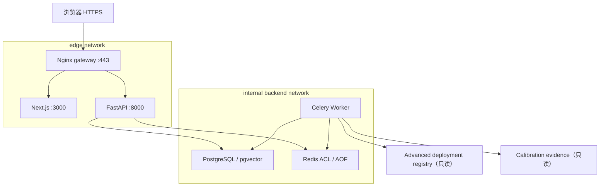

# 竞赛 ECS 单机部署

## 目的与当前状态

本页描述泉芯智寿个人比赛演示的目标部署路径。目标是用一台 4 vCPU、8 GiB
内存的 Ubuntu ECS 提供公网 HTTPS 纵向闭环，而不是声明企业级高可用生产系统。

截至 2026-08-02：

- **Implemented**：私有 ACR 发布工作流、竞赛 Compose、数据库迁移、完整 API、
  Celery Worker、Next.js、Nginx TLS 和 ADMIN 初始化；
- **Validated**：部署契约、运行设置、装配、迁移和 ADMIN 初始化测试通过；当前提交
  `daca47a7d0a2f8e82a7c549b6b97d0f25b5596a7` 的 Python、真实 PostgreSQL 和前端
  GitHub Actions 门禁全部通过；
- **Infrastructure audited**：私有 ACR 和正式 Let's Encrypt IP 证书可用，公网
  80/443 edge 可达；ECS 内部 Docker/Compose、migration、Worker、备份和证书 timer
  已完成只读审计；
- **Published**：release `2026.08.02-1` 已从该提交发布五个私有 ACR 镜像，记录
  digest，并为 backend/frontend/gateway 写入 OCI revision/version；
- **Not deployed**：目标 ECS 仍运行 `2026.07.29-1` 和 Runtime V7 单文件热修复绑定，
  Gateway 仍绑定宿主机配置；当前 `2026.08.02-1` 尚未部署或完成 RepoDigest 对账。

部署状态的权威定义见 [项目状态](../status.md)。
当前已发布镜像见 [ACR release `2026.08.02-1`](releases/2026.08.02-1.md)。历史
release `2026.07.28-1` 仅保留为旧源码证据。当前 ECS 事实见
[2026-08-02 ECS 只读审计](ecs-audit-2026-08-02.md)。

## 部署拓扑



只有 Nginx 的 80/443 发布到宿主机。PostgreSQL、Redis、FastAPI 和 Next.js 不直接
暴露公网。80 仅服务 ACME challenge 并重定向到 HTTPS。

## 前置条件

目标主机必须具备：

- Ubuntu 22.04 x86-64；
- Docker Engine 与 Compose；
- 至少 4 vCPU、8 GiB 内存、40 GB 系统盘和 2 GiB swap；
- UFW/安全组仅允许必要的 22、80、443；
- 私有 ACR 访问权限；
- `/etc/letsencrypt/live/quanxin-ecs-ip/` 下的正式证书；
- 经 SHA-256 验收的 Advanced deployment registry；
- 经登记的 calibration evidence；
- 服务器本地创建的 secrets，不能来自 Git。

## 1. 发布私有镜像

GitHub Actions 中手动运行：

```text
Publish competition images to ACR
```

工作流文件是
[`publish-acr.yml`](../../.github/workflows/publish-acr.yml)，只接受手动
`workflow_dispatch`：

- `release_tag`：不可变版本，例如当前 `2026.08.02-1`；
- `public_origin`：完整 HTTPS Origin，例如 `https://203.0.113.10`。

工作流发布：

```text
quanxin-backend
quanxin-frontend
quanxin-postgres
quanxin-redis
quanxin-nginx
```

发布前会逐个检查五个仓库；只要任一仓库已经存在同名 tag，工作流就会失败，禁止覆盖
既有 release 身份。`quanxin-nginx` 由 `deploy/Dockerfile.gateway` 构建，并把受审
`competition.conf` 固化进镜像。

成功后将 job summary 中的 source commit、release tag 和五个 digest 保存到部署
记录。不得使用 `latest`，不得只记录可变 tag。

## 2. 准备服务器目录

以非 root 运维用户执行：

```bash
sudo install -d -o quanxin -g quanxin -m 0750 \
  /srv/quanxin/deploy \
  /srv/quanxin/data \
  /srv/quanxin/artifacts \
  /srv/quanxin/policies \
  /srv/quanxin/config \
  /srv/quanxin/postgres \
  /srv/quanxin/redis \
  /srv/quanxin/deployment-registry \
  /srv/quanxin/calibration-evidence \
  /srv/quanxin/acme

sudo install -d -o root -g quanxin -m 0750 /etc/quanxin/secrets
```

保持仓库中的相对层级，把以下受审查文件放入服务器：

```text
/srv/quanxin/deploy/competition.compose.yaml
/srv/quanxin/deploy/competition.feishu-aily.override.yaml
/srv/quanxin/deploy/competition.env.example
```

例如从已核验的源目录执行：

```bash
install -m 0644 deploy/competition.compose.yaml \
  /srv/quanxin/deploy/competition.compose.yaml
install -m 0644 deploy/competition.feishu-aily.override.yaml \
  /srv/quanxin/deploy/competition.feishu-aily.override.yaml
install -m 0644 deploy/competition.env.example \
  /srv/quanxin/deploy/competition.env.example
install -m 0640 deploy/feishu-csv-registrations.example.json \
  /srv/quanxin/config/feishu-csv-registrations.json
```

Gateway 配置已经固化在不可变 `quanxin-nginx` 镜像中；Compose 只挂载证书和 ACME
webroot，不再从 ECS 宿主机 bind mount Nginx 配置。

不要把完整仓库、15 GB Advanced Final、原始 MATR 数据或训练检查点全集复制到 ECS。
部署 registry 只包含运行所需的 15 个代表候选及其闭包。

## 3. 准备运行输入

复制模板并在服务器本地填写身份信息：

```bash
cd /srv/quanxin/deploy
cp competition.env.example competition.env
chmod 0600 competition.env
```

`competition.env` 只保存非秘密身份：

```dotenv
ACR_REGISTRY=<ACR 公网或 VPC registry>
ACR_NAMESPACE=quanxin-life
RELEASE_TAG=<已发布不可变 tag>
PUBLIC_ORIGIN=https://<公网 IP 或域名>
FEISHU_APP_ID=<企业自建应用 App ID>
FEISHU_BITABLE_APP_TOKEN=<多维表格 app token>
FEISHU_BITABLE_TABLE_ID=<多维表格 table ID>
EXTERNAL_HTTPS_BASE_URL=https://<经审查公网 Origin>
ALLOW_CANDIDATE_SCENARIO_EXECUTION=false
ALLOW_CANDIDATE_SCENARIO_RESULTS=false
DEPLOYMENT_REGISTRY_ID=<64 位 registry SHA-256>
DEPLOYMENT_REGISTRY_ROOT=/srv/quanxin/deployment-registry
CALIBRATION_EVIDENCE_ROOT=/srv/quanxin/calibration-evidence
QUANXIN_SECRETS_ROOT=/etc/quanxin/secrets
DATA_ROOT=/srv/quanxin/data
ARTIFACT_ROOT=/srv/quanxin/artifacts
POLICY_ROOT=/srv/quanxin/policies
CONFIG_ROOT=/srv/quanxin/config
POSTGRES_DATA_ROOT=/srv/quanxin/postgres
REDIS_DATA_ROOT=/srv/quanxin/redis
LETSENCRYPT_ROOT=/etc/letsencrypt
ACME_WEBROOT=/srv/quanxin/acme
```

秘密文件和 JSON 输入格式见
[部署安全与 Secrets](security-and-secrets.md)。deployment registry 和 calibration
evidence 必须先在来源端生成 SHA-256 清单，再通过用户批准的传输通道带到 ECS，
到达后重新计算哈希。

启用飞书附件任务前，使用 `sha256sum <canonical.csv>` 计算每份获准 CSV 的实际哈希，
编辑 `${CONFIG_ROOT}/feishu-csv-registrations.json`。每条记录的 `payload_sha256`、
`metadata.source_sha256` 和一条 `source_kind=OBSERVED` provenance 的 `sha256` 必须完全
一致；文件结构从 `deploy/feishu-csv-registrations.example.json` 复制。完成后设置
`chmod 0640 ${CONFIG_ROOT}/feishu-csv-registrations.json`，并用同一发布环境运行配置解析。
空表只允许启动时保持 fail closed，不能处理任何附件；unknown payload 会被拒绝。

不启用飞书/Aily 时，不加载 `competition.feishu-aily.override.yaml`，并保持上述 6 个
可选身份为空；不能保留部分配置。启用后两个 candidate 开关仍应先保持 `false`，只有
完成候选路由人工审查后分别授权执行与结果展示。四个容器内 secret 路径由 override
固定，运维只需在 `QUANXIN_SECRETS_ROOT` 下创建对应文件。

## 4. 登录 ACR 并解析 Compose

ACR 密码只在 ECS 交互输入：

```bash
docker login <ACR_REGISTRY>
```

先进行无副作用解析：

```bash
cd /srv/quanxin/deploy
docker compose \
  --env-file competition.env \
  -f competition.compose.yaml \
  config --quiet
```

启用飞书/Aily 时，解析命令必须再加：

```bash
-f competition.feishu-aily.override.yaml
```

解析失败时不得继续启动。

## 5. 拉取并记录镜像

```bash
docker compose \
  --env-file competition.env \
  -f competition.compose.yaml \
  pull

set -a
. ./competition.env
set +a

for repository in \
  quanxin-backend \
  quanxin-frontend \
  quanxin-postgres \
  quanxin-redis \
  quanxin-nginx
do
  reference="${ACR_REGISTRY}/${ACR_NAMESPACE}/${repository}:${RELEASE_TAG}"
  docker image inspect \
    --format '{{index .RepoDigests 0}}' \
    "$reference"
done
```

每个 exact tag 的 RepoDigest 必须与 GitHub Actions job summary 一致。若同一镜像有
多个 RepoDigest，改用 `docker image inspect "$reference"` 完整检查，不能从混有旧
tag 的 `docker image ls` 输出中猜测。

## 6. 迁移并启动

Compose 会等待 PostgreSQL、Redis 健康，运行一次性 `migrate`，迁移成功后才启动
API 和 Worker：

```bash
docker compose \
  --env-file competition.env \
  -f competition.compose.yaml \
  -f competition.feishu-aily.override.yaml \
  up -d

docker compose \
  --env-file competition.env \
  -f competition.compose.yaml \
  -f competition.feishu-aily.override.yaml \
  ps
```

检查迁移日志：

```bash
docker compose \
  --env-file competition.env \
  -f competition.compose.yaml \
  -f competition.feishu-aily.override.yaml \
  logs --no-color migrate
```

必须出现：

```text
DATABASE_MIGRATIONS_OK
```

随后检查数据库 `alembic_version` 为 `0022`。API、Worker 和 migrate 使用同一组 strict
settings；若 Feishu/Aily 已启用但任一 secret file 或非秘密身份缺失，三个入口都会
fail closed，不应通过临时删除设置绕过。

## 7. 初始化 ADMIN

只允许在空身份库中创建一个强制改密 ADMIN。用户名可以是运维身份，临时密码必须
来自服务器 secret file。当前主 Compose 故意没有长期声明
`bootstrap_admin_password`；必须按 [运维 Runbook](operations-runbook.md) 创建受审查
的临时 override 文件后运行初始化，不能把密码加入主 Compose、环境变量值或命令行。
第一次登录后立即更改临时密码，并删除临时 secret 和 override。

## 8. 产品激活与纵向验收

按顺序完成：

1. 创建并激活比赛项目；
2. 绑定已验证 record batch；
3. 从 deployment registry 注册 15 个 `CONDITIONAL` 候选；
4. ADMIN 根据 promotion evidence 人工激活 route；
5. 创建 calibration materialization；
6. 等待 Worker 将其推进到 `READY`；
7. 执行 target-aware RUL；
8. 执行 finite-horizon SOH；
9. 签发 route-specific Split Conformal；
10. 让 Agent 使用同一 ToolResult 链生成审计报告；
11. 从 UI 检查 `result_id`、模型、数据、route、calibration 和 SHA 来源。

不得手工向数据库插入业务结果，也不得用示例数值代替尚未激活的模型输出。

## 9. 公网验收

```bash
curl --fail --silent --show-error https://<PUBLIC_HOST>/health
curl --fail --silent --show-error -I https://<PUBLIC_HOST>/
```

同时检查：

```bash
docker compose \
  --env-file competition.env \
  -f competition.compose.yaml \
  ps

docker compose \
  --env-file competition.env \
  -f competition.compose.yaml \
  logs --no-color --since 10m api worker gateway
```

当前 IP 证书首次使用 standalone authenticator 取得。gateway 启动后必须按
[运维 Runbook 的 TLS 续期步骤](operations-runbook.md#tls-续期)验证公网 ACME
webroot，并将该 certificate lineage 重新配置为 webroot；否则 gateway 占用 80
端口时，短期证书的自动续期会失败。

只有公网登录、真实 Worker、正式模型结果、Conformal、Agent 和报告全部通过后，
项目状态才能从 `Implemented/Validated` 更新为 `Deployed/Demonstrated`。

## 相关文档

- [部署安全与 Secrets](security-and-secrets.md)
- [竞赛运维 Runbook](operations-runbook.md)
- [运行与本地装配](../runtime-setup.md)
- [软件架构](../../ARCHITECTURE.md)
- [项目状态](../status.md)
- [已知限制](../limitations.md)
