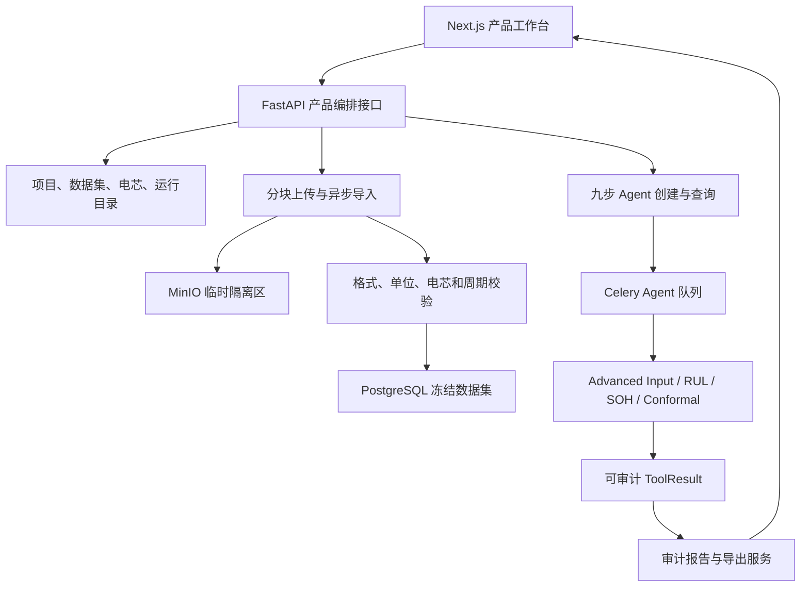

# 泉芯智寿产品化总计划

> 更新时间：2026-08-02（Asia/Shanghai）
> 性质：宏图、交接更新要求与实施路线的统一执行计划
> 当前生产公网 IP：`47.99.69.138`

## 一、宏图、现状与差距

### 1. 最终目标

泉芯智寿不能只做到“网页可以打开”，而要让普通用户不接触 UUID、数据库和服务器命令，也能完成：

1. 登录并进入项目。
2. 选择内置 `MATR_b3c34` 样例，或上传单电芯/多电芯数据。
3. 选择电芯与 cutoff 20、50、100 或 150。
4. 一键启动一个全新的真实九步 Agent。
5. 实时查看九步执行状态、耗时和失败原因。
6. 查看 RUL、SOH、Conformal 区间及数据来源。
7. 查看由同一批 ToolResult 生成的审计报告。
8. 下载 PDF、Word、Markdown、JSON、派生图表 CSV 和 ToolResult ZIP。

所有业务数值必须来自真实 `ToolResult`。LLM 只能编排工具和解释结果，前端、提示词和测试演示均不得硬编码 SOH、RUL、置信区间或经营指标冒充计算结果。

### 2. 当前进度

已经完成或验证：

- RUL、SOH、Conformal 和 Advanced Input 的真实工具链。
- 12 条校准路线全部 `READY`，共 128 条可审计校准样本。
- `MATR_b3c34` 的 cutoff 20/50/100/150 已上传并冻结。
- 真实 Advanced Tool 链形成 32 个数据库闭环 ToolResult。
- 精确九步 Agent 已完成，9 个步骤、9 个结果、审计报告均已闭环。
- Agent 报告接口与项目结果接口内容一致。
- ECS 上 API、Worker、Gateway、Frontend、PostgreSQL、Redis 正在运行。
- 最近本地完整基线为：Python `1770 passed, 7 skipped`，前端 `68 passed`；Ruff、mypy、compileall、ESLint、TypeScript 和 Next.js build 通过。

尚未完成：

- 项目首页没有形成样例、电芯、cutoff、历史运行和结果目录。
- 页面仍依赖手工复制 UUID，主流程不可发现。
- 没有面向用户的数据上传中心和多电芯导入流程。
- 九步时间线、结果图表、报告和下载没有串成完整流程。
- PDF、Word、完整 ToolResult ZIP 导出尚未完成。
- Runtime V7 仍通过 ECS bind mount 热修复运行，尚未固化为不可变镜像。
- 新公网 IP 的严格 TLS 浏览器验收、备份恢复和证书续期演练尚未闭环。

### 3. 主要麻烦及原因

当前最大的困难不是模型，而是产品化和集成：

- 前端是若干技术页面，不是一条可以顺着点击完成的产品流程。
- 官方上传接口仍偏底层，只适合单电芯、单 cutoff 的严格规范文件。
- ECS 历史上连续出现 SQLAlchemy 外键写入顺序、Shell、Python、PostgreSQL、TLS 和公网 IP 兼容问题。
- 过去过度依赖临时长脚本，没有在每一步前先确认真实数据库、容器、证书和配置状态。
- 后续必须先做只读审计、再执行版本化变更，不能继续根据旧对话或旧脚本猜测 ECS 状态。

### 4. 技术路线

保留已经验证的可信计算链，新增产品编排、上传、目录、展示、导出和运营层，不重写算法。

### 5. 用户需要提供或决定的信息

只有无法从代码和 ECS 发现时才询问用户。预计包括：

- 从 Product Design 生成的三套视觉方向中选择一套。
- 提供一份真实单电芯上传样例和一份真实多电芯上传样例；暂时没有时先用仓库夹具完成格式验收。
- 确认默认化学体系、标称容量和单位；单个电芯允许由 `metadata.csv` 覆盖。
- 若严格 TLS 无法签发，确认 `47.99.69.138` 是否为稳定公网/弹性 IP、80/443 是否放行，以及是否使用稳定域名。
- 密码只在交互登录时输入，不得写入仓库、计划、脚本、日志或截图。

## 二、完整交接文件更新要求

根目录 `CODEX_HANDOFF.md` 必须在实施前更新，并包含：

1. 总体目标和当前任务。
2. 全部需求及其变化。
3. 用户约束、禁止事项和验收标准。
4. 用户反复纠正的问题与最终做法。
5. 已完成、部分完成、未完成、已放弃内容。
6. 现存报错、阻塞和风险。
7. 修改、新增、删除文件及作用。
8. 重要模块、类型、函数、接口和配置。
9. 已运行命令、测试及真实结果。
10. 未提交修改，并区分 staged、unstaged 和未跟踪文件。
11. 已确认设计决策及原因。
12. 已否决方案，避免新对话重复采用。
13. 用户的沟通、执行、代码和输出偏好。
14. 下一步精确到文件、模块或问题的执行清单。
15. 文件末尾增加“新对话启动步骤”。

更新前必须重新执行并记录：

- `git status --short`
- `git diff --stat`
- `git diff`
- `git diff --cached`
- `git log -5 --oneline`
- 项目目录结构
- 相关代码、测试、部署配置和文档

当前已知但仍须重新验证的工作区事实：

- 分支：`codex/quanxin-full`
- 先前记录的 HEAD：`e91ce7c6c6323a74bd3a9cbff86d351327cd4200`
- `.gitignore` 是用户修改，包含 `/server-results/`，必须保留。
- `src/quanxin_life/audit/sql_project_ledger.py` 曾为 `MM` 状态。
- Runtime V7 相关修改覆盖 calibration、agent run、ledger 和 conformal 模块及其测试。
- `.playwright-mcp/`、`tmp/` 和旧 `CODEX_HANDOFF.md` 未经核对不得删除。
- 旧交接文件记录的是 2026-07-29、commit `4957aed` 和已过时 migration 阻塞，不能继续作为当前事实。

创建新版交接时不得修改业务代码。完成后必须重新完整阅读，检查遗漏、矛盾、乱码、过时 IP 和过时 commit。

## 三、实施计划

### Task 0：固化交接与工作区事实

- 重新审计 Git、目录、代码、测试和部署状态。
- 更新根目录 `CODEX_HANDOFF.md`。
- 明确 staged、unstaged、未跟踪和用户已有内容的边界。
- 本任务不修改业务代码。

验收：新 Codex 对话只读交接与代码即可准确说明现状并继续下一任务。

### Task 1：Product Design 前端设计门

前端编码前必须完成 Product Design 工作流：

1. 读取现有网页、组件、设计令牌和页面结构。
2. 在用户选择的浏览器中截取项目页、Agent 页和结果页作为视觉基线。
3. 生成恰好三套 `1440 × 1024` 主工作台视觉方案。
4. 三套均使用人民币 50 元启发的绿色组合配色和简约专业风格，只改变布局、信息层级和交互密度。
5. 用户选定一套后才开始前端编码。
6. 将选定方向扩展到登录、项目工作台、上传、九步执行、结果、报告和下载页面。
7. 选定图片是实现的视觉真相，不得只依据文字临场猜测。
8. 实现后运行 Product Design Design QA；根目录 `design-qa.md` 必须为 `final result: passed`。

初始配色令牌：

| 用途 | 颜色 |
| --- | --- |
| 主文字/深色导航 | `#173C32` |
| 主操作 | `#2F6B57` |
| 悬停/选中 | `#255746` |
| 辅助图形 | `#8FA58D` |
| 次级强调 | `#7E8753` |
| 页面底色 | `#F5F0E2` |
| 内容表面 | `#FCFAF4` |
| 小面积高亮 | `#B49A55` |
| 边框 | `#D7D7C7` |

配色比例约为暖白 70%、绿色 25%、暗金/橄榄 5%。只使用人民币 50 元的色彩气质，不复制钞票图案、纹理或防伪元素。

设计规则：

- 简约、可信、专业，不做科技蓝大屏。
- 不使用玻璃拟态、夸张渐变、发光边框、3D 电池和密集卡片墙。
- 通过留白、字号、分组和分隔线建立层级。
- 主操作始终只有一个：“启动全新九步 Agent”。
- 状态同时使用文字、图标和颜色，达到 WCAG AA。
- UI 效果图不得填入虚构业务数值。
- 图表中观测值用深墨绿、预测值用玉绿、Conformal 用灰豆绿透明带、新观测用暗金/橄榄、参考或模拟用中性灰虚线。

### Task 2：整理 Runtime V7 并建立不可变基线

- 区分正式修复、用户修改和临时部署文件。
- 为外键父记录写入顺序、Agent scope、canonical input 和固定九步执行补齐回归测试。
- 将有效热修复合并为正常源码。
- 重新执行 Python 和前端完整门禁。
- 构建不可变 backend、frontend 和 gateway 镜像，停止以 bind mount 作为最终发布。

### Task 3：项目、数据和分析目录 API

新增或完善：

- `GET /v1/projects/{project_id}/analysis-inputs`
- `GET /v1/projects/{project_id}/datasets`
- `GET /v1/datasets/{dataset_id}/batches`
- `GET /v1/projects/{project_id}/agent/runs`
- `GET /v1/agent/runs/{run_id}/results`
- `POST /v1/projects/{project_id}/advanced-analyses`

`advanced-analyses` 接收一个冻结 record batch、电芯、cutoff 和幂等键，服务端创建固定九步计划并返回 run ID。用户不再手工填写 UUID。

### Task 4：完整产品工作台

在现有 Next.js 工程内实现：

- 项目首页：样例、上传数据、最近运行和数据状态。
- 分析工作台：电芯、cutoff、质量摘要和一键启动。
- Agent 页：九步 SSE 时间线、耗时和失败信息。
- 结果页：摘要、RUL、SOH、Conformal、报告和证据标签页。
- 证据抽屉：ToolResult ID、模型/数据/特征版本、输入哈希、警告和上游关系。
- 下载中心：文件类型、生成状态、大小、SHA-256 和过期时间。

### Task 5：单电芯与多电芯上传

- 支持 CSV、Parquet、多文件和 ZIP。
- 一个文件只能包含一个电芯；多电芯通过多个文件或 ZIP 表达。
- ZIP 可包含 `metadata.csv`，提供公共元数据和单电芯覆盖。
- 至少覆盖 150 周期，由服务端生成 20/50/100/150 四个 cutoff。
- 16 MiB 分块上传，可暂停、重试和续传。
- 单文件上限 500 MiB，单数据集上限 2 GiB。
- 临时文件进入 MinIO 隔离区，完成哈希、格式、单位、周期、cell ID 和重复数据检查。
- 阻断性错误或未确认警告存在时不得冻结。
- 全部通过后自动冻结，但绝不自动启动 Agent。
- 导入使用独立 Celery 队列。
- 禁止原始上传数据下载。

计划引入 `UploadSessionRecord`、`DatasetImportRecord`、`DatasetFileStatus`、`DatasetQualitySummary`、`CellImportSummary`、`UnitMapping` 和 `RejectedFileRecord`。

### Task 6：报告与 ToolResult 导出

提供：

- 单个 ToolResult JSON。
- 九步 ToolResult 集合。
- 派生图表 CSV。
- Markdown、JSON、PDF 和 Word 报告。
- 包含清单、版本、时间和各文件 SHA-256 的异步 ZIP。

ZIP 不得包含原始输入文件。

### Task 7：真实浏览器纵向验收

使用用户选定浏览器完整验证：

1. 严格 TLS 登录，禁止用 `-k` 代替验收。
2. 进入项目并选择 `MATR_b3c34`。
3. 验证四个 cutoff。
4. 启动九步 Agent 并观察实时执行。
5. 查看 RUL、SOH、Conformal 和审计报告。
6. 将页面 ToolResult ID 与 API、数据库和证据文件逐项比对。
7. 下载并校验 PDF、Word、JSON 和 ZIP。
8. 验证单电芯和多电芯上传。
9. 检查键盘、焦点、空状态、错误状态、响应式布局和浏览器控制台。

### Task 8：部署与运营闭环

- 解决新公网 IP 的严格 TLS 证书问题。
- 验证 ACME challenge 不再被 Gateway 返回 404。
- 发布不可变镜像。
- 完成 PostgreSQL、MinIO 和配置备份。
- 实际完成一次恢复和回滚演练。
- 验证证书自动续期、服务重启、磁盘容量和队列积压。
- 形成版本化部署手册，不再依赖聊天里的临时命令。

## 测试与验收门禁

- 新功能和缺陷修复严格测试先行。
- Python：定向 pytest、完整 pytest、Ruff、mypy、compileall。
- 前端：Vitest、ESLint、TypeScript、Next.js production build。
- 上传：断点续传、大小限制、ZIP 路径穿越、单位错误、重复电芯、周期不足、部分失败和幂等。
- Agent：九步顺序、SSE、外键顺序、失败降级和真实 ToolResult 闭环。
- 导出：PDF/Word 可打开、ZIP 清单与哈希一致、不含原始数据。
- 视觉：源设计与同尺寸浏览器截图对照，修复全部 P0/P1/P2。
- 部署：严格 TLS、公网 E2E、备份恢复和回滚。

## 已确认决策与禁止事项

- 第一版一次只分析一个选中的电芯和 cutoff。
- 多电芯第一版只负责上传、管理和选择；批量 Agent 后续实现。
- 每次主动点击创建一个新运行；网络重试复用同一幂等键。
- 上传通过后自动冻结，但不自动启动 Agent。
- 报告必须包含 PDF 和 Word，同时保留 Markdown、JSON。
- 可以下载派生图表 CSV，不得下载原始上传数据。
- 不重写已验证算法，不让 LLM 生成业务数值。
- 不把 Runtime V7 bind mount 当作最终发布。
- 不以 SQLite 结果代替 PostgreSQL 验收，不以 `curl -k` 代替严格 TLS 验收。

## 多代理协作

- 根 Agent 负责公共契约、依赖顺序、集成、部署和最终验收。
- Product Design/前端代理负责视觉方案、组件和浏览器验收。
- 上传/后端代理负责上传、校验、目录和导出接口。
- 部署代理负责不可变镜像、TLS、恢复和运维证据。
- 并行代理不得编辑同一文件、扩大范围、修改公共契约、提交或推送。
- 根 Agent 必须复查全部差异并重新运行完整门禁。

## 新对话启动步骤

1. 完整阅读本计划、根目录 `AGENTS.md` 和更新后的 `CODEX_HANDOFF.md`。
2. 执行 Git 状态、差异和最近提交检查。
3. 以实际代码和工作区为准，旧交接发生冲突时不得沿用旧结论。
4. 从 Task 0 开始更新交接，不修改业务代码。
5. 随后执行 Product Design 三方案设计门，等待用户选定视觉方向后再进入前端开发。
