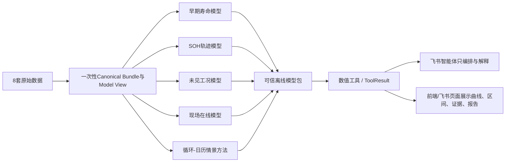

# 泉芯智寿全模型离线训练闭环 Implementation Plan

> **For agentic workers:** REQUIRED SUB-SKILL: Use superpowers:subagent-driven-development (recommended) or superpowers:executing-plans to implement this plan task-by-task. Steps use checkbox (`- [ ]`) syntax for tracking.

**Goal:** 从当前“模型与数据适配骨架存在、统一矩阵全部阻断”的真实状态出发，一次性实现八类数据的一次处理、十二类模型/方法的真实训练或计算生命周期、五种子评测、逐电芯证据、Conformal/OOD/在线更新、离线推理制品和 A100 物理卡 1 上可恢复的一行全流程训练。

**Architecture:** `data/raw` 永远只读；本地可信环境把原始来源一次性转换为带 SHA-256 和 `COMMITTED` 标记的 Canonical Bundle，再生成训练只读的 Model View。统一 `TrainingAdapter` 只包装经过审计的模型核心，不允许适配器继续以 `BLOCKED_DATA_VIEW` 代替实现；`TrainingMatrix` 物化 `smoke/select/final` 全阶段任务，统一执行器按依赖拓扑运行 GPU 深度模型、CPU 机理模型和训练后证据任务。A100 入口只校验冻结数据并训练，不重新处理 raw；同一条命令完成 Select、固化选择清单、Final、测试、校准、OOD、聚合与导出，断电重启后按上下文 SHA 恢复或跳过已完成任务。

**Tech Stack:** 复用 `A100-quanxin.md` 已记录的 `quanxin-a100` 环境：Python 3.11.13、PyTorch 2.12.0、CUDA 13.x、Pydantic 2.13.4、safetensors 0.8.0、PyArrow 23.0.1、NumPy 2.4.6、SciPy 1.17.1、pandas 2.3.3、scikit-learn 1.9.0、MLflow 3.14.0；仅为上游核心实际 import 的缺失包构建离线增量 wheelhouse。质量工具为 pytest、ruff、mypy、Bash；后台运行采用 tmux；计算设备为 NVIDIA A100 80GB，物理 GPU 1 通过 `CUDA_VISIBLE_DEVICES=1` 映射为进程内 `cuda:0`。

---

## 0. 完成口径：本计划不允许再次“以阻断代替实现”

本计划完成后，下列命令必须成为唯一正式入口：

```bash
bash scripts/a100/train_all_ready.sh
```

它必须依次完成：

```text
冻结输入核验
→ GPU1/环境预检
→ Smoke（每个可训练模型至少一个真实 batch）
→ Select（只读 train/validation，不读 calibration/test）
→ 固化 selection_manifest 及 SHA
→ Final（五 seed，按已选超参数训练）
→ 首次且仅一次读取 test
→ 逐电芯/逐轨迹结果
→ Conformal 与覆盖率
→ OOD 支持域
→ 在线更新回放
→ 五 seed 聚合及绘图源数据
→ promoted_models 离线推理 Bundle
→ 回传包及 SHA 清单
```

以下不是可接受的“完成”：

- 配置中仍有 `enabled: false` 或执行方法固定抛出 `BLOCKED_DATA_VIEW`；
- 模型名存在，但 `load_view/train_epoch/validate/predict/export_best` 未实现；
- 只输出总体 MAE，没有逐电芯/逐系统结果；
- 把模型自己重写一遍却没有上游等价性证据；
- 只跑 MATR，而把 HUST、280Ah、180Ah、160Ah 留在 raw；
- 让 A100 每次启动都重新解析 raw；
- Final 仍要求人工改写 selection SHA；
- 需要部署 Qwen、连接 Hugging Face 或在训练时加载 pickle；
- 把 MATR cycle life 或 cycle 500 SOH 说成 15–25 年真实寿命。

## 1. 锁定数据、模型、任务与物理意义

### 1.1 八类数据必须全部登记并产生明确角色

| 数据 | 训练角色 | 允许输出 | 禁止用途 |
|---|---|---|---|
| MATR | 早期寿命与 cycle 500 SOH 主监督 | official cycle life、RUL、真实 SOH 轨迹 | 换算 15–25 年 |
| HUST | 跨协议目标域 | zero/5/10-shot cycle life 与迁移误差 | 主进程反序列化 pickle |
| NAUMANN_CYCLE | 循环工况退化 | 温度/SOC/DoD/倍率条件响应 | 伪造单电芯 EOL |
| NAUMANN_CALENDAR | 日历老化 | 温度/SOC/自然时间容量响应 | 当成循环寿命标签 |
| LFP_280AH_DOD | 大容量外部域 | DoD/厂商条件外测、尺度 OOD | 混入主训练后再称外测 |
| LFP_280AH_TEMPEST | 单只大容量温度证据 | 15–35°C 灵敏度与 HPPC/容量轨迹 | 当成大样本精度证据 |
| LFP_180AH_FORKLIFT | 大容量真实负载轨迹 | RPT 间 SOH 轨迹外测 | 混淆 ageing/RPT 阶段 |
| LFP_FIELD_160AH | 现场系统监测 | 状态趋势、方差、偏离与在线更新 | 从时间直接推 SOH/RUL 标签 |

### 1.2 十二类模型/方法必须全部进入统一任务图

| 家族 | 任务 | 数据 | 训练/计算输出 |
|---|---|---|---|
| CPMLP | 早期寿命基线 | MATR | cycle life、RUL |
| CyclePatch Direct | 早期寿命 | MATR/HUST | cycle life、RUL |
| CyclePatch-BatLiNet | 跨电芯早期寿命 | MATR/HUST | cycle life、参考库证据 |
| PBT | 多域早期寿命 | MATR/HUST | seen/unseen、zero/few-shot |
| DITING-CPTransformer | 域适配寿命 | MATR→HUST | source/target/MMD、zero/few-shot |
| Current Hybrid | SOH 轨迹基线 | MATR | 至 cycle 500 真实轨迹 |
| HybridPatch-v2 | SOH 轨迹 | MATR | 轨迹、平滑/单调/残差 |
| BatteryMFormer | 多域长轨迹 | MATR/HUST/大容量兼容视图 | SOH 轨迹、memory/slot 指标 |
| MAGNet | 未见工况 Qd/Ed | Naumann/280Ah/TEMPEST | Qd/Ed 条件轨迹 |
| BattGP | 现场监测 | 160Ah Field | 均值、方差、残差、在线更新 |
| BLAST-Lite | 循环+日历情景 | Naumann/280Ah | 参数、场景残差、长期情景骨架 |
| Smart Feature | 短充健康特征 | MATR/280Ah | 特征值、覆盖率、与 SOH 相关性 |

15–25 年结果只允许由下式组成：

```text
真实数据支持的基础 SOH 轨迹
+ BLAST 循环老化项
+ Naumann 日历老化项
+ 用户未来工况 profile
+ 大容量尺度校准
+ 不确定性传播
+ 新观测在线更新
```

## 2. 目标文件结构与实现顺序

### 2.1 新建或拆分文件

```text
configs/training/
├── model_coverage_v1.json
├── full_lifecycle_v1.yaml
├── generated/{smoke,selection,final}.json
├── seeds_final.json
├── models/*.yaml
└── tasks/*.yaml

configs/data_splits/
├── hust_domain_split_v1.json
├── lfp_280ah_external_split_v1.json
├── lfp_180ah_external_split_v1.json
├── lfp_field_160ah_system_split_v1.json
└── naumann_condition_split_v1.json

src/quanxin_life/data/pipelines/
├── all_datasets.py
├── hust_isolated.py
├── lfp_large_format.py
└── model_view_pipeline.py

src/quanxin_life/training/
├── runtime.py
├── checkpoints.py
├── coverage.py
├── dag.py
├── run_state.py
├── selection.py
└── metrics_schema.py

src/quanxin_life/training/adapters/
├── cpmlp.py
├── native_advanced.py
├── pbt.py
├── diting.py
├── batterymformer.py
├── magnet.py
├── battgp.py
├── blast.py
└── smart_feature.py

scripts/data/
├── prepare_all_datasets_v2.py
├── build_all_model_views.py
├── convert_frozen_embeddings.py
└── freeze_training_inputs.py

scripts/a100/
├── train_all_ready.sh
├── run_all_in_tmux.sh
├── monitor_all.sh
├── preflight.sh
└── collect_results.sh
```

### 2.2 强制依赖顺序

```text
Task 1–5：数据与Model View
→ Task 6：安全冻结条件 embedding
→ Task 7：训练公共运行时
→ Task 8–13：全部模型真实适配
→ Task 14：统一指标与逐样本证据
→ Task 15：Conformal/OOD/在线回放
→ Task 16：selection/final 与五种子统计
→ Task 17：任务矩阵与一键 DAG
→ Task 18：离线包与环境
→ Task 19：安全推理包与 promotion
→ Task 20：本机完整 readiness 门禁
→ Task 21：A100 正式执行与回传
→ Task 22：技术文档图源与结论表
```

---

### Task 1：冻结完整覆盖清单并让矩阵缺项直接失败

**Files:**
- Create: `configs/training/model_coverage_v1.json`
- Create: `src/quanxin_life/training/coverage.py`
- Modify: `src/quanxin_life/training/matrix.py`
- Test: `tests/unit/training/test_model_coverage.py`

- [ ] **Step 1：写覆盖清单红测**

```python
def test_required_model_families_are_exactly_covered():
    coverage = load_model_coverage(Path("configs/training/model_coverage_v1.json"))
    assert set(coverage.required_model_families) == {
        "cpmlp", "cyclepatch_direct", "cyclepatch_batlinet", "pbt",
        "diting_cptransformer", "current_hybrid", "hybridpatch_v2",
        "batterymformer", "magnet", "battgp", "blast_lite", "smart_feature",
    }
    assert set(coverage.required_dataset_ids) == {
        "MATR", "HUST", "NAUMANN_CYCLE", "NAUMANN_CALENDAR",
        "LFP_280AH_DOD", "LFP_280AH_TEMPEST",
        "LFP_180AH_FORKLIFT", "LFP_FIELD_160AH",
    }
```

- [ ] **Step 2：运行红测确认当前没有覆盖契约**

Run: `python -m pytest tests/unit/training/test_model_coverage.py -q`

Expected: FAIL，提示 `quanxin_life.training.coverage` 不存在。

- [ ] **Step 3：实现不可缩减的覆盖契约**

```python
class TrainingCoverage(BaseModel):
    model_config = ConfigDict(extra="forbid", frozen=True)
    schema_version: Literal["training-coverage-v1"]
    required_model_families: tuple[str, ...]
    required_dataset_ids: tuple[str, ...]
    required_modes: tuple[TrainingMode, ...] = (
        TrainingMode.SMOKE, TrainingMode.SELECT, TrainingMode.FINAL
    )
    final_seeds: tuple[int, ...] = (38, 39, 40, 41, 42)
    early_life_cutoffs: tuple[int, ...] = (20, 50, 100, 150)

    @model_validator(mode="after")
    def identities_are_unique(self) -> "TrainingCoverage":
        if len(set(self.required_model_families)) != len(self.required_model_families):
            raise ValueError("model coverage contains duplicates")
        if len(set(self.required_dataset_ids)) != len(self.required_dataset_ids):
            raise ValueError("dataset coverage contains duplicates")
        return self
```

- [ ] **Step 4：让矩阵验证拒绝少模型、少数据、少阶段和少 seed**

新增 `validate_matrix_coverage(matrix, coverage)`；Final 深度模型必须正好含五个 seed，早期 MATR 原生模型必须覆盖四个 cutoff。BLAST/Smart Feature 可声明 `seed_policy="deterministic"`，但不能伪造五 seed。

- [ ] **Step 5：运行覆盖测试**

Run: `python -m pytest tests/unit/training/test_model_coverage.py tests/unit/training/test_matrix.py -q`

Expected: PASS。

- [ ] **Step 6：提交**

```bash
git add configs/training/model_coverage_v1.json src/quanxin_life/training/coverage.py src/quanxin_life/training/matrix.py tests/unit/training
git commit -m "feat(training): enforce complete model and dataset coverage"
```

### Task 2：完成八类数据的统一 Canonical Bundle，而不是只登记 raw

**Files:**
- Create: `src/quanxin_life/data/pipelines/all_datasets.py`
- Create: `scripts/data/prepare_all_datasets_v2.py`
- Modify: `src/quanxin_life/data/processing.py`
- Modify: `scripts/data/prepare_all_datasets.py`
- Test: `tests/unit/data/test_all_dataset_pipeline.py`

- [ ] **Step 1：写八数据 plan/build/verify 红测**

```python
@pytest.mark.parametrize("dataset_id", REQUIRED_DATASET_IDS)
def test_every_registered_dataset_has_a_real_builder(dataset_id, project_root):
    pipeline = build_dataset_pipeline(project_root)
    spec = pipeline.resolve(dataset_id)
    assert spec.dataset_id == dataset_id
    assert callable(spec.build)
    assert callable(spec.verify)
```

- [ ] **Step 2：写禁止重复处理和半成品发布红测**

```python
def test_second_build_skips_identical_committed_bundle(project_root):
    first = pipeline.build("LFP_280AH_DOD")
    second = pipeline.build("LFP_280AH_DOD")
    assert second.status == DatasetBuildStatus.SKIPPED_VALID
    assert first.output_sha256 == second.output_sha256

def test_interrupted_build_never_creates_committed_marker(project_root):
    with pytest.raises(InjectedBuildFailure):
        pipeline.build("LFP_FIELD_160AH", fail_after_artifact=1)
    assert not any(project_root.glob("data/processed/**/COMMITTED"))
```

- [ ] **Step 3：删除按 dataset_id 硬编码的永久阻断**

把旧 `_blocker()` 替换为来源状态与适配器注册状态检查：

```python
def readiness(entry: SourceCatalogEntry, registry: DatasetAdapterRegistry) -> str:
    if entry.license_status.upper() == "UNVERIFIED":
        return "BLOCKED_LICENSE"
    if not registry.contains(entry.dataset_id):
        return "BLOCKED_DATA_ADAPTER"
    return "READY"
```

TEMPEST 许可证必须在 `configs/data_sources.json` 中更新为来源页面核验到的真实许可证；若来源没有可用许可证，数据仍处理为隔离证据但不得进入晋级模型，覆盖清单中记录 `promotion_allowed=false`，而不是从工程中消失。

- [ ] **Step 4：统一构建输出结构**

每套数据输出：

```text
data/processed/<dataset>/<version>/canonical-v1/
├── observations.parquet
├── entities.parquet
├── conditions.parquet
├── source_manifest.json
├── dataset_manifest.json
├── artifact_manifest.json
└── COMMITTED
```

所有 Parquet 明确单位、层级、mask、原始相对路径与时间区；无 SOH 标签的数据写 `target_status="NOT_AVAILABLE_FROM_SOURCE"`。

- [ ] **Step 5：实现一次性总入口**

```python
for dataset_id in coverage.required_dataset_ids:
    result = pipeline.build_or_verify(dataset_id)
    if result.status not in {DatasetBuildStatus.COMMITTED, DatasetBuildStatus.SKIPPED_VALID}:
        raise SystemExit(42)
```

Run: `python scripts/data/prepare_all_datasets_v2.py build`

Expected: 第一次产生八套冻结 Bundle；第二次全部输出 `SKIPPED_VALID`。

- [ ] **Step 6：提交**

```bash
git add src/quanxin_life/data/pipelines scripts/data/prepare_all_datasets_v2.py scripts/data/prepare_all_datasets.py tests/unit/data
git commit -m "feat(data): build all canonical battery datasets once"
```

### Task 3：完成 HUST 隔离转换并建立可审计物理字段

**Files:**
- Modify: `configs/data_layouts/hust_mendeley_v2_layout_v1.json`
- Modify: `quarantine/hust/convert.py`
- Create: `src/quanxin_life/data/pipelines/hust_isolated.py`
- Modify: `src/quanxin_life/data/adapters/hust.py`
- Test: `tests/unit/data/test_hust_isolated_pipeline.py`
- Test: `tests/integration/test_hust_quarantine_conversion.py`

- [ ] **Step 1：写布局批准红测**

```python
def test_hust_layout_is_semantically_approved():
    layout = HUSTLayout.load(Path("configs/data_layouts/hust_mendeley_v2_layout_v1.json"))
    assert layout.review_status == HUSTLayoutReviewStatus.APPROVED
    assert {field.name for field in layout.fields} >= {
        "cell_id", "cycle_index", "voltage_v", "current_a",
        "capacity_ah", "temperature_c", "official_cycle_life",
    }
```

- [ ] **Step 2：在无网络、只读 ZIP、无宿主挂载写权限的容器内抽样发现字段**

Run:

```bash
docker compose -f quarantine/hust/compose.yaml run --rm discover
```

Expected: 生成只包含类型、shape、单位候选、文件身份和 opcode 审计的 JSON；不生成 Python 对象制品。

- [ ] **Step 3：人工把已核验字段写入版本化布局**

布局必须为每个字段写：源路径、dtype、shape、单位、缺测规则、cell_id 生成规则、cycle life 含义。`review_status` 只有这些字段全部填写后才可改为 `APPROVED`。

- [ ] **Step 4：隔离转换器只输出 Parquet/JSON**

```python
ALLOWED_OUTPUT_SUFFIXES = frozenset({".parquet", ".json"})

def write_cell(cell: ReviewedHUSTCell, output: Path) -> None:
    table = pa.Table.from_pylist(cell.observations)
    pq.write_table(table, output / f"{cell.cell_id}.parquet")
```

转换完成后主进程逐文件校验 SHA、列 schema、有限值、循环单调性和 `cell_id` 唯一性；主进程永远不导入 pickle。

- [ ] **Step 5：建立 MATR→HUST 域角色**

输出 HUST train/validation/adaptation/test 四分区；zero-shot 的 adaptation 为空，5-shot/10-shot 使用固定 cell 清单，三种实验共享同一冻结 test cohort。

- [ ] **Step 6：运行专项门禁并提交**

Run: `python -m pytest tests/unit/data/test_hust_isolated_pipeline.py tests/integration/test_hust_quarantine_conversion.py -q`

Expected: PASS。

```bash
git add configs/data_layouts/hust_mendeley_v2_layout_v1.json quarantine/hust src/quanxin_life/data/adapters/hust.py src/quanxin_life/data/pipelines/hust_isolated.py tests
git commit -m "feat(data): complete isolated HUST conversion"
```

### Task 4：完成 280Ah、180Ah、160Ah 大容量与现场数据写入

**Files:**
- Create: `src/quanxin_life/data/pipelines/lfp_large_format.py`
- Modify: `src/quanxin_life/data/adapters/lfp_280ah_dod.py`
- Modify: `src/quanxin_life/data/adapters/lfp_280ah_tempest.py`
- Modify: `src/quanxin_life/data/adapters/lfp_180ah_forklift.py`
- Modify: `src/quanxin_life/data/adapters/lfp_field_160ah.py`
- Test: `tests/unit/data/test_lfp_large_format_pipeline.py`

- [ ] **Step 1：写四套真实层级红测**

```python
def test_large_format_entities_keep_physical_level(bundle):
    assert set(bundle.entities.column("entity_level").to_pylist()) <= {
        "cell", "pack", "system"
    }
    assert not bundle.entities.column("entity_id").null_count

def test_field_data_does_not_invent_health_targets(field_bundle):
    assert field_bundle.manifest.target_semantics == "no_health_target"
    assert "soh" not in field_bundle.observations.column_names
    assert "rul" not in field_bundle.observations.column_names
```

- [ ] **Step 2：280Ah DoD 保持 vendor/cell/DoD 身份**

CATL 与 EVE 分别保留 vendor；18 个电芯使用来源目录编号形成稳定 `cell_id`；输出充电片段、RPT/容量、DoD 和温度，角色固定为 external calibration/test。

- [ ] **Step 3：TEMPEST 保持单电芯限制**

容量、HPPC、熵系数和 ageing 表以同一 `TEMPEST-LIC-280AH` 关联；温度 15/20/25/30/35°C 是条件维，不复制成五只电芯。

- [ ] **Step 4：Forklift 分离 ageing 与 RPT**

```python
phase = Literal["ageing", "rpt"]
```

SOH 只能由来源 RPT 容量与明确基准容量计算；ageing 片段不能直接当监督标签。

- [ ] **Step 5：Field 按 system_id 与 UTC 时间建模**

保留系统电压/电流/SOC/温度、8 个单体电压和均衡状态；无法从来源确定时区时写 `timezone_status="UNRESOLVED"`，不静默假设 UTC。

- [ ] **Step 6：运行四适配器测试并构建 Bundle**

Run: `python -m pytest tests/unit/data/test_lfp_large_format_pipeline.py -q`

Run: `python scripts/data/prepare_all_datasets_v2.py build --datasets LFP_280AH_DOD LFP_280AH_TEMPEST LFP_180AH_FORKLIFT LFP_FIELD_160AH`

Expected: 四套目录均有有效 `COMMITTED`，重复执行均为 `SKIPPED_VALID`。

- [ ] **Step 7：提交**

```bash
git add src/quanxin_life/data/adapters src/quanxin_life/data/pipelines/lfp_large_format.py tests/unit/data
git commit -m "feat(data): materialize large-format and field LFP bundles"
```

### Task 5：冻结全部 cell/system/condition 划分与 Model View

**Files:**
- Create: `src/quanxin_life/data/pipelines/model_view_pipeline.py`
- Modify: `src/quanxin_life/data/model_views/builder.py`
- Modify: `scripts/data/build_model_views.py`
- Create: `scripts/data/build_all_model_views.py`
- Create: `configs/data_splits/hust_domain_split_v1.json`
- Create: `configs/data_splits/lfp_280ah_external_split_v1.json`
- Create: `configs/data_splits/lfp_180ah_external_split_v1.json`
- Create: `configs/data_splits/lfp_field_160ah_system_split_v1.json`
- Create: `configs/data_splits/naumann_condition_split_v1.json`
- Test: `tests/unit/data/model_views/test_complete_model_views.py`

- [ ] **Step 1：写分割不可泄漏红测**

```python
@pytest.mark.parametrize("split_path", ALL_SPLIT_MANIFESTS)
def test_split_entities_are_unique_and_disjoint(split_path):
    split = SplitManifest.model_validate_json(split_path.read_bytes())
    groups = [set(split.train), set(split.validation), set(split.calibration), set(split.test)]
    assert all(not left & right for index, left in enumerate(groups) for right in groups[index + 1:])
```

MATR 保留当前固定电芯级四分区，同时在报告中称为“项目固定分层划分”，不得称官方划分。具有官方划分的数据保留官方身份；没有官方划分的数据使用版本化 group split，并记录生成算法与 seed。

- [ ] **Step 2：写五类 Model View 红测**

```python
EXPECTED_VIEWS = {
    "early_life_sequence",
    "multi_domain_early_life",
    "soh_trajectory",
    "degradation_condition",
    "field_monitoring",
    "partial_charge",
}

def test_all_required_views_are_committed(model_view_root):
    observed = {path.parent.parent.name for path in model_view_root.glob("**/COMMITTED")}
    assert EXPECTED_VIEWS <= observed
```

- [ ] **Step 3：实现训练集拟合归一化，其他分区只 transform**

```python
normalizer = ViewNormalizer.fit(train_rows)
train = normalizer.transform(train_rows)
validation = normalizer.transform(validation_rows)
calibration = normalizer.transform(calibration_rows)
test = normalizer.transform(test_rows)
```

Manifest 必须记录 `training_entity_ids_sha256`；测试验证归一化统计不随 validation/test 数值变化。

- [ ] **Step 4：构建全部视图**

```text
early_life_sequence: MATR c20/c50/c100/c150
multi_domain_early_life: MATR + HUST c20/c50/c100/c150
soh_trajectory: MATR c20/c50/c100/c150 + HUST兼容轨迹 + 180Ah外测
degradation_condition: Naumann cycle/calendar + 280Ah DoD + TEMPEST
field_monitoring: 160Ah，按system_id分区
partial_charge: MATR + 280Ah真实充电片段
```

- [ ] **Step 5：移除只支持 MATR/degradation 的硬编码**

构建器按注册的 `ModelViewBuilder` 路由，不允许 `view_id != degradation_condition` 直接返回 False。

- [ ] **Step 6：证明训练代码不能读取 raw**

在测试中 monkeypatch `Path.open`；路径包含 `data/raw` 时抛出 `RawDataAccessViolation`，对每个 Adapter 执行 `load_view()` 并确保只访问 `data/model_views`。

- [ ] **Step 7：生成与复验一次性视图**

Run: `python scripts/data/build_all_model_views.py build`

Run: `python scripts/data/build_all_model_views.py verify`

Expected: 所有视图 `VERIFIED`，重复 build 不重写字节。

- [ ] **Step 8：提交**

```bash
git add src/quanxin_life/data/model_views src/quanxin_life/data/pipelines/model_view_pipeline.py scripts/data configs/data_splits tests/unit/data/model_views
git commit -m "feat(data): freeze all task-specific model views"
```

### Task 6：一次性安全转换 Qwen 条件 embedding，A100 绝不部署 Qwen

**Files:**
- Create: `quarantine/embeddings/convert.py`
- Create: `quarantine/embeddings/README.md`
- Create: `scripts/data/convert_frozen_embeddings.py`
- Create: `src/quanxin_life/data/frozen_embeddings.py`
- Create: `configs/artifacts/frozen_condition_embeddings_v1.json`
- Test: `tests/unit/data/test_frozen_embeddings.py`
- Test: `tests/integration/test_embedding_quarantine.py`

- [ ] **Step 1：写禁止训练运行时加载 Qwen/pickle 红测**

```python
def test_training_source_never_imports_qwen_or_pickle():
    offenders = scan_python_sources(Path("src/quanxin_life/training"))
    assert offenders.forbidden_imports == ()
    assert offenders.forbidden_calls == ()
```

禁止项包括 `transformers`、`sentence_transformers`、`snapshot_download`、`pickle.load`、`joblib.load` 和 `torch.load`。

- [ ] **Step 2：核验上游预计算 embedding 来源**

输入固定为：

```text
research/upstream/BatteryMFormer/data_provider/prompt_embeddings/Qwen3_total.pkl
```

先记录文件 SHA、上游 commit、README 声明、键数量和隔离转换镜像 SHA；主进程不打开该文件。

- [ ] **Step 3：隔离进程转换为 safetensors + JSON**

```python
save_file({"condition_embeddings": tensor.contiguous()}, output / "condition_embeddings.safetensors")
(output / "metadata.json").write_text(
    json.dumps({"condition_ids": condition_ids, "shape": list(tensor.shape)}, sort_keys=True),
    encoding="utf-8",
)
```

PBT 需要的 PCA `components_` 和 `mean_` 在隔离环境读取一次后分别写 `pca_components.safetensors`、`pca_mean.safetensors`；归一化参数写 JSON。

- [ ] **Step 4：主进程闭世界校验**

检查键集合、shape、finite、condition_id 对齐、SHA、禁止符号链接；维度从制品读取，不在代码里猜测。PBT 的 `condition_embedding_dim` 和 BatteryMFormer 的 `d_llm` 必须与制品一致。

- [ ] **Step 5：证明 A100 lock 不包含 Qwen**

```python
def test_a100_lock_has_no_llm_runtime():
    lock = Path("requirements/a100-linux-py311.lock").read_text()
    assert "transformers==" not in lock
    assert "huggingface-hub==" not in lock
    assert "sentence-transformers==" not in lock
```

- [ ] **Step 6：运行转换与测试并提交安全制品清单**

Run: `python scripts/data/convert_frozen_embeddings.py --input-manifest configs/artifacts/frozen_condition_embeddings_v1.json`

Run: `python -m pytest tests/unit/data/test_frozen_embeddings.py tests/integration/test_embedding_quarantine.py -q`

Expected: PASS；A100 训练所需 embedding 全部为 `.safetensors/.json/.parquet`。

```bash
git add quarantine/embeddings scripts/data/convert_frozen_embeddings.py src/quanxin_life/data/frozen_embeddings.py configs/artifacts tests
git commit -m "feat(data): freeze condition embeddings without Qwen runtime"
```

---

### Task 7：把统一适配层补成真正可训练、可恢复、可预测的运行时

**Files:**
- Modify: `src/quanxin_life/training/protocols.py`
- Modify: `src/quanxin_life/training/adapters/base.py`
- Modify: `src/quanxin_life/training/adapters/registry.py`
- Create: `src/quanxin_life/training/runtime.py`
- Create: `src/quanxin_life/training/checkpoints.py`
- Create: `src/quanxin_life/training/randomness.py`
- Create: `src/quanxin_life/training/device.py`
- Test: `tests/unit/training/test_adapter_contract.py`
- Test: `tests/unit/training/test_checkpoint_resume.py`
- Test: `tests/unit/training/test_device_policy.py`

- [ ] **Step 1：先用契约测试钉死十二类方法的统一生命周期**

统一适配器必须实现而不能留 `pass`、`NotImplementedError` 或“外部仓库未就绪”分支：

```python
class TrainableAdapter(Protocol):
    family: ModelFamily

    def build(self, context: RunContext) -> AdapterRuntime: ...
    def train_epoch(self, runtime: AdapterRuntime, epoch: int) -> MetricRecord: ...
    def validate(self, runtime: AdapterRuntime, epoch: int) -> MetricRecord: ...
    def predict(self, runtime: AdapterRuntime, split: SplitName) -> PredictionTable: ...
    def save(self, runtime: AdapterRuntime, kind: Literal["best", "last"]) -> ArtifactManifest: ...
    def restore(self, context: RunContext, checkpoint: Path) -> AdapterRuntime: ...
    def export(self, runtime: AdapterRuntime) -> ArtifactManifest: ...
```

测试枚举十二项：`CPMLP`、`CYCLEPATCH_DIRECT`、`CYCLEPATCH_BATLINET`、`PBT`、`DITING_CPTRANSFORMER`、`CURRENT_HYBRID`、`HYBRIDPATCH_V2`、`BATTERY_MFORMER`、`MAGNET`、`BATTGP`、`BLAST_LITE`、`SMART_FEATURE`，逐个从注册表解析并检查完整方法集。

- [ ] **Step 2：建立不可变的 `RunContext`**

它至少包含 `run_id`、`matrix_row_id`、`family`、`dataset_ids`、`view_manifest_sha256`、`split_manifest_sha256`、`config_sha256`、`seed`、`cutoff`、`phase`、`device`、`output_dir`、`source_revision`。所有适配器只通过该上下文获得路径，禁止自行扫描 `data/raw` 或猜测最新版本。

- [ ] **Step 3：统一设备、随机性和精度策略**

GPU 策略固定为 `CUDA_VISIBLE_DEVICES=1` 后进程内只见 `cuda:0`；PyTorch 模型默认启用 AMP，数值不稳定的 GP/PCA/Conformal 保持 FP32/FP64。记录 Python、NumPy、PyTorch、CUDA 全部随机种子和确定性开关。配置允许原仓库要求的 batch size、学习率和优化器，不用统一超参数覆盖模型原设定。

- [ ] **Step 4：实现原子 checkpoint 和精确恢复**

`last` checkpoint 每个 epoch 更新，必须包含：模型权重、优化器、scheduler、AMP scaler、epoch、best epoch、best validation score、连续未改善验证次数、随机数状态、数据 sampler 状态、配置 SHA 和 view SHA。先写临时目录，再校验后原子重命名。恢复时若任一 SHA 不一致就拒绝，不能“尽量加载”。

- [ ] **Step 5：统一五轮验证与十次无提升早停**

所有可迭代训练模型遵循：每 5 epoch 验证一次；主验证指标按模型配置声明方向；连续 10 次验证未改善即早停，相当于最多 50 个无改善 epoch。`best` 只能由验证集决定；测试集在训练和选模期间不可访问。BattGP、BLAST-Lite、Smart Feature 若不是 epoch 型算法，应在适配器声明 `fit_once`，但仍必须执行独立 validate/test 阶段，不能伪造 epoch loss。

- [ ] **Step 6：落实 micro-batch 与梯度累积，而不是以 OOM 为理由跳过模型**

每个深度模型配置 `batch_size`、`micro_batch_size`、`gradient_accumulation_steps`。先按上游 batch size 尝试；smoke 阶段遇到 OOM 时只允许降低 micro-batch 并等比例增加累积步数，保持有效 batch size不变，同时将调整写入 `resource_adjustments.json`。不允许自动减少数据、epoch、seed 或模型宽度进入正式结果。

- [ ] **Step 7：执行契约门禁并提交**

Run: `python -m pytest tests/unit/training/test_adapter_contract.py tests/unit/training/test_checkpoint_resume.py tests/unit/training/test_device_policy.py -q`

Expected: 十二项全部可构建；中断前后下一批次、epoch 和验证计数一致；错误 SHA 恢复被拒绝。

```bash
git add src/quanxin_life/training tests/unit/training
git commit -m "feat(training): complete resumable adapter runtime"
```

---

### Task 8：完成 CPMLP、CyclePatch 系列与 Hybrid 系列五个本地核心模型

**Files:**
- Modify: `src/quanxin_life/training/adapters/native.py`
- Modify: `src/quanxin_life/models/cpmlp.py`
- Modify: `src/quanxin_life/models/cyclepatch.py`
- Modify: `src/quanxin_life/models/hybrid.py`
- Create: `configs/training/models/cpmlp.yaml`
- Create: `configs/training/models/cyclepatch_direct.yaml`
- Create: `configs/training/models/cyclepatch_batlinet.yaml`
- Create: `configs/training/models/current_hybrid.yaml`
- Create: `configs/training/models/hybridpatch_v2.yaml`
- Test: `tests/unit/training/test_native_adapters.py`
- Test: `tests/integration/training/test_native_models_tiny_fit.py`

- [ ] **Step 1：逐模型抄录并冻结原始训练语义**

为每个模型在 YAML 中记录原仓库/现有实现的输入形状、学习率、batch size、optimizer、scheduler、epoch 上限、损失组成、验证主指标、预测目标和来源文件。任何确需修改的参数必须写 `override_reason`，不能在公共 runner 中悄悄覆盖。

- [ ] **Step 2：完成 CPMLP 早期寿命基线**

输入前 20/50/100/150 循环的固定特征，输出 cycle life；由统一后处理计算对应 cutoff 下的 RUL。训练记录 total loss，验证/测试记录 cycle-life MAE、RMSE、MAPE、R² 和 RUL MAE；输出逐电芯 `y_true/y_pred/error/abs_error`。MATR 为主域，HUST 为外域测试，绝不混合 cell_id。

- [ ] **Step 3：完成 CyclePatch Direct 与 CyclePatch-BatLiNet**

Direct 使用目标电芯早期循环 patch；BatLiNet 额外使用参照电芯关系，但参照库只能来自训练集合。两者均覆盖四个 cutoff。保存 patch 配置、参照库 cell_id 清单和其 SHA；测试断言 validation/test cell 绝不进入参照库。

- [ ] **Step 4：完成 Current Hybrid 与 HybridPatch-v2 轨迹任务**

输出真实监督范围内的未来 SOH 序列。Current Hybrid 作为现有基线；HybridPatch-v2 保留轨迹损失、残差损失、单调约束和可用时的 knee 辅助项。每个 loss 分量必须逐 epoch 记录，不允许只写一个 `loss`。预测表按 `cell_id + horizon/cycle` 输出，不把 cycle 500 监督曲线冒充 15—25 年。

- [ ] **Step 5：实现统一 `predict()` 与安全制品导出**

最终权重优先导出 safetensors；架构、归一化参数、特征版本、输入列、输出语义写 JSON。若优化器状态为恢复训练必须保留 `.pt`，只能位于受控 checkpoint 目录，清单包含 SHA-256，推理包不得携带或加载该文件。

- [ ] **Step 6：小数据端到端验证并提交**

Run: `python -m pytest tests/unit/training/test_native_adapters.py tests/integration/training/test_native_models_tiny_fit.py -q`

Expected: 五类模型都完成 build→train→validate→save→restore→predict；逐电芯预测数量与测试 cell 数/轨迹点数精确一致。

```bash
git add src/quanxin_life/models src/quanxin_life/training/adapters/native.py configs/training/models tests
git commit -m "feat(models): train native early-life and trajectory families"
```

---

### Task 9：完成 PBT 多域早期寿命模型，不依赖运行时 Qwen

**Files:**
- Modify: `src/quanxin_life/training/adapters/pbt.py`
- Create: `src/quanxin_life/models/pbt.py`
- Create: `src/quanxin_life/models/upstream_compat/pbt.py`
- Create: `configs/training/models/pbt.yaml`
- Create: `configs/training/tasks/pbt_multidomain.yaml`
- Test: `tests/unit/models/test_pbt_upstream_equivalence.py`
- Test: `tests/integration/training/test_pbt_tiny_fit.py`

- [ ] **Step 1：把 reviewed upstream 的核心网络和损失封装进项目命名空间**

保留上游特征编码、条件 embedding 融合、PCA 路径和预测头；适配层只负责输入映射、训练生命周期和结果归一化，不能用一个普通 MLP 顶替 PBT 后仍叫 PBT。`upstream_compat/pbt.py` 记录源仓库 URL、commit、原文件 SHA、许可和本地改动摘要。

- [ ] **Step 2：建立数值等价 fixture**

固定一组小输入和固定权重，对比上游核心与适配核心的 forward 输出、loss 和梯度，容差写死。该测试不读取真实数据，也不加载不可信 pickle。

- [ ] **Step 3：绑定多域早期寿命 view**

训练域至少包含准备就绪且标签语义一致的 MATR、HUST、Naumann-cycle；大容量数据若不具备统一 EOL/cycle-life 标签，只作为支持度/OOD 域，不强塞进监督目标。条件 embedding 从 Task 6 安全制品读取；PCA 只在训练 cell 上拟合或读取已验证训练域制品。

- [ ] **Step 4：形成 seen/unseen 和少样本实验**

正式任务必须包括：域内 held-out cell、leave-one-dataset-out zero-shot，以及目标域 5-shot/10-shot 轻量校准。5/10-shot cell 清单由固定 seed 生成并写 manifest；这些 cell 不得再出现在目标域 test 中。

- [ ] **Step 5：记录模型专属证据**

除统一寿命指标外，记录 domain-wise MAE、zero-shot MAE、5-shot/10-shot MAE、条件 embedding 覆盖率、PCA explained variance、训练域与目标域误差差值。每项必须来自结果表，不在文档中手算。

- [ ] **Step 6：运行等价和 tiny-fit 门禁并提交**

Run: `python -m pytest tests/unit/models/test_pbt_upstream_equivalence.py tests/integration/training/test_pbt_tiny_fit.py -q`

Expected: 核心数值等价；PBT 能在 frozen safetensors embedding 上完成训练和跨域预测；依赖图没有 Qwen/Transformers。

```bash
git add src/quanxin_life/models/pbt.py src/quanxin_life/models/upstream_compat/pbt.py src/quanxin_life/training/adapters/pbt.py configs/training tests
git commit -m "feat(models): integrate PBT multidomain training"
```

---

### Task 10：完成 DITING-CPTransformer 的跨域训练与 0/5/10-shot 适配

**Files:**
- Modify: `src/quanxin_life/training/adapters/diting.py`
- Create: `src/quanxin_life/models/cptransformer.py`
- Create: `src/quanxin_life/models/diting.py`
- Create: `src/quanxin_life/models/upstream_compat/cptransformer.py`
- Create: `configs/training/models/diting_cptransformer.yaml`
- Create: `configs/training/tasks/diting_domain_transfer.yaml`
- Test: `tests/unit/models/test_cptransformer_upstream_equivalence.py`
- Test: `tests/unit/models/test_diting_mmd.py`
- Test: `tests/integration/training/test_diting_tiny_transfer.py`

- [ ] **Step 1：锁定 CPTransformer 的真实来源**

以已经审阅的 `research/upstream/BatteryMFormer/models/CPTransformer.py`（以及 BatteryLife 对应版本）为核心来源，记录二者 SHA 和差异。若二者不一致，选择与 DITING 输入契约一致的一版，并把选择依据写入 compatibility manifest；不能继续以“缺模块”为永久 blocker。

- [ ] **Step 2：移植核心并做 forward 等价测试**

仅修改 import、配置注入和张量命名；固定权重与输入对比 logits/embedding。适配器不得改写 attention、position encoding 或预测头后仍宣称等价。

- [ ] **Step 3：实现 DITING 域适配目标**

总损失明确记录为：

```text
loss_total = loss_supervised_source
           + lambda_target * loss_supervised_target_shot
           + lambda_mmd * loss_domain_alignment
```

zero-shot 时 `lambda_target` 项不存在但不填伪零；5/10-shot 才启用目标域标注。MMD 的核、带宽、权重来自配置并进入运行清单。

- [ ] **Step 4：构建 source/target 双数据加载器**

source 为公开训练域，target 按实验指定为完整留出数据集；对齐时只使用 target-train 的无标签特征，绝不读取 target-test 标签。单元测试故意在 test 标签放哨兵值，验证训练过程不触达。

- [ ] **Step 5：完成三阶段评估**

同一目标域输出 zero-shot、5-shot、10-shot 三个 run group；报告目标域逐电芯寿命指标、校准带来的绝对/相对改善、MMD 值曲线和 source-domain 保持率。许可若限制商业部署，训练与比赛研究结果仍可生成，但模型清单必须标 `research_evaluation_only`，不能静默包装成生产可部署。

- [ ] **Step 6：运行门禁并提交**

Run: `python -m pytest tests/unit/models/test_cptransformer_upstream_equivalence.py tests/unit/models/test_diting_mmd.py tests/integration/training/test_diting_tiny_transfer.py -q`

Expected: zero/5/10-shot 均可执行；target-test 标签访问测试通过；CPTransformer 核心数值等价。

```bash
git add src/quanxin_life/models/cptransformer.py src/quanxin_life/models/diting.py src/quanxin_life/models/upstream_compat/cptransformer.py src/quanxin_life/training/adapters/diting.py configs/training tests
git commit -m "feat(models): complete DITING CPTransformer transfer training"
```

---

### Task 11：完成 BatteryMFormer 多域 SOH 轨迹训练

**Files:**
- Modify: `src/quanxin_life/training/adapters/batterymformer.py`
- Create: `src/quanxin_life/models/batterymformer.py`
- Create: `src/quanxin_life/models/upstream_compat/batterymformer.py`
- Create: `configs/training/models/batterymformer.yaml`
- Create: `configs/training/tasks/batterymformer_trajectory.yaml`
- Test: `tests/unit/models/test_batterymformer_upstream_equivalence.py`
- Test: `tests/integration/training/test_batterymformer_tiny_fit.py`

- [ ] **Step 1：保留上游核心结构和 prompt-conditioning 语义**

移植实际使用的 encoder、attention/fusion、trajectory head 和 loss，不引入 Qwen runtime。条件 embedding 仅从 Task 6 的 safetensors 读取。compatibility manifest 逐文件记录上游 SHA 与本地改动。

- [ ] **Step 2：完成等价性与维度契约测试**

用确定性 fixture 对比移植前后的 forward/loss；额外测试 condition id 缺失、embedding 维度错误、history 长度不符时必须显式拒绝，不允许补随机 embedding。

- [ ] **Step 3：绑定多域 trajectory view**

训练样本以 `cell_id + observation_window + forecast_horizon` 组织；各数据集的 SOH 定义、容量基准和时间轴必须由 view manifest 提供。只联合语义可对齐的数据；不可对齐的现场电压流不伪造成 SOH 监督。

- [ ] **Step 4：记录全轨迹损失与 horizon 指标**

逐 epoch 保存 total、point、shape/monotonic（若上游存在）、condition loss（若存在）；测试输出整体 MAE/RMSE、按 horizon 分箱 MAE/RMSE、单调违例率、每个 cell 的 trajectory error。knee/EOL 仅在真实轨迹跨越定义阈值时计算，并记录 eligible 样本数。

- [ ] **Step 5：执行 tiny fit、恢复与导出**

Run: `python -m pytest tests/unit/models/test_batterymformer_upstream_equivalence.py tests/integration/training/test_batterymformer_tiny_fit.py -q`

Expected: 训练、恢复、预测、safetensors 导出全部成功；无 Transformers/Qwen import；逐 horizon 结果表完整。

```bash
git add src/quanxin_life/models/batterymformer.py src/quanxin_life/models/upstream_compat/batterymformer.py src/quanxin_life/training/adapters/batterymformer.py configs/training tests
git commit -m "feat(models): integrate BatteryMFormer trajectory training"
```

---

### Task 12：完成 MAGNet 未见工况轨迹模型

**Files:**
- Modify: `src/quanxin_life/training/adapters/magnet.py`
- Create: `src/quanxin_life/models/magnet.py`
- Create: `src/quanxin_life/models/upstream_compat/magnet.py`
- Create: `configs/training/models/magnet.yaml`
- Create: `configs/training/tasks/magnet_unseen_condition.yaml`
- Test: `tests/unit/models/test_magnet_upstream_equivalence.py`
- Test: `tests/integration/training/test_magnet_meta_split.py`

- [ ] **Step 1：冻结上游 MAGNet 的任务定义**

明确其输出究竟是 Qd、Ed、SOH 或多任务组合，沿用上游网络、损失和优化设置。不能把本项目希望展示的 SOH 名称强加给上游实际输出；由后处理在有物理定义时换算，并保留原输出列。

- [ ] **Step 2：建立按工况而非按行的 meta split**

temperature、charge rate、discharge rate、DoD、protocol id 组成 condition key。meta-train、meta-validation、meta-test 的 condition key 不相交，cell_id 也不相交；测试断言双重隔离。

- [ ] **Step 3：完成 meta-train/meta-test 适配**

保留 support/query 采样语义；每个 episode 记录 support loss、query loss 和外循环 loss。最终测试必须覆盖 seen-condition 与 unseen-condition，两类结果不能平均成一个数字。

- [ ] **Step 4：生成可用于前端工况比较的证据，而不是任意滑块公式**

输出每个受支持 condition 的真实测试轨迹与误差、最近训练 condition 距离、是否 unseen、支持范围。前端未来只能在这些数据支持边界内插值；超范围时交给 OOD/情景模型降级，不让 MAGNet 伪造任意 25 年曲线。

- [ ] **Step 5：运行门禁并提交**

Run: `python -m pytest tests/unit/models/test_magnet_upstream_equivalence.py tests/integration/training/test_magnet_meta_split.py -q`

Expected: 核心等价；condition/cell 双隔离；seen/unseen 结果分别落盘。

```bash
git add src/quanxin_life/models/magnet.py src/quanxin_life/models/upstream_compat/magnet.py src/quanxin_life/training/adapters/magnet.py configs/training tests
git commit -m "feat(models): complete MAGNet unseen-condition training"
```

---

### Task 13：完成 BattGP、BLAST-Lite 与 Smart Feature 三类现场/机理方法

**Files:**
- Modify: `src/quanxin_life/training/adapters/battgp.py`
- Modify: `src/quanxin_life/training/adapters/blast.py`
- Modify: `src/quanxin_life/training/adapters/smart_feature.py`
- Create: `src/quanxin_life/models/battgp.py`
- Create: `src/quanxin_life/models/blast_lite.py`
- Create: `src/quanxin_life/features/smart_charge.py`
- Create: `configs/training/models/battgp.yaml`
- Create: `configs/training/models/blast_lite.yaml`
- Create: `configs/training/models/smart_feature.yaml`
- Test: `tests/unit/models/test_battgp.py`
- Test: `tests/unit/models/test_blast_lite.py`
- Test: `tests/unit/features/test_smart_charge.py`
- Test: `tests/integration/training/test_monitoring_methods.py`

- [ ] **Step 1：完成 BattGP 的概率状态估计**

用 160Ah field view 的时间有序窗口训练/更新 GP 状态，输出均值、预测方差、标准化残差和异常分数。划分必须按系统/电芯与时间同时隔离；未来时间不能进入历史拟合。若现场数据没有可信 SOH 标签，主任务是趋势/异常与概率校准，禁止编造 SOH MAE。

- [ ] **Step 2：完成在线 replay 协议**

按真实时间顺序逐批送入新观测，每个时间点先预测再更新，保存 prequential NLL、coverage、interval width、residual、update latency。断电恢复记录最后事件时间和输入 shard SHA，避免重复消费或跳过。

- [ ] **Step 3：完成 BLAST-Lite 循环—日历退化拟合**

绑定 Naumann-cycle、Naumann-calendar 和可用的 280Ah 温度/DoD证据，显式拟合 calendar term、cycle term、温度项、SOC/DoD 项及参数置信范围。BLAST-Lite 作为 CPU 隔离子进程被总命令调度；它不是深度网络，但必须产出 15—25 年情景层所需的机理参数与支持边界。

- [ ] **Step 4：完成 Smart Feature 短充片段特征**

依据上游 MATLAB/论文定义实现局部充电片段的电压区间、时间、容量、斜率等健康特征；用保存的 reference fixture 对齐数值。其输出供早期寿命模型或现场模型使用，不把相关性特征单独包装成高精度寿命模型。

- [ ] **Step 5：为非 epoch 方法保留真实、不同的日志语义**

BattGP 记录 marginal likelihood/optimization loss；BLAST 记录 objective、parameter trace、fit residual；Smart Feature 记录 feature extraction coverage、missing reason、下游验证指标。统一图表层允许 `metric_name/value/step_type`，但禁止为了表面整齐给不存在的模型伪造 training loss。

- [ ] **Step 6：运行四类门禁并提交**

Run: `python -m pytest tests/unit/models/test_battgp.py tests/unit/models/test_blast_lite.py tests/unit/features/test_smart_charge.py tests/integration/training/test_monitoring_methods.py -q`

Expected: BattGP 时间无泄漏；BLAST 参数可恢复且单位一致；Smart Feature 与 reference fixture 对齐；三者均由统一 runner 调用。

```bash
git add src/quanxin_life/models src/quanxin_life/features src/quanxin_life/training/adapters configs/training tests
git commit -m "feat(models): complete monitoring and degradation methods"
```

---

### Task 14：建立统一但不抹平模型差异的训练、验证、测试和逐电芯证据账本

**Files:**
- Create: `src/quanxin_life/training/metrics_schema.py`
- Create: `src/quanxin_life/training/metric_writers.py`
- Create: `src/quanxin_life/evaluation/regression.py`
- Create: `src/quanxin_life/evaluation/trajectory.py`
- Create: `src/quanxin_life/evaluation/probabilistic.py`
- Create: `src/quanxin_life/evaluation/per_cell.py`
- Create: `configs/evaluation/metric_contract_v1.json`
- Create: `docs/experiments/metric-dictionary.md`
- Test: `tests/unit/evaluation/test_metric_contract.py`
- Test: `tests/unit/evaluation/test_per_cell_reconciliation.py`
- Test: `tests/integration/training/test_metric_materialization.py`

- [ ] **Step 1：定义三张不可缺失的长表**

每个 run 必须写：

```text
history.parquet
  run_id, epoch, global_step, phase, metric_name, metric_value,
  dataset_id, seed, cutoff, timestamp_utc

predictions.parquet
  run_id, dataset_id, split, cell_id, target_name, horizon,
  y_true, y_pred, residual, abs_error, supported, reason_code

metrics.parquet
  run_id, dataset_id, split, metric_name, metric_value,
  n_cells, n_points, aggregation, eligible_count
```

可解释的 CSV 镜像用于画图，但 Parquet 是权威源。字段不可随模型自由命名；模型专属指标通过受控 `metric_name` 字典扩展。

- [ ] **Step 2：统一早期寿命指标口径**

CPMLP、CyclePatch Direct、CyclePatch-BatLiNet、PBT、DITING 至少保留：train loss 及所有 loss 分量、validation cycle-life MAE（选模主指标）、test MAE、RMSE、MAPE、R²、median absolute error、P90 absolute error、RUL MAE、误差均值/标准差。MAPE 对接近零目标显式拒绝；R² 样本不足时写 `not_eligible`，不能写 0。

- [ ] **Step 3：统一轨迹指标口径**

Current Hybrid、HybridPatch-v2、BatteryMFormer、MAGNet 至少保留：total 与分量 loss、point MAE/RMSE、cell-macro MAE/RMSE、按 horizon 分箱误差、单调违例率、终点误差。只有真实序列跨越 knee/EOL 定义的 eligible cell 才计算 knee-cycle MAE、EOL-cycle MAE；同时报告 eligible/total，避免选择性展示。

- [ ] **Step 4：统一概率与现场指标口径**

BattGP 至少保留 optimization loss/NLL、prequential NLL、80%/90% coverage、mean interval width、standardized residual 分布和 update latency。异常 AUROC/AUPRC 只有存在可信异常标签时报告；否则只报告无标签风险排序稳定性并标明不能证明召回率。

- [ ] **Step 5：统一 BLAST 与 Smart Feature 口径**

BLAST-Lite 保留 fit objective、容量残差 MAE/RMSE、参数估计与置信范围、按温度/DoD/calendar/cycle 子集残差。Smart Feature 保留 extraction success rate、缺测原因分布、特征稳定性、与容量/SOH 的相关性及接入下游模型前后的配对指标；不把相关系数说成寿命预测精度。

- [ ] **Step 6：落实“逐电芯预测证明结果没有被平均数掩盖”**

每个 test cell 必须能从 predictions 表还原其误差；宏平均由逐电芯表重新计算并与 metrics 表对账。轨迹任务先在 cell 内聚合再做 cell-macro；不能让长寿命或采样点多的 cell 主导全局数字。

- [ ] **Step 7：为图文技术文档直接物化图源表**

训练阶段只保存原始长表；汇总阶段生成 `figure_sources/`：loss curves、validation curves、predicted-vs-true、residual distribution、per-cell error、horizon error、coverage-width、domain generalization、online replay、condition comparison。图源表写 `source_run_ids.json`，图表不能读取手填数字。

- [ ] **Step 8：运行对账门禁并提交**

Run: `python -m pytest tests/unit/evaluation/test_metric_contract.py tests/unit/evaluation/test_per_cell_reconciliation.py tests/integration/training/test_metric_materialization.py -q`

Expected: 缺任一必需指标即失败；metrics 可从 predictions/history 精确重算；不存在 NaN 被静默转 0。

```bash
git add src/quanxin_life/training src/quanxin_life/evaluation configs/evaluation docs/experiments tests
git commit -m "feat(evaluation): materialize complete training evidence ledger"
```

---

### Task 15：实现严格独立的 Conformal、OOD、跨域与在线校正后评估

**Files:**
- Create: `src/quanxin_life/evaluation/conformal.py`
- Create: `src/quanxin_life/evaluation/ood.py`
- Create: `src/quanxin_life/evaluation/domain_shift.py`
- Create: `src/quanxin_life/evaluation/online_replay.py`
- Create: `configs/evaluation/conformal_v1.yaml`
- Create: `configs/evaluation/ood_v1.yaml`
- Create: `scripts/evaluation/run_post_training.py`
- Test: `tests/unit/evaluation/test_conformal_isolation.py`
- Test: `tests/unit/evaluation/test_ood_support.py`
- Test: `tests/integration/evaluation/test_post_training_pipeline.py`

- [ ] **Step 1：让 calibration 成为独立 split，而不是 validation/test 的别名**

`train` 用于拟合权重，`val` 用于选模型，`calibration` 只拟合区间，`test` 只做最终评估。所有 split 以 cell_id 隔离。测试构造重叠 cell 时必须在启动前失败。

- [ ] **Step 2：实现点预测 split conformal**

在 calibration cell 的绝对残差上计算 80%/90% 分位数；测试输出 PICP、MPIW、normalized width、under/over coverage。按 cutoff、目标和域分别校准；样本不足时标记 `insufficient_calibration_support`，不能借用 test residual。

- [ ] **Step 3：实现轨迹 conformal/分 horizon 校准**

对 trajectory 按 horizon bucket 或受控的 normalized residual 做区间；记录每个 horizon 的 coverage/width。越过实验支持范围后只允许不确定性扩大，不允许因为外推而区间反常缩窄。

- [ ] **Step 4：实现 OOD 支持度评分与拒绝语义**

基于训练域的受控元数据距离、表示空间距离和缺测掩码计算支持度；输出 `in_domain / weak_support / out_of_domain / rejected` 以及触发字段。阈值只在 validation/calibration 上定，test 不调阈值。未知化学体系、容量/温度/倍率远超范围或必需字段缺失时显式拒绝。

- [ ] **Step 5：实现 leave-one-dataset/condition 的跨域评估**

统一产出 source-only、zero-shot、5-shot、10-shot 表，报告每个目标域和五种子统计；同域随机切分不能代替跨域证据。大容量/现场域即使无统一标签，也必须进入 OOD 支持度报告。

- [ ] **Step 6：实现新观测在线修正 replay**

对支持在线更新的 BattGP、Hybrid/轨迹校准器依时间顺序执行 predict→score→update；保存校正前后轨迹、误差、区间、参数/隐状态版本和事件 SHA。LLM 不参与数值更新。

- [ ] **Step 7：运行后训练门禁并提交**

Run: `python -m pytest tests/unit/evaluation/test_conformal_isolation.py tests/unit/evaluation/test_ood_support.py tests/integration/evaluation/test_post_training_pipeline.py -q`

Expected: 测试集从不参与校准/阈值选择；80/90 区间与 OOD/在线结果均可追溯到 run 和输入 SHA。

```bash
git add src/quanxin_life/evaluation configs/evaluation scripts/evaluation tests
git commit -m "feat(evaluation): add conformal OOD and online replay"
```

---

### Task 16：实现 selection/final 两阶段与五随机种子统计，杜绝用测试集挑模型

**Files:**
- Create: `src/quanxin_life/training/selection.py`
- Create: `src/quanxin_life/evaluation/aggregate.py`
- Create: `src/quanxin_life/evaluation/bootstrap.py`
- Create: `scripts/training/select_configs.py`
- Create: `scripts/evaluation/aggregate_final.py`
- Create: `configs/training/seeds_final.json`
- Test: `tests/unit/training/test_selection_no_test_access.py`
- Test: `tests/unit/evaluation/test_paired_seed_aggregate.py`
- Test: `tests/integration/training/test_selection_final_binding.py`

- [ ] **Step 1：明确 smoke、selection、final 三阶段用途**

`smoke` 只验证代码链路，不进入报告；`selection` 只用 train/val 选择配置；`final` 冻结配置后用 seeds 38、39、40、41、42 各跑一次，并首次读取 test。所有阶段使用相同正式 split manifest，smoke 只能缩短 epoch/样本但必须显式 `non_reportable=true`。

- [ ] **Step 2：生成不可修改的 selection artifact**

`selected_config.json` 包含候选配置、validation 指标、选择规则、模型/数据/view/source SHA、选择时间和签名摘要。final runner 只接受该文件，不接受命令行临时更改学习率、cutoff 或损失权重。

- [ ] **Step 3：固定五种子且做配对比较**

所有可比较模型使用相同的五 seeds 和相同 split/view。汇总报告 mean、std、median、95% bootstrap CI；模型差值按相同 seed 配对，输出 paired delta 及 CI，而非拿不同随机实验硬比较。

- [ ] **Step 4：防止挑选最好 seed**

promotion 与技术文档默认展示五种子 aggregate；单 seed 曲线可作案例但必须显示 seed/run_id，不能把最好 seed 当总体结果。缺任一 final seed 时 aggregate 状态为 incomplete，不能晋级。

- [ ] **Step 5：运行选择与统计门禁并提交**

Run: `python -m pytest tests/unit/training/test_selection_no_test_access.py tests/unit/evaluation/test_paired_seed_aggregate.py tests/integration/training/test_selection_final_binding.py -q`

Expected: selection 访问 test 会失败；final 配置 SHA 不可变；五种子配对结果可由 run 表重算。

```bash
git add src/quanxin_life/training/selection.py src/quanxin_life/evaluation scripts/training scripts/evaluation configs/training tests
git commit -m "feat(training): freeze validation selection and five-seed finals"
```

---

### Task 17：物化完整实验矩阵并把一行命令实现成可恢复 DAG

**Files:**
- Modify: `scripts/run_training_matrix.py`
- Create: `src/quanxin_life/training/dag.py`
- Create: `src/quanxin_life/training/run_state.py`
- Create: `scripts/training/materialize_matrix.py`
- Create: `scripts/training/run_full_lifecycle.py`
- Create: `scripts/a100/train_all_ready.sh`
- Create: `scripts/a100/run_all_in_tmux.sh`
- Create: `scripts/a100/monitor_all.sh`
- Create: `configs/training/full_lifecycle_v1.yaml`
- Test: `tests/unit/training/test_dag_resume.py`
- Test: `tests/integration/training/test_full_matrix_materialization.py`
- Test: `tests/integration/training/test_full_lifecycle_tiny.py`

- [ ] **Step 1：从覆盖合同生成实际行，不维护第二份手写矩阵**

matrix row 至少包含 family、task、dataset/view、cutoff、phase、seed、config SHA、依赖 row、资源类型、reportable。早期寿命四 cutoff 展开；zero/5/10-shot 展开；轨迹、现场和 BLAST 依其任务展开。生成后必须证明十二类方法和八数据角色均被覆盖。

- [ ] **Step 2：建立完整 DAG 顺序**

固定拓扑为：verify package→preflight→smoke→selection→freeze selection→final five seeds→test predictions→Conformal/OOD/online replay→aggregate→figure sources→promotion→offline bundle。BLAST 的 CPU 子进程可与 GPU 训练排队或并行，但其失败会阻止总任务完成，不能当作“可选”。

- [ ] **Step 3：定义行状态机**

仅允许 `PENDING/RUNNING/INTERRUPTED/SUCCEEDED/FAILED/STALE`。`SUCCEEDED` 要求成功标记、预期制品、指标、预测和 SHA 全部存在；仅有目录或 checkpoint 不算成功。重新运行时：SUCCEEDED 且 SHA 一致则跳过，INTERRUPTED 从 last 恢复，FAILED 重试并保留旧日志，STALE 因依赖/config 变化强制重跑。

- [ ] **Step 4：实现一行无参数入口**

用户最终只执行：

```bash
bash scripts/a100/train_all_ready.sh
```

脚本内部固定读取 `configs/training/full_lifecycle_v1.yaml`，设置 GPU 1、环境、日志根目录和退出码；不得要求用户逐模型传参数。`run_all_in_tmux.sh` 只负责创建/复用名为 `quanxin-train` 的 tmux 会话并调用同一个入口，不能有另一套逻辑。

- [ ] **Step 5：实现断网、断 SSH、断电恢复**

断网不影响任何步骤；代码禁止下载。tmux 保证断开终端继续；断电后再次运行同一命令，根据状态机恢复。每行日志写 `logs/<row_id>/stdout.log`、`events.jsonl`、`resource.csv`；`monitor_all.sh` 展示总进度、当前 row、epoch、最近验证指标、GPU 显存和失败原因。

- [ ] **Step 6：禁止“全部完成”假象**

根命令只有在所有必需 row SUCCEEDED、所有 final seeds 齐全、聚合与 promotion 完成时返回 0；任何模型 stub、数据 view 缺失、license 未记录、指标缺失或制品 SHA 错误都返回非零，并在 `run_summary.json` 列出精确阻断项。

- [ ] **Step 7：运行 tiny 全生命周期门禁并提交**

Run: `python -m pytest tests/unit/training/test_dag_resume.py tests/integration/training/test_full_matrix_materialization.py tests/integration/training/test_full_lifecycle_tiny.py -q`

Expected: tiny 数据上十二方法全部经过其真实适配路径；第二次执行只跳过完整成功行；模拟中断后从 checkpoint 恢复；根命令状态正确。

```bash
git add scripts/run_training_matrix.py scripts/training scripts/a100 src/quanxin_life/training configs/training tests
git commit -m "feat(training): run complete resumable model DAG with one command"
```

---

### Task 18：完成 A100 离线依赖、源代码、数据视图和制品目录打包

**Files:**
- Modify: `requirements/a100-linux-py311.lock`
- Create: `requirements/blast-linux-py311.lock`
- Modify: `scripts/a100/build_offline_package.py`
- Modify: `scripts/a100/verify_offline_package.py`
- Create: `configs/offline/package_contents_v1.json`
- Create: `scripts/a100/preflight.sh`
- Create: `scripts/a100/collect_results.sh`
- Test: `tests/unit/offline/test_package_manifest.py`
- Test: `tests/integration/offline/test_closed_world_imports.py`
- Test: `tests/integration/offline/test_offline_package_roundtrip.py`

- [ ] **Step 1：以现有 `quanxin-a100` 为基线冻结环境差异**

先把 `A100-quanxin.md` 中已安装版本写成 baseline manifest，禁止为了本计划重装 PyTorch/CUDA 等大包。静态扫描十二适配器的 import，再在同版本 Linux/Python 3.11 环境解析缺失依赖；只把缺失项及其传递依赖下载为增量 wheelhouse。BLAST 若确有冲突才创建独立 CPU 环境和锁文件。所有 wheel 记录 SHA，正式 A100 运行不得访问 PyPI/GitHub/Hugging Face。

- [ ] **Step 2：打包恰好需要的源与上游核心**

包含本项目 `src/`、`scripts/`、`configs/`、必要 tests/smoke fixtures、许可与 provenance manifests，以及适配实际引用的 upstream core。排除前端、Node 依赖、未引用仓库历史、大型 raw 数据和不可信 checkpoint。A100 只读取已提交的 processed bundles/model views。

- [ ] **Step 3：打包全部已提交数据 bundle/view**

根据 COMMITTED manifest 自动收集八数据集 canonical bundles、全部 model views、split manifests、normalizers、frozen embeddings/PCA；逐文件 SHA 写总清单。若任何覆盖合同引用的 view 不在包内，构建直接失败。

- [ ] **Step 4：实现闭世界预检**

`preflight.sh` 检查 Python 3.11、CUDA/GPU1、磁盘、包 SHA、import、数据/view/config/source revision、无网络依赖、输出目录可写。检查失败时训练一个 row 都不能启动。

- [ ] **Step 5：实现结果回收而不打包冗余 checkpoint**

`collect_results.sh` 收集 best/last manifests、最佳推理权重、selected configs、history/predictions/metrics、post-training 证据、aggregate、figure sources、promotion 和日志索引；优化器 checkpoint 可按需单独归档用于续训，不混入推理包。

- [ ] **Step 6：执行离线 roundtrip 门禁并提交**

Run: `python -m pytest tests/unit/offline/test_package_manifest.py tests/integration/offline/test_closed_world_imports.py tests/integration/offline/test_offline_package_roundtrip.py -q`

Expected: 在无网络模拟环境解包、安装、preflight、tiny lifecycle、结果回收成功；无 Qwen runtime 和未核验 pickle/pt 推理加载。

```bash
git add requirements scripts/a100 configs/offline tests
git commit -m "build(a100): complete closed-world training package"
```

---

### Task 19：生成可被智能体安全调用的离线模型包与 promotion 证据

**Files:**
- Modify: `src/quanxin_life/training/promotion.py`
- Modify: `scripts/build_offline_model_package.py`
- Create: `src/quanxin_life/artifacts/model_bundle.py`
- Create: `configs/promotion/model_gates_v1.yaml`
- Create: `docs/experiments/promotion-policy.md`
- Test: `tests/unit/training/test_promotion_gates.py`
- Test: `tests/integration/artifacts/test_offline_model_bundle.py`

- [ ] **Step 1：按任务晋级而不是硬选一个万能模型**

分别晋级 early-life point、trajectory、unseen-condition、field monitoring、degradation-scenario 五种能力；每种能力可保留 champion 与 challenger。不能拿寿命 MAE 最小的模型去冒充现场监测或 25 年情景模型。

- [ ] **Step 2：定义硬门禁**

必须具备：五 final seeds、逐电芯预测、独立 test、数据/模型/source SHA、训练与验证历史、Conformal/OOD（适用任务）、license/provenance、无泄漏检查、数值有限、输入输出契约。性能阈值在 validation 冻结；test 只报告是否满足预注册门槛，不重新改门槛。

- [ ] **Step 3：构建安全推理制品**

模型权重 safetensors/安全 GP 参数、架构 JSON、normalizer JSON/safetensors、feature/view contract、calibration/OOD 制品、model card、metrics summary、per-cell 索引与 SHA 清单。推理包不含 optimizer、任意 Python pickle、上游不明 checkpoint 或 Qwen。

- [ ] **Step 4：绑定 `ToolResult` 数值来源**

每个推理能力声明它能产生的 ToolResult 类型、单位、支持范围、证据等级和拒绝原因。未来飞书智能体只能调用这些工具并解释结果，不能自己生成 SOH/RUL/置信区间/经营指标。

- [ ] **Step 5：运行 promotion 与 bundle 门禁并提交**

Run: `python -m pytest tests/unit/training/test_promotion_gates.py tests/integration/artifacts/test_offline_model_bundle.py -q`

Expected: 不完整 run 无法晋级；完整 bundle 在隔离进程验证 SHA 后推理；每个数值可追溯至模型、输入和 calibration 版本。

```bash
git add src/quanxin_life/training/promotion.py src/quanxin_life/artifacts scripts/build_offline_model_package.py configs/promotion docs/experiments tests
git commit -m "feat(artifacts): promote safe offline inference bundles"
```

---

### Task 20：在本机完成最终静态/小样本验收后再上传 A100

**Files:**
- Modify: `pyproject.toml`
- Create: `scripts/quality/check_training_readiness.py`
- Create: `scripts/quality/check_no_training_stubs.py`
- Create: `scripts/quality/check_metric_coverage.py`
- Create: `docs/experiments/a100-readiness-report-template.md`
- Test: `tests/system/test_training_readiness.py`

- [ ] **Step 1：实现机器可判定的 readiness 报告**

报告逐项列出八数据 bundle、全部 model view、十二适配器、配置、依赖、许可、safe artifacts、matrix row 数、smoke 结果、估算 GPU/CPU/磁盘资源。只有零 BLOCKED、零 STUB、零缺失 SHA 才输出 `READY_FOR_A100=true`。

- [ ] **Step 2：扫描训练路径中的永久降级**

拒绝 `pass`、`NotImplementedError`、`BLOCKED_DATA_VIEW`、`plan_only`、`disabled`、用固定预测替代模型、只写聚合指标不写 predictions 等模式。允许非报告性的 smoke 缩短，但必须在 final matrix 中存在完整对应行。

- [ ] **Step 3：执行项目最低质量门禁**

Run: `python -m ruff check src tests scripts`

Run: `python -m mypy src/quanxin_life`

Run: `python -m pytest tests/unit tests/integration tests/system/test_training_readiness.py -q`

Run: `bash -n scripts/a100/train_all_ready.sh scripts/a100/run_all_in_tmux.sh scripts/a100/monitor_all.sh scripts/a100/preflight.sh scripts/a100/collect_results.sh`

Expected: 全部 PASS。若 Windows 无 bash，只能在 WSL/Git Bash 或构包容器补跑，不得跳过后宣称 ready。

- [ ] **Step 4：构建最终包并验证**

Run: `python scripts/quality/check_training_readiness.py --output artifacts/readiness/a100-readiness.json`

Run: `python scripts/a100/build_offline_package.py --config configs/offline/package_contents_v1.json`

Run: `python scripts/a100/verify_offline_package.py --archive artifacts/offline/quanxin-a100-training.tar.zst`

Expected: readiness 为 true；archive SHA 与 contents manifest 一致；输出唯一上传文件、SHA256 文件和预计解压空间。

- [ ] **Step 5：提交 readiness 工具**

```bash
git add pyproject.toml scripts/quality docs/experiments/a100-readiness-report-template.md tests/system
git commit -m "test(training): enforce complete A100 readiness gate"
```

---

### Task 21：在 A100 卡 1 上用一行命令完成正式训练、恢复和回收

**Files:**
- Reference: `A100-quanxin.md`
- Runtime output: `runs/full_lifecycle/<lifecycle_id>/`
- Runtime output: `artifacts/final_results/<lifecycle_id>/`

- [ ] **Step 1：按 `A100-quanxin.md` 选择已有环境与容量路径**

上传 `quanxin-a100-training.tar.zst` 和对应 `.sha256` 到百度网盘，在 A100 下载到明确的项目工作目录。不要覆盖旧 run；每次包版本使用自己的解压目录和 lifecycle id。

- [ ] **Step 2：在服务器先核验再解压**

```bash
sha256sum -c quanxin-a100-training.tar.zst.sha256
tar --zstd -xf quanxin-a100-training.tar.zst
cd quanxin-a100-training
bash scripts/a100/preflight.sh
```

Expected: GPU physical index 1 可用；闭世界依赖、processed/views/config SHA、磁盘与写权限全部通过。

- [ ] **Step 3：只执行用户要求的一行启动命令**

推荐入口：

```bash
bash scripts/a100/run_all_in_tmux.sh
```

该脚本内部最终只调用 `bash scripts/a100/train_all_ready.sh`。若用户已在 tmux 中，也可以直接执行后者。两种方式跑的是同一个 DAG，不存在模型级手工命令。

- [ ] **Step 4：通过只读监控命令观察**

```bash
bash scripts/a100/monitor_all.sh
```

监控输出应同时看到：总 row 完成数、当前模型/数据/cutoff/seed、epoch、最近 train loss、最近 validation 主指标、early-stop 计数、GPU1 利用率/显存、预计剩余量和失败 row。监控不修改运行状态。

- [ ] **Step 5：验证断电恢复**

真实断电无需主动制造。发生断电或系统重启后，在同一解压目录再次执行完全相同的一行命令；SUCCEEDED 行跳过，RUNNING 转 INTERRUPTED，epoch 型模型从 last 恢复，在线 replay 从最后事件恢复。不得删除状态文件后重跑全量。

- [ ] **Step 6：训练结束后确认根完成条件**

检查 `run_summary.json`：十二方法必需任务全部 SUCCEEDED，五 seeds 齐全，test/per-cell/Conformal/OOD/online/aggregate/figure_sources/promotion 均完成，根退出码为 0。任何一项缺失都继续用同一命令修复/重试，不手工伪造成功标记。

- [ ] **Step 7：回收结果并再次核验 SHA**

```bash
bash scripts/a100/collect_results.sh
sha256sum -c artifacts/final_results/latest.sha256
```

将最终结果压缩包通过百度网盘带回本机；保留服务器上的 last checkpoints 直到本机确认结果和推理包完整。

---

### Task 22：把正式结果转成技术文档可直接使用、但不夸大的图源与结论表

**Files:**
- Create: `scripts/reporting/build_figure_sources.py`
- Create: `scripts/reporting/build_result_tables.py`
- Create: `scripts/reporting/audit_claims.py`
- Create: `docs/experiments/result-report-template.md`
- Test: `tests/unit/reporting/test_figure_provenance.py`
- Test: `tests/integration/reporting/test_result_tables.py`

- [ ] **Step 1：生成统一图源，不在绘图时重新计算实验**

从冻结的 history/predictions/metrics/aggregate 生成：训练收敛、验证选模、测试泛化、逐电芯误差、五种子箱线/误差棒、跨域 zero/5/10-shot、工况 seen/unseen、horizon 误差、Conformal coverage-width、OOD、在线校正前后、BLAST 温度/DoD/calendar/cycle 参数图源。

- [ ] **Step 2：每张图绑定证据**

每个图源目录必须有 `provenance.json`，列出 run ids、输入表 SHA、过滤条件、聚合公式和输出 SHA。后续 Nature 风格绘图或飞书文档只消费这些表，不得复制粘贴手填指标。

- [ ] **Step 3：生成模型—问题—证据对照表**

表中明确：哪一模型解决早期寿命、哪一模型解决全轨迹、哪一模型解决未见工况、哪一模型解决现场在线、哪一方法提供循环/日历长期情景；同时写数据支持边界和失败/拒绝条件。

- [ ] **Step 4：自动审查禁止性表述**

禁止将实验室小电芯 test MAE 表述为海辰 280Ah 电芯精度；禁止说“准确预测 25 年”；禁止把 PyBaMM/BLAST 情景曲线当真实标签；禁止在没有标签时声称异常召回率；禁止把最好 seed 当总结果。

- [ ] **Step 5：运行报告证据门禁并提交**

Run: `python -m pytest tests/unit/reporting/test_figure_provenance.py tests/integration/reporting/test_result_tables.py -q`

Expected: 所有图源可追溯；结果表与 aggregate 对账；不支持的 claim 被拒绝。

```bash
git add scripts/reporting docs/experiments/result-report-template.md tests
git commit -m "feat(reporting): build traceable experiment figure sources"
```

---

## 统一实验输出目录（执行时不得自行改名）

```text
runs/full_lifecycle/<lifecycle_id>/
├── lifecycle_manifest.json
├── matrix.parquet
├── state.sqlite
├── run_summary.json
├── selection/
│   └── <family>/<task>/selected_config.json
├── rows/
│   └── <row_id>/
│       ├── run_manifest.json
│       ├── logs/
│       │   ├── stdout.log
│       │   ├── events.jsonl
│       │   └── resource.csv
│       ├── checkpoints/
│       │   ├── best/manifest.json
│       │   └── last/manifest.json
│       ├── evidence/
│       │   ├── history.parquet
│       │   ├── predictions.parquet
│       │   └── metrics.parquet
│       └── SUCCESS.json
├── post_training/
│   ├── conformal/
│   ├── ood/
│   ├── domain_shift/
│   └── online_replay/
├── aggregate/
│   ├── five_seed_metrics.parquet
│   ├── paired_comparisons.parquet
│   └── bootstrap_intervals.parquet
├── figure_sources/
└── promotion/
    ├── decisions.json
    └── offline_model_bundles/
```

任何人工可读摘要都由上述权威数据生成；摘要缺失可以重建，权威表缺失则该 run 不完整。

---

## 模型—数据—指标最低覆盖矩阵

| 方法 | 必跑数据/视图 | 必跑实验 | 必保留训练量 | 必保留测试量 |
|---|---|---|---|---|
| CPMLP | MATR；HUST 外域 | cutoff 20/50/100/150；5 seeds | total loss | cycle-life/RUL MAE、RMSE、MAPE、R²、逐电芯误差 |
| CyclePatch Direct | MATR；HUST 外域 | 四 cutoff；5 seeds | total loss | 同上，另加 cutoff 分层结果 |
| CyclePatch-BatLiNet | MATR；HUST 外域 | 四 cutoff；5 seeds | total/representation loss（按实现） | 同上，另加参照库覆盖与 Direct 配对差值 |
| PBT | 语义一致的多域早期寿命 view | 域内、LODO zero/5/10-shot；5 seeds | 上游全部 loss 分量、PCA explained variance | domain-wise/seen/unseen 寿命指标、逐电芯误差 |
| DITING-CPTransformer | source 多域 + HUST/其他目标域 | zero/5/10-shot；5 seeds | supervised source/target、MMD、total | 目标域寿命指标、适配增益、逐电芯误差 |
| Current Hybrid | MATR trajectory | 多 observation window；5 seeds | trajectory total/分量 loss | point/cell-macro MAE/RMSE、horizon、单调、eligible knee/EOL |
| HybridPatch-v2 | MATR + 可对齐 trajectory view | 同上；5 seeds | point/residual/monotonic/knee/total | 同上，另加与 Current Hybrid 配对差值 |
| BatteryMFormer | 多域 trajectory view + frozen condition embeddings | seen/unseen domain；5 seeds | 上游全部 loss 分量 | trajectory/horizon/condition-domain/逐电芯指标 |
| MAGNet | 有 temperature/rate/DoD/protocol 的多工况 view | seen/unseen condition；5 seeds | support/query/meta loss | Qd/Ed/实际目标轨迹指标、condition 距离、逐电芯指标 |
| BattGP | 160Ah field view | 时间顺序 replay；5 seeds/固定初始化 | marginal likelihood/NLL | prequential NLL、coverage、width、residual、latency、异常指标（仅有标签） |
| BLAST-Lite | Naumann cycle/calendar；280Ah 温度/DoD | 参数拟合与留出条件验证 | objective、parameter trace | residual MAE/RMSE、参数区间、条件分层误差 |
| Smart Feature | 可用短充片段 view | 特征等价、下游 ablation；5 seeds | extraction coverage（非 epoch） | feature 稳定性/相关性、加入前后配对指标 |

这里的“必跑”不是说把每个原始文件强行喂给每个模型，而是八套数据都在其物理语义匹配的任务中发挥作用。没有 cycle-life 标签的现场数据绝不为了覆盖率被塞给寿命回归器；它们通过现场 replay、OOD 或尺度支持度进入证据链。

---

## 数据—模型—智能体—前端最终衔接（本计划训练阶段的交付边界）



本计划完成到 `可信离线模型包 + ToolResult 契约绑定`。飞书智能体与前端在后续计划中接入这些晋级制品，不参与训练，也不重新计算/编造数值。

---

## 分阶段执行检查点

### Checkpoint A：数据闭环（Task 1–6）

通过标准：八数据均有 canonical manifest；所有 model views 已提交；split 以 cell/system/condition/time 正确隔离；Qwen/PCA 已安全冻结；训练主进程只读 `data/processed` 和 `data/model_views`。

### Checkpoint B：模型闭环（Task 7–13）

通过标准：十二适配器均走真实模型/方法核心；不存在 stub；各自 tiny-fit、恢复、predict 和 upstream-equivalence（适用者）通过；所有原始模型参数的保留/修改有来源记录。

### Checkpoint C：证据闭环（Task 14–16）

通过标准：history、predictions、metrics 齐全；逐电芯可对账；train/val/calibration/test 隔离；五种子、跨域、Conformal、OOD 与在线 replay 协议冻结。

### Checkpoint D：运行闭环（Task 17–20）

通过标准：一行 DAG 在 tiny 数据完整通过；状态机能跳过/恢复；离线包闭世界 roundtrip 成功；readiness 报告为 true 且零 blocker/stub。

### Checkpoint E：A100 正式结果（Task 21–22）

通过标准：A100 卡 1 上根命令退出 0；十二方法的必需 final row 与五 seeds 齐全；结果包 SHA 通过；图源与结论表可以完全从权威证据重建。

每个 checkpoint 必须完成后才进入下一个；不允许为了先上 A100 而越过 A/B/C，也不允许因为某模型难适配就永久删除该行。遇到真实技术失败时修实现、恢复并重跑；只有数据物理语义不支持某个指标时，才以 `not_eligible + reason` 诚实记录，而不是伪造数值。

---

## 最终 Definition of Done

只有同时满足下列全部条件，才能对用户说“只差上传 A100 并运行一行命令”或“全模型训练已经完成”：

- [ ] 八套数据都已一次性处理成带 SHA 的 canonical bundles，所有必需 model views 已物化；
- [ ] 所有 split 按 cell_id/system_id/condition/time 的任务语义隔离，无行级随机泄漏；
- [ ] 十二类模型/方法全部有真实适配器、真实输入、真实训练/拟合、真实 predict 和正式任务；
- [ ] PBT、DITING、BatteryMFormer、MAGNet 保留上游核心并通过数值等价测试；
- [ ] A100 不部署 Qwen，所有 embedding/PCA 只以核验后的安全静态制品读取；
- [ ] epoch 型模型每 5 轮验证，连续 10 次验证无提升早停；best 与 last 均保存且可恢复；
- [ ] 原仓库训练超参数被保留，任何调整均进入配置与审计；OOM 仅通过等效 micro-batch/梯度累积解决；
- [ ] 正式结果固定五 seeds，selection 不访问 test，test 不参与选模、调阈值或校准；
- [ ] 每个适用模型均有完整 loss、validation、test、逐电芯、跨域、置信区间/OOD 证据；
- [ ] 160Ah 现场数据不伪造 SOH 标签；无标签任务不报告虚假 MAE/AUROC；
- [ ] 15—25 年输出由基础轨迹 + BLAST 循环/日历项 + 工况 + 不确定性传播组成，并明确是情景推演而非真实 25 年标签；
- [ ] `bash scripts/a100/train_all_ready.sh` 能完成整个 DAG，成功行自动跳过，中断行精确恢复，任何必需失败使根命令非零；
- [ ] 离线包在无网络环境安装、预检与 tiny lifecycle 通过，且 GPU 固定为物理卡 1；
- [ ] champion/challenger 推理包为 safetensors/JSON/Parquet 等安全制品，全部 SHA 可核验；
- [ ] 智能体未来只能通过 ToolResult 调用这些离线模型并解释，不能生成业务数值；
- [ ] 技术文档全部图源带 run id、输入 SHA、过滤条件和聚合公式，无手填实验数字；
- [ ] readiness 报告零 `BLOCKED`、零 `STUB`、零缺失，A100 正式 run summary 根状态为 `SUCCEEDED`。

最终用户操作保持为：

```bash
bash scripts/a100/run_all_in_tmux.sh
```

监控保持为：

```bash
bash scripts/a100/monitor_all.sh
```

断电后仍然执行第一条相同命令，不需要也不应该逐模型人工补跑。
